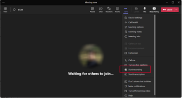
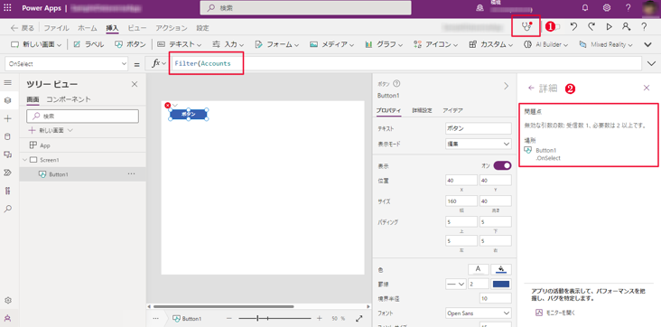
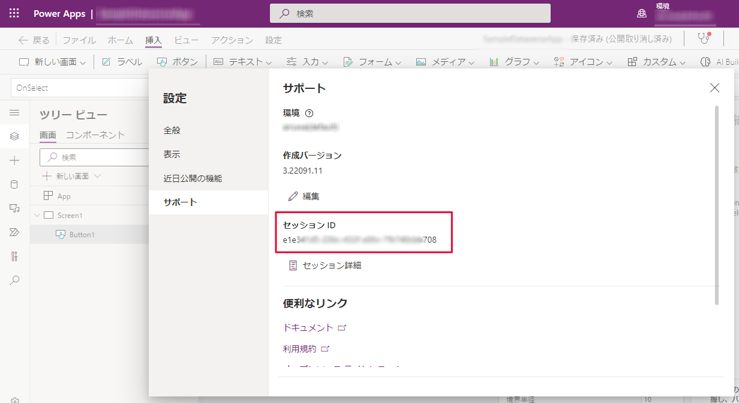
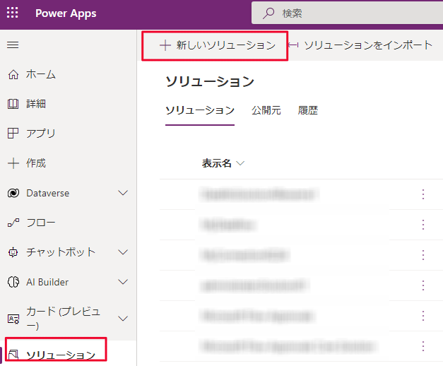
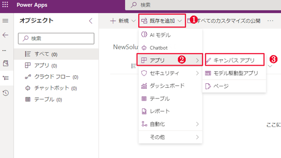

こんにちは、Power Platform サポートの谷です。 
弊社サポートでは、キャンバス アプリが動作しない、エラーが発生する、等のトラブルシューティングにおいて、お問い合わせの内容をもとに調査方針を立てておりますが、発生している事象を明確に把握するため、ご利用者様の環境で発生している事象の切り分けや情報提供をお願いすることがあります。 
この記事では、キャンバス アプリのトラブルシューティングを行うにあたって、必要となる情報の取得手順をご説明します。

<!-- more -->

## 概要
キャンバス アプリ編集時、また実行時に発生する問題解決におけるお問い合わせの際の情報取得手順についてご説明します。

---
1. [事象の発生状況](#anchor-about-situation)
2. [事象発生時のエラーメッセージや画面キャプチャ・動画](#anchor-about-screencapture)
3. [アプリ チェッカーのエラーメッセージ　※編集中のみ](#anchor-about-appchecker)
4. [Power Apps バージョン](#anchor-about-versions)
5. [Power Apps モニターログ](#anchor-about-monitorlog)
6. [Webブラウザのネットワーク トレース・コンソール ログ](#anchor-about-networkhar)
7. [セッションID](#anchor-about-sessionid)
8. [アプリURL (アプリID、テナントID) ](#anchor-about-app-tenant-ids)
9. [環境ID](#anchor-about-enviromentid)
10. [アプリ](#anchor-about-canvasapp)

## 情報取得手順

### 1. 事象の発生状況
エラーや意図しない状況がどのような状況下で発生するかお知らせください。 
事象の発生条件を見極めることで、問題の箇所を特定するだけではなく、弊社環境で動作検証を行い再現するかどうか確認することができます。 
例えば、以下の情報をお知らせいただくことでより明確に事象を把握することができます。

- 事象が発生するタイミング
    - いつから発生しているか・現在も継続して発生しているか
    - どのような頻度で発生しているか
    - 発生前後で何らかの変更を行ったか
- 事象が発生する端末の差異
- 事象が発生しているユーザーと事象が発生していないユーザーの差異
    - 事象の内容によりユーザーのメールアドレス情報やユーザープリンシパル名をご提供いただく場合があります
- キャンバス アプリをご利用いただいている端末のネットワーク環境の差異(プロキシー経由で利用など)
- 事象が発生しているWebブラウザの差異(Microsoft Edge、Google Chrome、Firefoxなど)
    - Webブラウザのプラグインや拡張機能の有無
- 事象の発生環境 (Power Apps モバイルアプリ/Webブラウザ)

### 2. 事象発生時のエラーメッセージや画面キャプチャ・動画
エラーの内容を具体的に表すメッセージや画面キャプチャなどの情報をお寄せください。 
事象再現時の動画がありますと事象の発生状況をより正確に把握することができます。

#### エラーメッセージや画面キャプチャ
エラーの内容が分かるよう画面キャプチャをご取得ください。 
エラーメッセージ内にタイムスタンプや何らかのエラーコードが記載されている場合はそれらの情報を **テキスト形式** でご取得ください。

#### 動画
以下の2つの方法で事象発生時の動画をご取得ください。

- Windows ＋ G での画面収録
    1. Webブラウザを起動します
    2. Webブラウザの画面を一度クリックしたのち、Windowsキー + G を押下します
    3. 「●」から画面キャプチャを開始します
        - 
    4. 事象を発生させます
    5. 画面キャプチャを停止します
    6. 録画ファイルが保存されます

- Teams会議の録画機能
    1. Teams会議を開始します
    2. 「Start Recording」を選択し、録画を開始します
        - 
    3. 画面共有し、事象を発生させます
    4. Teams会議を終了します(録画も停止します)
    5. 録画ファイルを保存します

### 3. アプリ チェッカーのエラーメッセージ　※編集中のみ
キャンバス アプリ編集中の場合、Power Apps Studioのアプリ チェッカーにエラーメッセージが記録されます。 
エラーが発生している処理(関数やコントロール等)と併せてアプリチェッカーに記録されているエラーメッセージをご提供ください。

1. Power Apps 作成者ポータル(http://make.powerapps.com) にサインインします
2. 対象のアプリの編集画面を表示します
3. 事象を発生させます
4. アプリ チェッカーに記録されるエラーメッセージを **画面キャプチャ** などで取得します
    - 

### 4. Power Appsバージョン
バージョン差異による問題かどうかお調べする際に使用します。

#### キャンバスアプリ 編集時
1. Power Apps 作成者ポータル(http://make.powerapps.com) にサインインします
2. 対象のアプリ編集画面を表示します
3. メニュー「設定」＞「サポート」を選択します
4. 作成バージョンを **テキスト形式** で取得します
    - 

#### キャンバス アプリ 実行時
本手順にてキャンバスアプリのリリース バージョンをご取得いただき、さらに、事象が発生している端末においてライブバージョンをご取得ください。 
ライブ バージョンはセッション情報から取得します。 
Webブラウザで事象が発生している場合、[セッションID(Webブラウザ)](#anchor-about-sessionid-playweb) をご参照ください。 
モバイル アプリで事象が発生している場合、[セッションID(モバイルアプリ)](#anchor-about-sessionid-playmobile) をご参照ください。

1. Power Apps 作成者ポータル(http://make.powerapps.com) にサインインします
2. 対象のアプリの「…」メニュー＞「詳細」を選択します
    - 
3. 「バージョン」タブを押下し、Power Apps リリース バージョンを **テキスト形式** で取得します
    - 

### 5. Power Apps モニターログ
キャンバス アプリ編集中、あるいは再生中に発生するイベントの記録をご提供ください。 
アプリ実行中のイベントを確認することで発生している事象を正確に把握することができます。

以下ブログ記事でもモニターログの取得方法をご説明しています。 
[キャンバス アプリのモニターログ取得手順](https://jpdynamicscrm.github.io/blog/canvasapp/Canvas-app-monitor/)

#### キャンバス アプリ 再生時
1. Power Apps 作成者ポータル(http://make.powerapps.com) にアクセスします
2. アプリ 一覧画面から対象のアプリの「...」メニューを表示し、「監視」を選択します
    - ※別タブで監視ウィンドウが表示されます
3. 「公開したアプリの再生」を行い、事象を発生させます
4. 監視ウィンドウに移動し、記録されたモニター結果を「ダウンロード」します 
5. ダウンロードしたファイル（PowerAppsTraceEvents.json）をご提供ください
	
#### キャンバス アプリ 編集時
1. Power Apps 作成者ポータル(http://make.powerapps.com) にアクセスします
2. アプリ 一覧画面から対象のアプリの編集画面を表示します  
3. 画面左方にある　高度なツール＞監視＞モニターを開く を選択します
    - ※別タブで監視ウィンドウが表示されます
4. 事象を発生させます
5. 監視ウィンドウに移動し、記録されたモニター結果を「ダウンロード」します 
6. ダウンロードしたファイル（PowerAppsTraceEvents.json）をご提供ください

### 6. Webブラウザのネットワークト レース・コンソール ログ
キャンバス アプリ編集中、あるいは実行中に発生するHTTPリクエストの記録をご提供ください。 
Power Appsサービスへ送信するHTTPリクエストやPower Appsサービスから受信するHTTPレスポンスの内容を確認することで通信上の問題を特定します。 
※事象の内容により、netsh traceコマンドやサードパーティ製のツール「Fiddler」によるネットワーク キャプチャの取得をお願いする場合があります。

1. Webブラウザを起動します
2. [F12] を押下してブラウザの開発者ツールを開始します
3. 事象が発生する操作を行います
4. ブラウザ開発者ツールに戻り、Networkタブの赤色の [Stop recording network log] アイコンをクリックします(❷)
5. [Export HAR] のアイコンをクリックし、任意のファイル名で保存します(❸)
6. Consoleタブをクリックし、表示されるすべての情報をコピーして **テキスト形式** で保存します(❹)

### 7. セッションID
セッション情報からPower Appsサービス側の記録を確認し、発生している事象を調査します。

#### Webブラウザ
- キャンバス アプリ編集時
    1. Power Apps 作成者ポータル(http://make.powerapps.com) にサインインします
    1. アプリ 一覧画面から対象のアプリのアプリ編集画面を表示します
    2. メニュー「設定」を選択します
    3. ポップアップの左メニューから「サポート」を選択します
    4. 「セッション詳細」を押下し、セッションIDを **テキスト形式** で取得します
        - 

- キャンバス アプリ実行時
    1. 対象のアプリを実行します
    2. 画面右上部の歯車アイコンを押下します
    3. 「セッション詳細」を選択し、Power Apps ライブバージョンを含む、表示されている情報をすべてを **テキスト形式** で取得します
        - 

#### モバイルアプリ
1. Power Apps モバイルアプリを起動します
2. 画面左上部のユーザーアイコンを押下します
    - 
3. 「バージョン情報」を **テキスト形式** でお手元に控えます
    - 
4. 「セッション詳細」を押下します
    - 
5. クリップボードにコピーされた セッションIDを **テキスト形式** で取得します
    - 

#### SharePoint カスタマイズ フォーム等、埋め込みのキャンバス アプリ
1. Alt キーを押下しながらフォームを右クリックします
2. 「セッション詳細」を押下し、セッションIDを **テキスト形式** で取得します
    - 

### 8. アプリURL(アプリID、テナントID）
アプリID、テナントIDの情報からPower Appsサービス側の記録を確認し、発生している事象を調査します。

1. Power Apps 作成者ポータル(http://make.powerapps.com) にアクセスします
2. アプリ 一覧画面から対象のアプリの「...」メニューを押下し、「詳細」を選択します
3. アプリURLを **テキスト形式** で取得します
    - 

### 9. 環境ID
環境IDの情報からPower Appsサービス側の記録を確認し、発生している事象を調査します。

1. Power Apps 作成者ポータル(http://make.powerapps.com) にアクセスします
2. 事象が発生している環境に切り替えます (❶)
3. 画面右上部の歯車アイコンを押下します (❷)
4. 「セッション詳細」を選択します (❸)
5. ポップアップで表示された、環境IDを含むセッションの詳細情報すべてを **テキスト形式** で取得します (❹)
    - ※環境IDは赤枠で囲った部分です。本セッション情報を用いて事象が発生している環境の情報を確認します
    - 

### 10. アプリ
事象が発生しているアプリを調査し、問題の箇所を特定します。 
アプリが接続するデータソースによりSharePoint リストのテンプレートやDataverse テーブルのメタ情報をご提供いただく場合があります。

#### アプリのエクスポートファイル
「エクスポート」機能によりエクスポートされるアプリのファイルは公開済みのバージョンです。 
アプリを編集中の場合はmsappファイルとしてローカルに保存したアプリのファイルをご取得ください。

- 公開済みのアプリ
    1. Power Apps 作成者ポータル(http://make.powerapps.com) にサインインします
    2. アプリ 一覧画面から対象のアプリの「...」メニューを押下し、「エクスポートパッケージ」を選択します
        - 
    3. 任意の名前を付けてエクスポートします
    4. ローカルにzipファイルがダウンロードされます

- 編集中の最新のアプリ
    1. Power Apps 作成者ポータル(http://make.powerapps.com) にサインインします
    2. アプリ一覧画面から対象のアプリを編集します
    3. メニュー「ファイル」＞「名前を付けて保存」を選択します
    4. 保存先を「このコンピューター」を選択します
        - 
    5. ローカルにmsappファイルがダウンロードされます
        - 

#### アプリを含むソリューションファイル
1. Power Apps 作成者ポータル(http://make.powerapps.com) にサインインします
2. ソリューション 一覧画面を表示します
3. 「新しいソリューション」を押下します
    
4. 手順3 で作成したソリューションに対象のアプリを追加します
    - 必要に応じて使用するDataverseテーブルなどを含めます
    - 
5. カスタマイズを公開します
    - 
6. ソリューションをエクスポートします
    - 
7. ローカルにzipファイルがダウンロードされます

## 補足
本手順は執筆時点でのユーザー インターフェイスを基に紹介しています。バージョンアップによって若干の UI の遷移など異なる場合があります。その場合は画面の指示に従って進めてください。 
※本情報の内容（添付文書、リンク先などを含む）は、作成日時点でのものであり、予告なく変更される場合があります。

## 参考情報
- [Teams で会議を記録する](https://support.microsoft.com/ja-jp/office/teams-%E3%81%A7%E4%BC%9A%E8%AD%B0%E3%82%92%E8%A8%98%E9%8C%B2%E3%81%99%E3%82%8B-34dfbe7f-b07d-4a27-b4c6-de62f1348c24)
- [ブラウザートレースのキャプチャ手順](https://social.technet.microsoft.com/Forums/ja-JP/7c2e860a-c756-42d7-8fde-6afe043ab57f/12502125211245412470125401248812524125401247312398124611251512?forum=DCRMSupport)
- [セッションおよびアプリ ID の詳細を取得する](https://learn.microsoft.com/ja-jp/power-apps/maker/canvas-apps/get-sessionid)
- [モニターでキャンバス アプリをデバッグする](https://learn.microsoft.com/ja-jp/power-apps/maker/monitor-canvasapps)
- [高度なモニタリングの概要](https://learn.microsoft.com/ja-jp/power-apps/maker/monitor-advanced)
---
