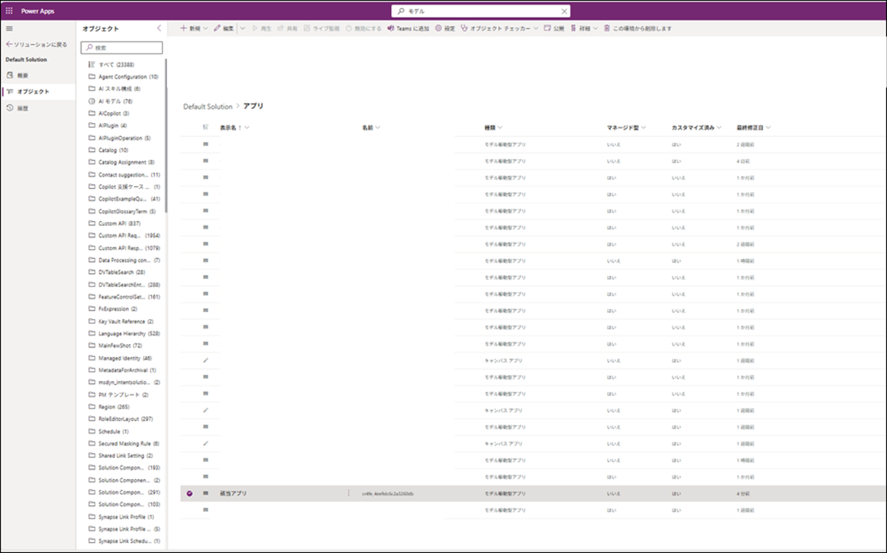
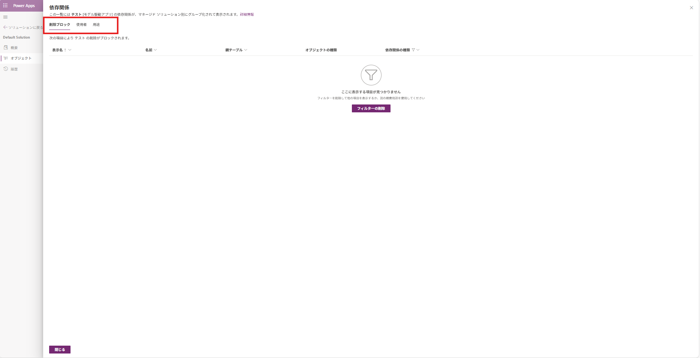

# モデル駆動型アプリ削除ガイド

こんにちは、PowerPlatformサポートチームの三田です。

本記事ではモデル駆動型アプリの削除について、以下の Q1〜Q3 の質問に回答する形でご説明します。

- [Q1: モデル駆動型アプリの削除に必要な権限は？](#q1)
- [Q2: モデル駆動型アプリを削除する際に注意しなければならない「依存関係」とは？](#q2)
- [Q3: 削除を阻止する「依存関係」がないのに削除できないときの対処法は？](#q3)

### この記事でわかること
- 削除に必要な基本ロールと最低限の権限
- どの依存関係が削除を止めるのかの判断基準
- マネージド / 案マネージド の違いによる削除可否の差
- 依存関係表示が空でも失敗する代表的内部要因
- 外部キーエラー (SQL 547) 発生時の実務的回復手順

## 目次
- [モデル駆動型アプリ削除に必要な権限 (Q1)](#q1)
- [削除前に確認すべき依存関係の整理 (Q2)](#q2)
- [依存関係が表示されないのに削除できない場合の対処 (Q3)](#q3)
- [まとめ](#summary)
- [注意事項（情報の更新可能性）](#notice)

<h2 id="q1">モデル駆動型アプリ削除に必要な権限 (Q1)</h2>
【結論】モデル駆動型アプリを削除できる主な既定ロールはシステム管理者 (System Administrator) とシステムカスタマイザー (System Customizer) です。

これら以外のカスタムロールで削除を許可したい場合、両既定ロールが保有する App (App Module) の Delete、関連 Solution 操作 (Read / Write / Delete / Append / Append To) および Publish Customizations などの権限セットを完全に再現する必要があります。

マネージド ソリューションのアプリはロールに関わらず個別削除できず、マネージド ソリューション全体を環境から削除する必要があります。

【ポイント】
1. 既定ロール: システム管理者 (System Administrator) / システムカスタマイザー (System Customizer) 
2. 必須操作: App Module Delete + Publish Customizations
3. 付随権限: Solution（Read / Write / Delete / Append / Append To）
4. カスタムロール: 上記権限を完全複製で代替可
5. マネージド 配下: 個別削除不可（ソリューション全体の削除）

 【よくある誤解】
- 誤解: アプリを作成したユーザなら誰でもそのアプリを削除できる。
	- → 正しくは: 作成者であっても適切な Delete 権限と関連カスタマイズ権限がなければ削除できません。
- 誤解: マネージド ソリューションからインポートしたアプリも [Power Apps ポータル](#https://make.powerapps.com/environments/Default-b78d9d9a-c2e6-42d2-9bcc-1fa7852ad660/home)から直接削除できる。
	- → 正しくは: マネージド ソリューション配下のコンポーネントは個別削除不可で、ソリューションの全体の削除が必要です。
 - 誤解: Publish Customizations 権限は削除には無関係である。
 	- → 正しくは: 削除後の状態反映で公開処理が走るため関連カスタマイズ権限不足でエラーとなる場合があります。
 - 誤解: App Module の Delete 権限さえ付与されていればアプリを削除できる。
 	- → 正しくは: Delete 単独では不十分で Solution への Read / Write / Delete / Append / Append To と Publish Customizations、および依存関係解消が揃って初めて削除可能です。誤設定リスク低減のため既定ロール (システム管理者 / システムカスタマイザー) の利用を推奨します。

＜参考資料＞
- [セキュリティ ロールおよび特権 (Dataverse)](https://learn.microsoft.com/ja-jp/power-platform/admin/security-roles-privileges)
- [カスタマイズに必要な特権 (モデル駆動型アプリ)](https://learn.microsoft.com/ja-jp/power-apps/maker/model-driven-apps/privileges-required-customization)
- [Managed と Unmanaged の違い](https://learn.microsoft.com/ja-jp/power-platform/alm/managed-unmanaged-solutions)
- [モデル駆動型アプリを削除する](https://learn.microsoft.com/ja-jp/power-apps/maker/model-driven-apps/delete-model-driven-app)


<h2 id="q2">削除前に確認すべき依存関係の整理 (Q2)</h2>
【結論】依存関係は「アプリが中で利用"している"項目 (用途：Uses)」と「そのアプリを利用"されている"項目 (使用者：Used by)」の 2 種類です。
削除を止めるのは依存関係ページの「削除ブロック（Delete blocked by）」タブに表示される項目だけです。

代表例として SiteMap、テーブル (Table)、フォーム (SystemForm)、ビュー (SavedQuery)、ビューのチャート (SavedQueryVisualization)、ダッシュボード、Business Process Flow、ロール依存、Web リソース、URL Suffix などが該当します。

【ポイント】
1. ブロック判定: “削除ブロック（Delete blocked by）” タブ列挙項目
2. 代表的な要素: SiteMap / Table / SystemForm / SavedQuery / SavedQueryVisualization


【補足】“使用者（Used by）” に表示されても “削除ブロック（Delete blocked by）” に現れない要素は削除ブロックではありません。無闇に削除すると他アプリや別ソリューションでリンク切れや機能欠落を生む恐れがあります。


[Power Apps ポータル](#https://make.powerapps.com/environments/Default-b78d9d9a-c2e6-42d2-9bcc-1fa7852ad660/home)で依存関係を確認する手順 (簡易):
1. 対象環境で ソリューション を開き、アプリを含むソリューションを選択
	
2. アプリ行を選択後、該当行のコマンドバー (… など) から「詳細 > 依存関係を表示」をクリック
	
3. 削除ブロック（Delete blocked by）/ 使用者 (Used by) / 用途 (Uses) の各タブで確認可能
	


【よくある誤解】
- 誤解: アプリを削除すれば内部で参照しているビューやフォームも自動削除される。
	- → 正しくは: 参照コンポーネントは独立しており自動削除されないため別途クリーンアップが必要です。
- 誤解: Used by に出た要素はすべて削除ブロックである。
	- → 正しくは: Delete blocked by に現れない限り直接のブロックではありません。
- 誤解: マネージド コンポーネントは アンマネージド に変換しないと依存関係表示できない。
	- → 正しくは: マネージド でも依存関係ビューから直接確認可能です。

＜参考資料＞
- [コンポーネントの依存関係を表示する](https://learn.microsoft.com/ja-jp/power-apps/maker/data-platform/view-component-dependencies)
- [テーブルとモデル駆動型アプリ間の依存関係を削除する](https://learn.microsoft.com/ja-jp/power-platform/alm/remove-table-app)
- [依存関係の削除の概要](https://learn.microsoft.com/ja-jp/power-platform/alm/removing-dependencies)
- [Managed と Unmanaged の違い](https://learn.microsoft.com/ja-jp/power-platform/alm/managed-unmanaged-solutions)
- [モデル駆動型アプリを削除する](https://learn.microsoft.com/ja-jp/power-apps/maker/model-driven-apps/delete-model-driven-app)


<h2 id="q3">依存関係が表示されないのに削除できない場合の対処 (Q3)</h2>
【結論】依存関係ページにブロック項目が無くても AppSettingBase など内部設定テーブルの参照（外部キー）が残っていると削除が失敗する事例があります。

以下のようなエラーが発生しシステム管理者でも削除できない事例が複数報告されています。

```
Sql error: Statement conflicted with a constraint.
The DELETE statement conflicted with the REFERENCE constraint "appmodule_appsetting_parentappmoduleid".
The conflict occurred in database "db_crmcorejpn_********_********_****", table "dbo.AppSettingBase", column 'ParentAppModuleId'.
The statement has been terminated.
CRM ErrorCode: -2147185375
Sql ErrorCode: -2146232060
Sql Number: 547
```

エラー文の要点:
1. Sql Number 547 は参照整合性 (外部キー) 違反を示す一般的エラー
2. 外部キー名 appmodule_appsetting_parentappmoduleid は AppSettingBase の ParentAppModuleId が対象 App Module を指しているレコードが残存していることを示唆
3. 一時的な未公開 / キャッシュ状態や App 設定レイヤー未更新により不要な AppSetting レコード参照が残留している可能性があります。


エラー対処手順:
1. システム管理者が対象モデル駆動型アプリを Power Apps (Maker ポータル) で開き「保存して公開」(Save & Publish) を実行
（「保存して公開」が非活性の場合はページの追加など軽微な編集を行ってください）
2. 直後に「再生」(Play) を押下し一度アプリを起動


【補足】上記手順でのエラーが解消されない場合は、問題発生直後のサポート リクエストの起票を推奨します。

＜参考資料＞
- [コンポーネントの依存関係を表示する](https://learn.microsoft.com/ja-jp/power-apps/maker/data-platform/view-component-dependencies)
- [依存関係の削除の概要](https://learn.microsoft.com/ja-jp/power-platform/alm/removing-dependencies)
- [Managed と Unmanaged の違い](https://learn.microsoft.com/ja-jp/power-platform/alm/managed-unmanaged-solutions)
- [ソリューションの一般的な問題のトラブルシューティング](https://learn.microsoft.com/ja-jp/power-platform/alm/troubleshoot-common-solution-issues)

<h2 id="summary">まとめ</h2>
- モデル駆動型アプリ削除には システム管理者 (System Administrator) / システムカスタマイザー (System Customizer) 
または同等の削除権限を付与したカスタム セキュリティ ロール が必要です。
- 依存関係は [Power Apps ポータル](#https://make.powerapps.com/environments/Default-b78d9d9a-c2e6-42d2-9bcc-1fa7852ad660/home) の「依存関係を表示」から 用途（Use） / 使用者（Used by） / 削除ブロック（Delete blocked by） を確認可能です。
- SQL Number 547 (appmodule_appsetting_parentappmoduleid) は AppSettingBase 残留参照が原因で「保存して公開 → 再生 → 削除」手順が有効です。

<h2 id="notice">注意事項（情報の更新可能性）</h2>
本記事の内容は執筆日時点の公開情報に基づいています。仕様や UI、権限名称、依存関係の表示挙動は将来変更される可能性があります。最新情報は公式ドキュメントをご確認ください。
