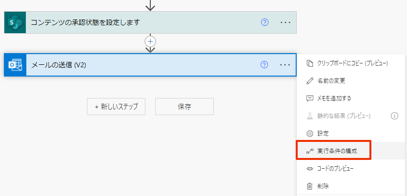
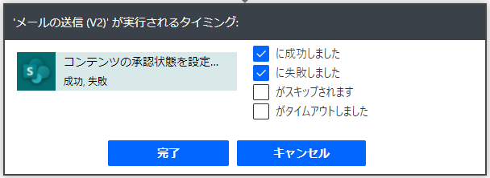

こんにちは、Power Platform サポートチームの三宅です。  
  今回は、 Power Automate でクラウド フローにエラー処理のステップを組み込む方法についてご紹介いたします。

## 実行条件を構成する    
 
エラーの予測されるアクションがある場合、後続アクションの実行条件を構成することで、エラーの有無にかかわらずフローを最後まで実行させることができます。  

**[手順]**  
1. アクションの [メニュー] から、[実行条件の構成] を選択します。  
 　
2. アクションが実行されるタイミングについて、チェックボックスの任意の値を選んで [完了] をクリックします。  
  

## アクションの成否によって後続のアクションを変更する

並列分岐を用いることで、アクションが成功した場合と失敗した場合とで異なる処理を行うことも可能です。

例として、エラーが予測されるアクションの後にステップがある場合、[並列分岐の追加] から、前のアクションが失敗した場合にメールを送るステップを追加します。  
  


また、実行時のアクションの出力を返す outputs 関数を用いることで、エラー情報を取得することが可能です。  
例えば、「式」にて以下のように記述することで、エラーメッセージを取得することができます。  
```outputs('<アクション名>').body.error.message```  

「失敗しました」側のアクションでの使用例:  
  
参考：[式関数のリファレンス ガイド](https://docs.microsoft.com/ja-jp/azure/logic-apps/workflow-definition-language-functions-reference#outputs)

## スコープを用いてフロー全体を監視する  
実行条件を用いる方法ではアクション単位でのエラー検知が必要でしたが、コントロール コネクタの [スコープ] を用いるとフロー全体をまとめて処理することができます。  
以下、Try、Catch、Finally テンプレートによるエラー処理の手順をご説明いたします。  
[Try、Catch、Finally テンプレート](https://flow.microsoft.com/en-us/galleries/public/templates/e8e028c6df7b4eb786abdf510e4f1da3/try-catch-and-finally-template/)  
  

**[手順]**  
1. Try スコープ内に、メインとなるアクションを挿入します。  
2. Catch スコープの実行条件は Try ブロックが失敗した際に実行するように設定されています。Try ブロックが失敗した際は、Catch スコープ内のアクションによりメールが送信されます。  
3. Finally スコープ内には、前のアクションの成否にかかわらず実行されるアクションを挿入します。  

### 参考情報  
[Error handling steps, counters, a new flow details experience and more](https://powerautomateweb.microsoft.com/en-us/blog/error-handling/)
