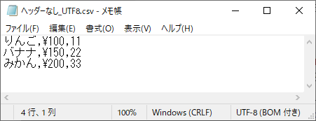
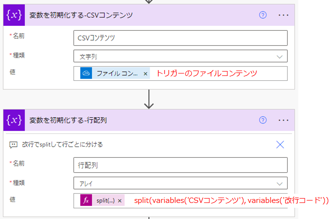
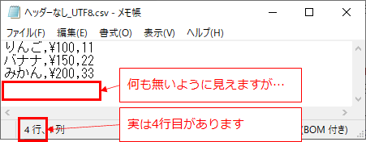
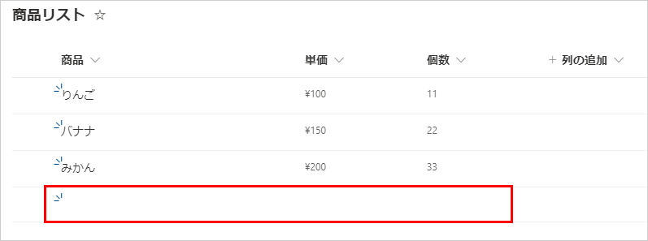
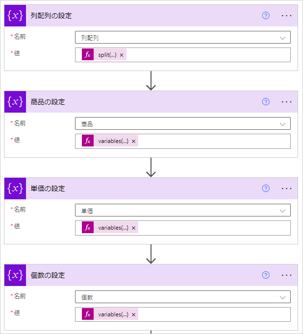
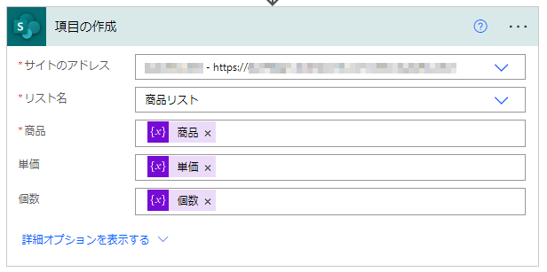
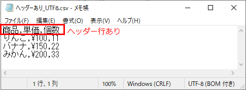
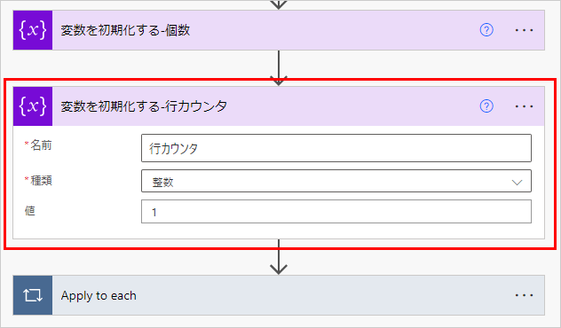
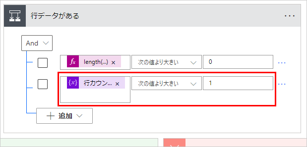
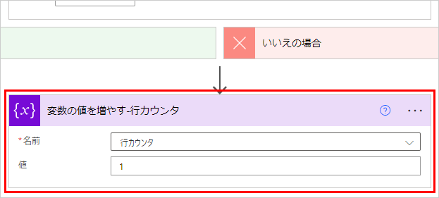

# Power Automate で csv ファイルを取り込む

こんにちは、Power Platform サポートの瀬戸です。
今回は、Power Automate で csv ファイルを取り込む方法をご紹介します。
標準コネクタのみで実現する方法なので、多くの方に活用していただけます。

<!-- more -->

## 今回取り込む csv ファイル

上図が今回使用した Excel シートです。これを、ファイルの種類を「CSV UTF (コンマ区切り)」へ変更して保存しました。その csv ファイルをメモ帳で開いた様子が下図です。

特徴は下記の通りです：

* ヘッダー行 ： 無し
* 引用符 ： 無し
* 文字コード ： UTF-8 (BOM付き)
* 改行コード ： CRLF

## フローの例
今回の例では、以下の状況を想定しています。

* トリガー： csv ファイルが OneDrive に作成されたとき
* やりたいこと：SharePoint リストに csv ファイルの内容を登録する

↓やりたいことイメージ図  

フローの全体図は下記の通りです。

ここから、フローの詳細を順を追って解説いたします。

### csvファイルの内容を行ごとに分割する
csv ファイルを処理する前に、まずは改行を格納する変数を用意します。

式：`decodeUriComponent('%0D%0A')`

今回の例では、[decodeUriComponent 関数](https://docs.microsoft.com/ja-jp/azure/logic-apps/workflow-definition-language-functions-reference#decodeUriComponent) を使用します。パラメータの `%0D%0A` は改行コード (CRLF) を表しています。

次に、トリガーアクションの「ファイルコンテンツ」を変数「CSVコンテンツ」に格納します。その後、「CSVコンテンツ」を「改行コード」で分割してアレイ変数に格納します。
指定の文字で分割するには、[split 関数](https://docs.microsoft.com/ja-jp/azure/logic-apps/workflow-definition-language-functions-reference#split) を使います。

式：`split(variables('CSVコンテンツ'), variables('改行コード'))`

### 列ごとの値を入れる変数の準備
次に、列を分割した後の値を入れるアレイ変数 (列配列) と、csv ファイルに定義されている列と同じ変数を初期化します。

今回は 商品、単価、個数の3つの列があるので、それぞれ同じ名前で変数を作りました。

### 空の行を取り込まないようにする分岐

ここから、行ごとの繰り返し処理 (Apply To Each) に入ります。

繰り返し処理の初めに条件を指定し、行が空ではないときだけ後続のフローを続けるようにします。

条件式の左辺：`length(item())`

「`length(item())` が 0 より大きい」ときに「はい」になるようにしています。`item()` は行配列の各要素を表しているので、行が空でなければ「はい」になります。

この条件を入れておくと、csv ファイルの最後の行が空の場合に、空のまま取り込んでしまうのを防止できます。

この条件分岐なしでフローを作成すると、取込先の SharePoint リストに空のデータが入ってしまいます。

### カンマごとに列を分割する
ここからは、条件分岐の「はいの場合」のときの処理です。

まず、行データをカンマで分割し、「列配列」変数へ格納します。その後、列配列の各要素を、商品、単価、個数の変数へ格納します。

それぞれの変数名と値は下記の通りです。

|変数名|値|
|---|---|
|列配列|`@{split(item(), ',')}`|
|商品|`@{variables('列配列')?[0]}`|
|単価|`@{variables('列配列')?[1]}`|
|個数|`@{variables('列配列')?[2]}`|

### 分割した値を取り込む
最後に 商品、単価、個数を SharePoint リストへ登録します。

あらかじめ作成しておいた SharePoint リストを選択すれば自動的に列が表示されますので、それぞれ対応した変数を指定します。

詳細の解説は以上です。

## ヘッダー行がある場合
先ほどの例は csv ファイルにヘッダー行がありませんでしたが、ヘッダー行がある場合は、ヘッダー行を取り込んでしまわないような処理が必要です。

例えば、csv ファイルの行を読み取るたびに何行目かをカウントし、1行目だけ読み飛ばすようにします。そのために、まずは先ほどのフローの Apply to each の前に、新しい変数の初期化を挿入します。

* 名前 ： 行カウンタ
* 種類 ： 整数
* 値 ： 1

次に、Apply to each の中の条件分岐の条件式を追加します。

「行カウンタが1より大きい」となるように条件を設定します。

これで、行カウンタが1のときは「いいえの場合」になるので SharePoint リストへの登録が行われなくなります。

最後に、条件分岐が終わった後に「変数の値を増やす」アクションを追加します。行配列を読み込むごとに、1ずつカウントアップします。これで、2行目以降は 「はいの場合」になります。

## 最後に
以上、Power Automate で csv ファイルを取り込む方法をご紹介いたしました。

SharePoint リストへの登録の部分を他のアクションへ置き換えることで、様々な状況で活用していただけます。参考になりましたら幸いです。
