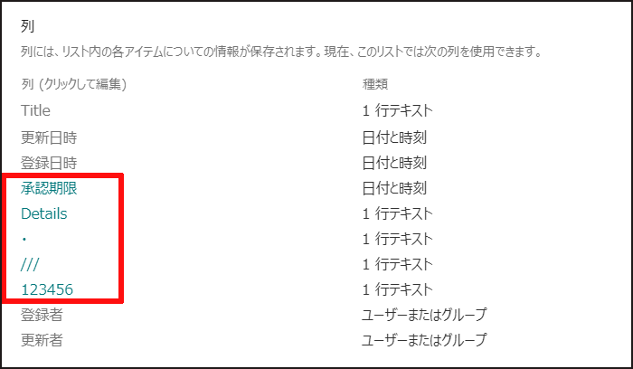
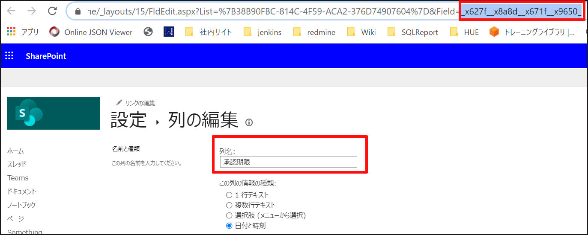

#  SharePointの内部列名を確認する方法

こんにちは、Power Platform サポートチームの網野です。

 
今回はSharePointリストを利用したフローを作成するときに、必ず知っておくべき内部列名とその確認方法をご案内します。 

内部列名を使いこなせれば、トリガー条件やフィルタークエリを使って、SharePointを更に便利に使いこなせます！ 

便利な使い方は別の機会にたくさん紹介しますので、今回は内部列名の確認方法についてしっかり覚えていきましょう。

 

この記事の対象者
 - Power Automateをはじめたばかりの方
 - SharePointリストとPower Automateの連携に興味のある方

 
私たちMicrosoftはすべての人が開発者になる未来を目指しています。 
Power Automateを使って、一緒にビジネスを加速させましょう！ 
 
 
<!-- more -->

---

#目次
1. [はじめに](#anchor-intro)
1. [内部列名って何？](#anchor-what-is-internal-column)
1. [内部列名の確認方法](#anchor-how-to-look-up-internal-column)

 

## はじめに
 

### こんなことしたいなって思ったことありませんか？

 - SharePointリストの期限列と現在日時を比較して、期限間近のアイテムをTeamsやメールでリマインドしたい
 - ステータス列が「完了」以外のときだけフローを実行したい

 
Power Automateを使えば、「期限列」や「ステータス列」の値を利用して、～この列が〇〇のとき～のような条件式を簡単に作成することができます!
 
 
詳しい方法はまた別の機会にblogとして更新しますので、今回は列を指定するときに必要な内部列名について学んでいきます。
 
 
それでは早速SharePointリストの内部列名とは何かから、学んでいきましょう！
 

基礎知識は飛ばして確認方法を知りたいという方は[内部列名の確認方法](#anchor-how-to-look-up-internal-column)へ進んでください。
 
 

## 内部列名って何?

内部列名はシステム側で列を特定するためのキー項目です。 
 
### 内部列名がないと・・・
 

例えば、以下のようなデータがあったとします。
| 列名 | 値 | 
| :- | :- |
| Title | A社様見積もり |
| 承認者 | 〇〇部長 |
| 期限 | 2021/06/01 |

 
 
ここに、二次承認者を加えることになりました。 
そこで「承認者」と「期限」の列名を変更することにしました。 
 

| 表示上の列名 | 値 | 
| :- | :- |
| Title | A社様見積もり |
| 一次承認者 | ？ |
| 一次承認期限 | ？ |
| 二次承認者 | - |
| 二次承認期限 | - |

 

「承認者」と「期限」という列名がなくなってしまったので、システム側が元々の値を見つけられなくなってしまいます。 
では、二次承認を加える前のデータに内部列名を追加してみましょう。
 

| 表示上の列名 | 内部列名 | 値 | 
| :- | :- | :- |
| Title | Title | A社様見積もり |
| 承認者 | Approver| 〇〇部長 |
| 期限 | deadline | 2021/06/01 |

 
次に、「承認者」と「期限」の列名を変更して、二次承認者の情報を増やします。
 

| 表示上の列名 | 内部列名 | 値 | 
| :- | :- | :- |
| Title | Title | A社様見積もり |
| 一次承認者 | Approver | 〇〇部長 | 
| 一次承認期限 | deadline | 2021/06/01 | 
| 二次承認者 | Secondary Approver | - | 
| 二次承認期限 | Secondary Approve deadline | - | 

 
表示上の列名が変更されても内部列名が変わらないので、システム側も値を見つけることができますね。 
 
Power AutomateからSharePointの列を扱うときも、同様の理由で表示名ではなく、内部列名を利用します。 
この仕組みがあるから誰かが表示上の列名を変更された場合でも、フローを編集する必要はありませんね。
 
 
今回は説明の便宜上わかりやすい内部列名を利用しましたが、SharePoint登録時に内部列名を利用者が設定することはできません。 
例えば、「承認期限」という名前で列を作ると、「_x627f__x8a8d__x671f__x9650_」という内部列名が自動で作成されます。
 
 

一見取っつきにくい表記に思えますが、どの列かを識別するためのものなので、列を表す記号と捉えて次に進みましょう。
 
 

## 内部列名をPower Automateで利用するために

 
Powre Automate利用時に注意が必要になるのが、内部列名はそのままで利用できる場合と、加工が必要な場合があります。 
決まりなので覚えていきましょう。 

 
以下の列を持つリストを例にして、確認していきます。

 
 
各列の内部列名を確認していくと、以下のようになります。 

- 文字の種類がアルファベットからはじまる場合は、<strong>OData_</strong> という接頭辞が不要
- 文字の種類がアルファベット以外からはじまる場合以外は、<strong>OData_</strong> という接頭辞が必要

 
 

| 文字の種類 | 列名 | 内部列名  |Power Automate 利用時|
| :-: | :-: |:-:|:-:|
| アルファベット | Details | Details | Details|
| 日本語 | 承認期限 | \_x627f__x8a8d__x671f__x9650_ | OData_\_x627f__x8a8d__x671f__x9650_ |
| 記号 ( 2byte ) | ・ | \_x30fb_  | OData_\_x30fb_ |
| 記号 ( 1byte ) | /// | \_x002f__x002f__x002f_ | OData_\_x002f__x002f__x002f_ |
| 数値 | 123456 | \_x0031_23456  | OData_\_x0031_23456 |

 

 

## 内部列名の確認方法
 
では実際に、内部列名を確認していきましょう。
 
 

1. SharePointにて、内部列名を確認したいリストを表示します。
2. 歯車アイコンからリストの設定を開きます。 
    
3. 列の一覧から、確認したい列を選択します。 
    
4. URL の <strong>Field= </strong>以降の値が内部列名となります。 
    
5. 最後に以下の表の規則に従い、アルファベットからはじまる場合以外は OData_ を付与します。 

 
 

   | 文字の種類 | 列名 | 内部列名 | SharePoint 列の設定での表示 |Power Automate 利用時|
   | :-: | :-: |:-:|:-:|:-:|
   | アルファベット | Details | Details |  | Details|
   | 日本語 | 承認期限 | \_x627f__x8a8d__x671f__x9650_ |  | OData_\_x627f__x8a8d__x671f__x9650_ |
   | 記号 ( 2byte ) | ・ | \_x30fb_ |  | OData_\_x30fb_ |
   | 記号 ( 1byte ) | /// | \_x002f__x002f__x002f_ |  | OData_\_x002f__x002f__x002f_ |
   | 数値 | 123456 | \_x0031_23456 |  | OData_\_x0031_23456 |

 
 
これで内部列を取得することができました。
 
内部列名についてのご案内は以上となります。 

 
いかがでしたでしょうか。
 
内部列名を使えるとSharePointリストを使ったフローの幅を広げることができますので、どんどん使っていってくださいね。
 

---
Hope to acceralate your business with Power Automate!

