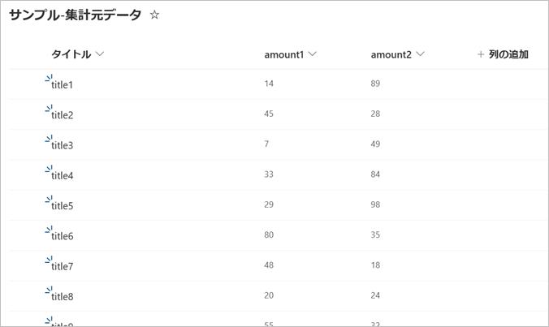
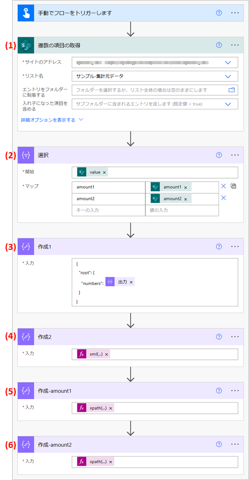
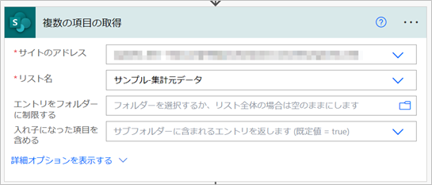
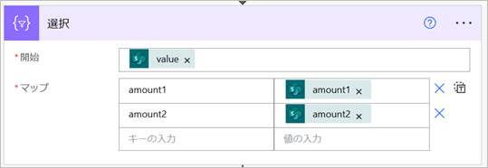
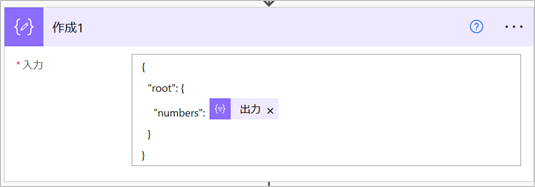

# XPath を活用した集計

こんにちは、Power Platform サポートの瀬戸です。
今回は、クラウド フローで、なるべく少ない手順で集計をしたいときに活用いただける Tips をご紹介いたします。

<!-- more -->

## 基本的な集計方法
例えば、下図のような数値の列を持つ SharePoint リストがあるとします。

この amount1、amount2 の列の合計を求めたい場合、素直に考えると Apply to each で数を集計することを考えます。

※ Apply to each を使った集計の例

合計値を求めるならこれでも良いのですが、この方法では、集計するだけで少なくとも リストの行数 × 集計したい列の数 の回数アクションが実行されます。
データ件数が多いときや、他にもフローで行いたい処理があるときは、アクション要求数が気になってしまいます。

## XPath を使った集計方法
XPath は、XML という形式のデータの位置を指定できる言語です。関数も用意されていて、集計 (sum) や個数のカウント (count) ができます。

Power Automate 上のデータは基本的に JSON 形式で扱われます。ですが、Power Automate には、JSON 形式を XML 形式へ変換する関数と、XPath の処理を行える関数がありますので、それらを使って集計を求められます。

以下に、XML と XPath を使って、先ほどの SharePoint リストを集計するサンプルを記載いたします。
Apply to each を使用していない点にご注目ください。

### フローの例
※フロー全体図

#### (1) 複数の項目の取得

SharePoint コネクタの「[複数の項目の取得](https://learn.microsoft.com/ja-jp/connectors/sharepointonline/#%E9%A0%85%E7%9B%AE%E3%82%92%E5%8F%96%E5%BE%97%E3%81%99%E3%82%8B)」アクションを使用し、リストを取得します。

|パラメータ|値|
|---|---|
|サイトのアドレス|リストがあるサイトを選択します。|
|リスト名|リストの名前を選択します。|

#### (2) 選択

データ操作コネクタの「[選択](https://learn.microsoft.com/ja-jp/power-automate/data-operations#use-the-select-action)」アクションを使用し、集計に必要な列のみの配列を作成します。

|パラメータ|値|
|---|---|
|開始|「(1) 複数の項目の取得」アクションの出力「value」|
|マップ|集計に必要な列の列名と値を指定します。|

この例では amount1 列と amount2 列を集計したいので、その2つを指定します。

|マップ-キー|マップ-値|
|---|---|
|amount1|「(1) 複数の項目の取得」アクションの出力「amount1」|
|amount2|「(1) 複数の項目の取得」アクションの出力「amount2」|

#### (3) 作成1

データ操作コネクタの「[作成](https://learn.microsoft.com/ja-jp/power-automate/data-operations#use-the-compose-action)」アクションを使用し、配列をXML へ変換できる形へ整形します。

|パラメータ|値|
|---|---|
|入力|`{"root": {"numbers":「(2) 選択」アクションの出力  }}`|

#### (4) 作成2
データ操作コネクタの「[作成](https://learn.microsoft.com/ja-jp/power-automate/data-operations#use-the-compose-action)」アクションを使用し、先のアクションの出力を XML へ変換します。

|パラメータ|値|
|---|---|
|入力|以下を式として入力： `xml(outputs('作成1'))`　※1|

※1 「作成1」は「(3) 作成1」アクションのアクション名です。

参考 (xml 関数)：https://learn.microsoft.com/ja-jp/azure/logic-apps/workflow-definition-language-functions-reference#xml

#### (5) 作成-amount1
データ操作コネクタの「[作成](https://learn.microsoft.com/ja-jp/power-automate/data-operations#use-the-compose-action)」アクションを使用し、XML へ変換した内容と XPath を使用して amount1 列の集計を求めます。
|パラメータ|値|
|---|---|
|入力|以下を式として入力： `xpath(outputs('作成2'), 'sum(/root/numbers/amount1)')`　※1|

※1 「作成2」は「(4) 作成2」アクションのアクション名です。

参考 (xpath 関数)：https://learn.microsoft.com/ja-jp/azure/logic-apps/workflow-definition-language-functions-reference#xpath

#### (6) 作成-amount2
データ操作コネクタの「[作成](https://learn.microsoft.com/ja-jp/power-automate/data-operations#use-the-compose-action)」アクションを使用し、amount1 と同じく amount2 の集計を求めます。
|パラメータ|値|
|---|---|
|入力|以下を式として入力： `xpath(outputs('作成2'), 'sum(/root/numbers/amount2)')`　※1|

※1 「作成2」は「(4) 作成2」アクションのアクション名です。

実行結果：

