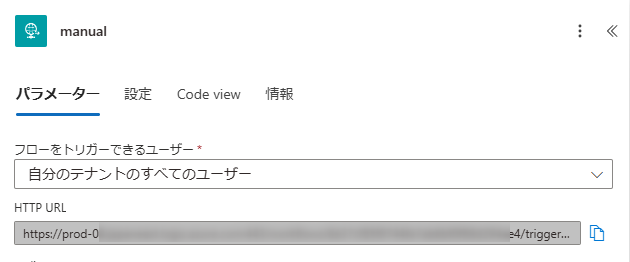
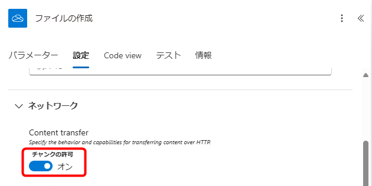

# はじめに

こんにちは、Power Platform サポートチームの山田です。  
本記事では 下記公開情報でご案内のPower Automate クラウドフローの制限について、
よくお問い合わせいただく制限の詳細をご案内致します。

[自動化フロー、スケジュールされたフロー、インスタント フローの制限事項](https://learn.microsoft.com/ja-jp/power-automate/limits-and-config)

本記事は上記公開情報の制限内容を補足・説明したものとなります。<br>
実際の制限値などは上記公開情報をご確認ください。

<!-- more -->
# 目次

1. [スループットの制限](#anchor-throughput-limits)
   1. [Power Platform 要求の制限](#anchor-power-platform-request-limits)
      * [5分ごと、および24時間ごとのPower Platform要求](#anchor-power-platform-request-limits-per)
      * [同時発信呼](#anchor-concurrent-outbound-calls)
   1. [ランタイムエンドポイント要求](#anchor-runtime-endpoint-request-limits)
      * [同時着信](#anchor-concurrent-inbound-calls)
      * [5分ごとに通話を読み取る](#anchor-read-calls-per-5-minutes)
      * [5分ごとの Invoke 呼び出し](#anchor-invoke-calls-per-5-minutes)
   1. [コンテンツスループットの制限](#anchor-content-throughput-limit)
1. [要求の制限](#anchor-request-limits)
   1. [タイムアウトの制限](#anchor-timeout)
      * [送信同期要求](#anchor-outbound-synchronous-request)
      * [送信非同期要求](#anchor-outbound-asynchronous-request)
      * [受信要求](#anchor-inbound-request)
   1. [メッセージサイズの制限](#anchor-message-size)
   1. [再試行ポリシー](#anchor-retry-policy)
1. [制限対象単位と制限抵触時の動作まとめ](#anchor-summary-list)
---  

<a id='anchor-throughput-limits'></a>

# スループットの制限
この項目でご案内する制限は「スループットの制限」に該当いたします。<br>
スループットの制限には下記3種類があります。
* Power Platform 要求の制限
* ランタイムエンドポイント要求
* コンテンツスループットの制限

制限値は、ライセンスに基づくパフォーマンスプロファイルによって決定されます。

制限の解除について、Power Automate のクラウドフローの場合はライセンス割り当て後にフローを再保存することで、新しいライセンスに紐づく制限を適用いたします。<br>
再保存を行わなかった場合は、週に1度のバックグラウンド処理により適用いたします。

<a id='anchor-power-platform-request-limits'></a>

## Power Platform 要求の制限
フロー単位での制限となります。<br>
制限に抵触すると、フローが低速実行（スロットリング状態）となります。<br>
また、低速実行が14日間連続で発生した場合は、クラウドフローは自動でオフとなります。

下記の２種類があります。
* 5分ごと、および24時間ごとのPower Platform要求
* 同時発信呼

<a id='anchor-power-platform-request-limits-per'></a>

### 5分ごと、および24時間ごとのPower Platform要求

詳細については下記記事をご参照ください。<br>
[Power Automate / Power Platform 要求数制限](https://jpdynamicscrm.github.io/blog/powerautomate/power-automate-ppr/)

<a id='anchor-concurrent-outbound-calls'></a>

### 同時発信呼
同時発信呼とは、ひとつのフローで同時に実行できるアクション数を指しております。<br>
制限に抵触した場合、フローの実行が失敗します。

例えば、フロー内でアクションが並列に実行されるよう構成されている場合や、
複数のユーザーが同時にフローを実行する場合にこの制限に抵触する可能性が考えられます。

例えば、コンカレンシー制御をオンにして同時実行する処理数を制限することで、同時発信呼の制限に抵触することを回避することができます。

<a id='anchor-runtime-endpoint-request-limits'></a>

## ランタイムエンドポイント要求
ランタイムエンドポイントとは、フロー自体のエンドポイントを指します。 (例: https://prod-00.westus.logic.azure.com:443/)<br>
例えば、下図の「HTTP要求の受信時」トリガー(manual)を使用するフローがある場合、「HTTP URL」に直接POSTリクエストを送信することで、フローを起動することが可能でございます。

 

上記の例のように、フロー実行時のエンドポイントへ (から) の直接のアクセスをランタイムエンドポイント要求と呼びます。

ランタイムエンドポイント要求には3つの制限がございます。<br>
エンドポイントごとに制限対象となり、制限に抵触した場合、フローの実行が失敗します。
* 同時着信
* 5分ごとに通話を読み取る
* 5分ごとの Invoke 呼び出し

<a id='anchor-concurrent-inbound-calls'></a>

### 同時着信
ひとつのフローのランタイムエンドポイントにて、同時に要求を受け付け可能な数を指します。<br>
例えば、複数ユーザーでボタントリガーのフローを共有しており、1,000 名以上のユーザーが同時刻にフローを起動した場合、この制限に抵触いたします。

<a id='anchor-read-calls-per-5-minutes'></a>

### 5分ごとに通話を読み取る
5 分間に実行可能なランタイムエンドポイントへの読み取り要求を指します。<br>
例えば、フローの実行履歴から生の入力や出力を取得する際がこれにあたります。

例として、SharePoint コネクタの複数の項目の取得アクションを実行し、大量のデータを取得した場合、
生の出力データを確認するには、実行履歴詳細ページにて、「クリックしてダウンロードします」リンクをクリックする必要がある場合がございます。<br>
リンクをクリックすると、ランタイムエンドポイントへの要求が実行され、生データをブラウザにて直接確認することが可能となります。<br>
この要求が、ランタイムエンドポイントへの読み取り要求にあたります。

下図は「クリックしてダウンロードします」リンクをクリックした場合の例ですが、URL よりランタイムエンドポイントへの要求が実行されていることがわかります。


<a id='anchor-invoke-calls-per-5-minutes'></a>

### 5分ごとの Invoke 呼び出し
5 分間に実行可能なランタイムエンドポイントへの呼び出し要求を指します。<br>
例えば、上記にご案内した 「HTTP 要求の受信時」トリガーを呼び出す場合など、フローを起動する操作がこれにあたります。

<a id='anchor-content-throughput-limits'></a>

## コンテンツスループットの制限
コンテンツスループットとは、フロー内の各アクションを実行後の入力および出力のデータサイズを指しております。<br>
フローの各実行において、単位時間に処理できるアクションで取り扱う情報量の制限となります。

例えば、フロー内で SharePoint コネクタの「項目の取得」アクションが使用された場合、<br>
実行履歴に表示される入力 (SharePoint に対して送信されたアドレスやリスト名など) と出力 (SharePoint から取得した項目の詳細情報) のデータサイズがカウントされます。<br>
フロー毎に、全てのアクションをカウントした合計サイズによる制限となります。

継続した5分、または24時間におけるフローごとに制限対象となります。<br>
制限に抵触すると、フローが低速実行（スロットリング状態）となります。<br>

> [!IMPORTANT]  
> 低速実行が14日間連続で発生した場合は、クラウドフローは自動でオフとなります。

<a id='anchor-request-limits'></a>

# 要求の制限
HTTP要求の制限になります。

<a id='anchor-timeout'></a>

## タイムアウトの制限
この項目ではタイムアウトとなる制限をご紹介します。<br>
制限に抵触した場合、フローの実行が失敗します。<br>

> [!IMPORTANT]  
> タイムアウトの制限は緩和できない＝タイムアウトまでの時間を延ばすことはできないものとなっております。

* 送信同期要求
* 送信非同期要求
* 受信要求

<a id='anchor-outbound-synchronous-request'></a>

###  送信同期要求
フロー内の同期処理の待ち時間となります。<br>
リクエストを投げてから待ち時間以内に応答がない場合、制限に抵触します。<br>
INSERTやGET要求などAPIごとに制限対象となります。

例えば、DataverseやSQLテーブルの読み取りや書き込み時などが挙げられます。<br>
テーブルに対する各操作をリクエストし、待ち時間以内に操作が完了せず、応答がない場合、フローの実行が失敗します。

<a id='anchor-outbound-asynchronous-request'></a>

### 送信非同期要求
フロー内の非同期処理の待ち時間となります。<br>
実行しているアクションごとでの時間となります。

例えば、承認アクションなどが挙げられます。<br>
承認コネクタを通じて、承認リクエストを投げると、承認者からの承認完了を待ちます。<br>
待ち時間以内に承認完了の応答がない場合、フローの実行は失敗します。

<a id='anchor-inbound-request'></a>

### 受信要求
応答アクションがフロー内で使用されている場合、受信要求120秒の制限が適用される場合がございます。<br>
当制限は制限された時間のみ受信要求を待機する動作となります。

フロー単位での制限となります。

例えば、フローの実行開始からカウントし、受信要求の120秒を超えて、応答アクションを実行できない場合、
応答アクションで設定したレスポンスではなく、504 Bad Gateway Timeoutを返します。<br>
応答アクションが使用されていないフローの場合は、呼び出し元にすぐに202 Acceptedを返します。

<a id='anchor-message-size'></a>

## メッセージサイズの制限
1つのアクションでの、 HTTP要求可能なメッセージサイズの制限になります。

この制限に達した場合、下記のようなメッセージと共にエラーが発生します。<br>
```
HTTP 要求に失敗しました: 'Cannot write more bytes to the buffer than the configured maximum buffer size: 104857600.'
```

通常は100MBまでとなりますが、下記条件を満たす場合、この制限は1GBとなります。<br>
・アクションがチャンクをサポートしている
・アクションの設定でチャンクを許可している




<a id='anchor-retry-policy'></a>

## 再試行ポリシー
フローが失敗した場合の再試行数の制限になります。<br>
上限以上の設定は不可となり、フローが保存できません。

再試行ポリシーに「指数の間隔」を設定しますと、設定された最小間隔、最大間隔の間でランダムに再試行が行われます。<br>
例えば、「間隔」に設定した7秒に指数をかけて、以下のように最小間隔と最大間隔を算出します。

最小間隔　～　最大間隔
- 1回目0秒　～7秒（7×0～7×1）
- 2回目7秒　～14秒（7×1～7×2）
- 3回目14秒　～28秒（7×2～7×4）
- 4回目28秒　～56秒（7×4～7×8）
- 5回目56秒　～112秒（7×8～7×16）
- 6回目112秒　～224秒（7×16～7×32）
- 7回目224秒　～448秒（7×32～7×64）

算出された、最小間隔から最大間隔の間のどこかで、処理が再試行されます。<br>
「最小間隔」「最大間隔」はオプション項目となり、設定しない場合は既定値で動作いたします。

「最小間隔」は、再試行させたい最小の間隔を設定します。「5秒」と設定しますと<br>
再試行間隔は「間隔」から算出された最小間隔に関わらず、前の実行から5秒経過後となります。

「最大間隔」は、再試行させたい最大の間隔を設定します。<br>
「1日」と設定しますと、「間隔」から算出された最大間隔に関わらず、1日以内に再試行されます。<br>
「1時間」と設定しますと1時間以内に再試行されます。

既定値
- 最小間隔　–5秒
- 最大間隔　–1日

<a id='anchor-summary-list'></a>

# 制限対象単位と制限抵触時の動作まとめ

| 制限種類 | 制限対象単位 | 制限抵触時の動作 |
| :- | :- | :- |
| [5分ごと、および24時間ごとのPower Platform要求](#anchor-power-platform-request-limits-per) | [Power Automate / Power Platform 要求数制限](https://jpdynamicscrm.github.io/blog/powerautomate/power-automate-ppr/)を参照 | フローの実行が低速化 |
| [同時発信呼](#anchor-concurrent-outbound-calls) | フローごと | フローの実行が失敗 |
| [同時着信](#anchor-concurrent-inbound-calls) | エンドポイントごと | フローの実行が失敗 |
| [5分ごとに通話を読み取る](#anchor-read-calls-per-5-minutes) | エンドポイントごと | フローの実行が失敗 |
| [5分ごとの Invoke 呼び出し](#anchor-invoke-calls-per-5-minutes) | エンドポイントごと | フローの実行が失敗 |
| [コンテンツスループットの制限](#anchor-content-throughput-limit) | フローの実行ごと | フローの実行が低速化 |
| [送信同期要求](#anchor-outbound-synchronous-request) | 実行するAPI≒アクションごと | フローの実行が失敗 |
| [送信非同期要求](#anchor-outbound-asynchronous-request) | 実行するAPI≒アクションごと | フローの実行が失敗 |
| [受信要求](#anchor-inbound-request) | フローごと | フローの実行が失敗 |
| [メッセージサイズの制限](#anchor-message-size) | アクションごと | フローの実行が失敗 |
| [再試行ポリシー](#anchor-retry-policy) | フローごと | フローの保存が不可 |

---

## 補足

本手順は執筆時点でのユーザー インターフェイスを基に紹介しています。バージョンアップによって若干の UI の遷移など異なる場合があります。その場合は画面の指示に従って進めてください。

