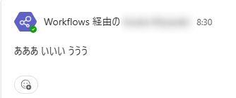
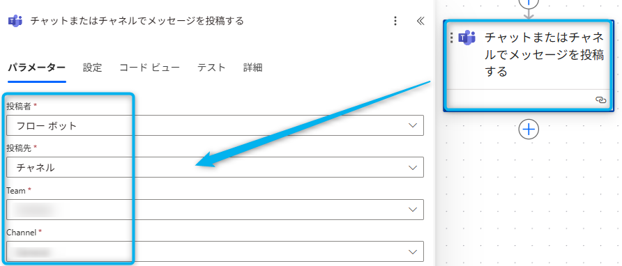
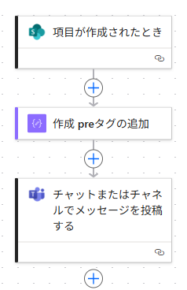
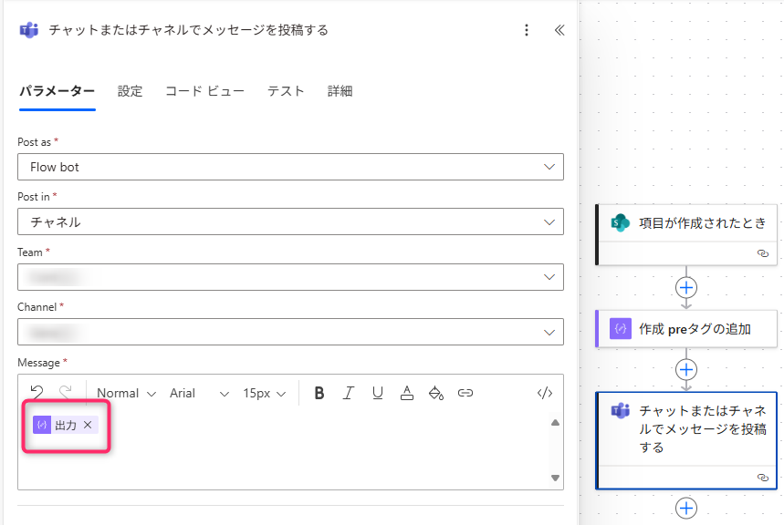

# はじめに

こんにちは、Power Platform サポートチームの宮﨑です。  
本記事では Power Automate で Teams コネクタを使用してメッセージを投稿する際、文字列の改行を反映する方法についてご案内いたします。


<!-- more -->
# 目次
1. [概要](#anchor-intro)
1. [解決したい事象](#anchor-line-break-issue)
1. [改行を反映する方法](#anchor-line-break)
   1. [replace関数を使用する](#anchor-line-break-replace)
      1. [フローの例](#anchor-line-break-replace-flow)
      1. [なぜこれで解消できるのか](#anchor-line-break-replace-reason)
   1. [preタグを使用する](#anchor-line-break-pre)
      1. [フローの例](#anchor-line-break-pre-flow)
      1. [なぜこれで解消できるのか](#anchor-line-break-pre-reason)
1. [補足](#補足)

<a id='anchor-intro'></a>

# 概要
今回はよくあるお問い合わせとして、 Power Automate で Teams コネクタを使用してメッセージを投稿する際、文字列の改行を反映する方法についてご案内いたします。

<a id='anchor-line-break-issue'></a>

## 解決したい事象

下のような SharePoint リストから、Power Automate のクラウドフローで複数行テキストを取得する際、


Teams に投稿すると改行が反映されないことがあります。




以降では、このような事象の解決方法をご案内いたします。  
※今回は Teams コネクタを使用している想定での事象となります。コネクタにより動作が異なる可能性がございますのでご留意ください。

<a id='anchor-line-break'></a>

## 改行を反映する方法

今回は事象の解決方法として、replace 関数を使用する方法と、&lt;pre&gt;タグを使用する方法の２つをご案内いたします。

<a id='anchor-line-break-replace'></a>

### replace 関数を使用する方法

<a id='anchor-line-break-replace-flow'></a>

#### フローの例
今回の例では、以下の状況を想定しています。

トリガー：SharePoint リストにアイテムが追加されたとき  
アクション：アイテムの内容を Teams に投稿する

イメージ図  


フローの全体図は以下の通りです。  


ここから、フローの詳細を順を追って解説いたします。

#### トリガー：SharePoint リストにアイテムが追加されたとき  
※こちらのトリガーはあくまでも一例となります。

下画像のように、ご自身の SharePoint リストをご指定ください。<br>


#### アクション：アイテムの内容を Teams に投稿する

下画像のように、投稿先の情報についてご指定ください。<br>


#### メッセージ部分

以下の式をアクション内で設定することで、投稿されたメッセージに改行を反映できるようになります。

```
replace(改行を反映したい文字列, decodeUriComponent('%0A'), '<br>')
```


---

<a id='anchor-line-break-replace-reason'></a>

#### なぜこれで解消できるのか
SharePoint リストや Microsoft Excel から取得した複数行テキストを Teams に HTML形式で投稿する際には、
改行部分を「&lt;br&gt;」タグへ置換する必要がございます。

特定の文字列を別の文字列に置換する replace 関数を用いることで、「&lt;br&gt;」タグを挿入することが可能となります。

#### replace(文字列, '\n', '&lt;br&gt;') ではなぜ解消しないのか


フロー内で文字列を扱う際、改行コードは「\n」と表示されますが、Power Automate で変換するときに特殊文字はそのまま扱えません。  
そのため、replace( 文字列, '\n', '&lt;br&gt;' ) では、Power Automate が認識する改行部分を取得・置換することができません。

今回の方法では、decodeUriComponent 関数を使って「%0A」をデコードすることで、実際の改行文字（LF）を取得しています。  
その改行文字を replace 関数で 「&lt;br&gt;」タグ に置換することで、Teams などに投稿する際に正しく改行が反映されるようになります。

他のテキストファイルなどからコピーして取得した文字列では、改行コードが LF とは限らない可能性がございますので、　　
上記方法で上手くいかない場合には、次の「pre タグを使用する方法」をお試しいただくか、以下の表をご参考ください。

※ 改行コードとURLエンコードの対応表

| 改行コード | 意味                          | エンコード後の文字列 |
|------------|-------------------------------|-----------------------|
| LF         | Line Feed（改行）             | `%0A`                |
| CR         | Carriage Return（復帰）       | `%0D`                |
| CRLF       | Carriage Return + Line Feed   | `%0D%0A`             |

- `decodeUriComponent('%0A')` → LF（改行）を取得
- `decodeUriComponent('%0D')` → CR（復帰）を取得
- `decodeUriComponent('%0D%0A')` → CRLF（Windows系改行）を取得

---

<a id='anchor-line-break-pre'></a>

### pre タグを使用する方法

<a id='anchor-line-break-pre-flow'></a>

#### フローの例

今回の例では、以下の状況を想定しています。

トリガー：SharePoint リストにアイテムが追加されたとき  
アクション１：作成  pre タグの追加   
アクション２：作成した変数の内容を Teams に投稿する

イメージ図  


フローの全体図は以下の通りです。<br>


ここから、フローの詳細を順を追って解説いたします。

#### トリガー：SharePoint リストにアイテムが追加されたとき  
※こちらのトリガーはあくまでも一例となります。

下画像のように、ご自身の SharePoint リストをご指定ください。<br>


#### アクション１：作成 pre タグの追加

下画像のように、取得したい文字列に &lt;pre&gt; タグを追加してください。


#### アクション２：作成した変数を Teams に投稿する  

上で作成した変数をメッセージに設定することで、改行が反映されるようになります。  


<a id='anchor-line-break-pre-reason'></a>

#### なぜこれで解消できるのか

HTML における &lt;pre&gt; タグは、整形済みのテキストとして表示するためのものになります。  
これを使用することで、要素内に記述されたテキストの空白文字（スペース、タブ、改行）をまとめて反映できるようになります。

以上が、Power Automate で Teams コネクタを使用してメッセージを投稿する際、文字列の改行を反映する方法でございます。
お役に立てましたら幸いです。

<a id='補足'></a>

# 補足

本手順は執筆時点でのユーザー インターフェイスを基に紹介しています。バージョンアップによって UI の遷移などが若干異なる場合があります。その場合は画面の指示に従って進めてください。  

