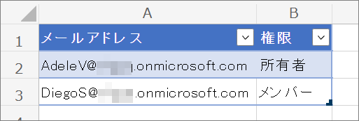
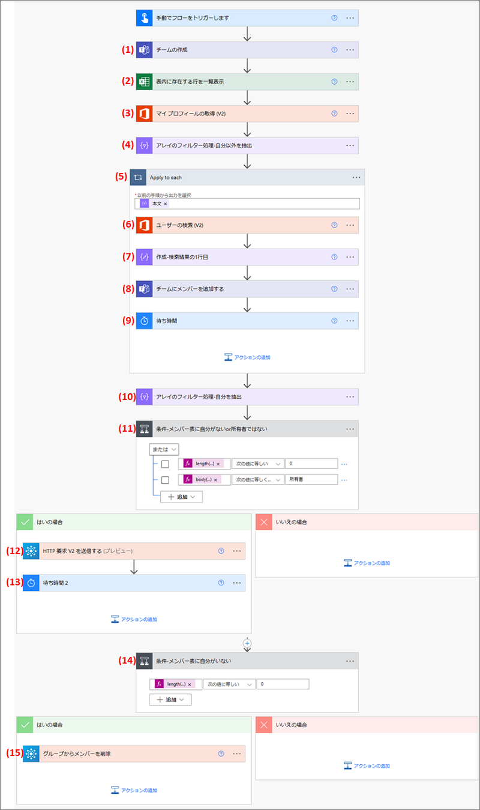
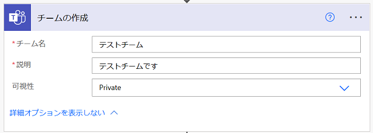
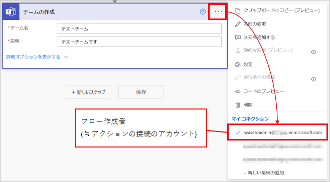
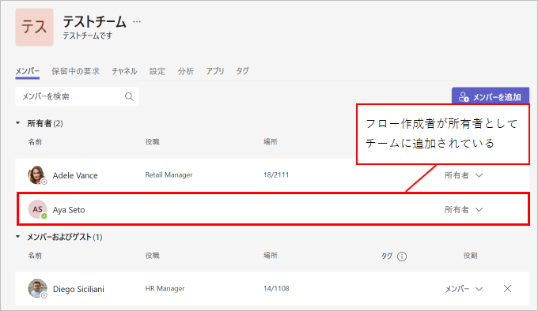
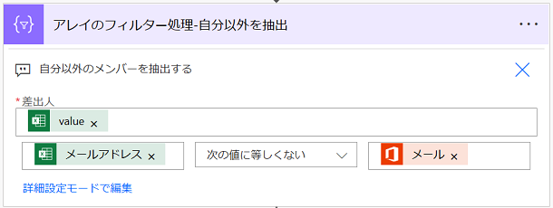
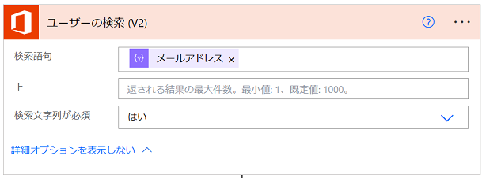
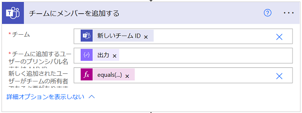
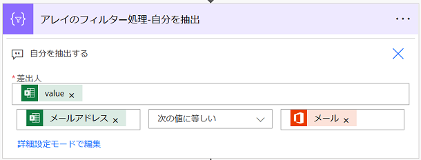
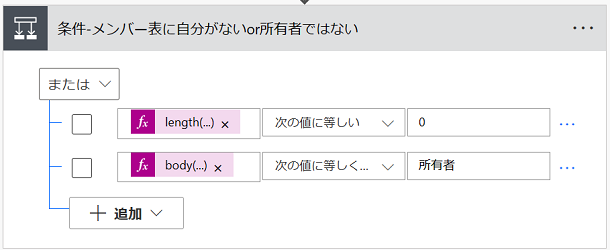

# Power Automate で Teams のチーム作成とメンバー追加を自動化

こんにちは。Power Platform サポートの瀬戸です。

今回は、Teams の新しいチームの作成と、そのチームへのメンバー追加を、Power Automate で自動化する例をご紹介いたします。組織の方針でチーム作成を申請制にしている場合や、たくさんのチームを一度に作成しなければいけないときにご活用いただけます。

<!-- more -->

## メンバー表の例

今回は、上図のような Excel ファイルのメンバー表を元に、チームのメンバーを追加すると想定しています。表はテーブル形式で、メンバーのメールアドレスと、チームに対する権限の列があります。このファイルを、既存の SharePoint サイトのドキュメント ライブラリへ保存しておきます。

## フローの例
ここから、フローのサンプルをご案内します。フローの大まかな流れは下記の通りです。

1. 新しいチームを作成します。
1. Excel ファイルのメンバー表を読み込みます。
1. メンバー表のメールアドレスを元に、メンバーを追加します。

### 全体図
下図がフローの全体図です。それぞれのアクションの設定方法は後述します。

### (1) チームの作成

Microsoft Teams コネクタの「[チームの作成](https://learn.microsoft.com/ja-jp/connectors/teams/#%E3%83%81%E3%83%BC%E3%83%A0%E3%81%AE%E4%BD%9C%E6%88%90)」アクションを使用し、新しいチームを作成します。

|パラメータ名|値|
|---|---|
|チーム名|任意のチーム名を指定します。|
|説明|任意の説明文を指定します。|
|可視性|任意の値 (Private または Public) を選択します。|

「チームの作成」アクションでチームを作成すると、フロー作成者 (≒このアクションの接続のアカウント) がチームの所有者となります。

接続のアカウント： 

作成されたチームのメンバー： 

これは Teams で手作業でチームを作成した場合と同じ動作です。しかし、このままではメンバー表にいない人がチームに参加していることになってしまうため、後でチームを脱退する必要があります。このフローのサンプルでは、その脱退についても実施しています。

### (2) 表内に存在する行を一覧表示

Excel Online (Business) コネクタの「[表内に存在する行を一覧表示](https://learn.microsoft.com/ja-jp/connectors/excelonlinebusiness/#%E3%83%86%E3%83%BC%E3%83%96%E3%83%AB%E5%86%85%E3%81%AB%E5%AD%98%E5%9C%A8%E3%81%99%E3%82%8B%E8%A1%8C%E3%82%92%E4%B8%80%E8%A6%A7%E8%A1%A8%E7%A4%BA%E3%81%99%E3%82%8B)」アクションを使用し、メンバー表の値を取得します。

|パラメータ名|値|
|---|---|
|場所|Excel ファイルがある場所を指定します。|
|ドキュメント ライブラリ|Excel ファイルがあるライブラリを指定します。|
|ファイル|Excel ファイルのパスを指定します。|
|テーブル|メンバー表のテーブル名を指定します。|

### (3) マイ プロフィールの取得 (V2)

※ 設定が必要なパラメータはありません。

Office 365 Users コネクタの「[マイ プロフィールの取得 (V2)](https://learn.microsoft.com/ja-jp/connectors/office365users/#%E8%87%AA%E5%88%86%E3%81%AE%E3%83%97%E3%83%AD%E3%83%95%E3%82%A1%E3%82%A4%E3%83%AB%E3%82%92%E5%8F%96%E5%BE%97%E3%81%99%E3%82%8B-(v2))」アクションを使用し、自分 (フロー作成者) の情報を取得します。
このアクションは、「(1) チームの作成」のアクションと接続のアカウントが同じである必要があります。

前述したように、「(1) チームの作成」で作成したチームは、自分が所有者として追加されています。しかし、メンバー表に自分がいない場合はチームから脱退しておきたいので、それに必要な情報を取得しています。

### (4) アレイのフィルター処理-自分以外を抽出

データ操作 コネクタの「[アレイのフィルター処理](https://learn.microsoft.com/ja-jp/power-automate/data-operations#use-the-filter-array-action)」アクションを使用し、Excel ファイルから取得したメンバー表から、自分 (フロー作成者) を削除した一覧を作成します。
この後メンバーをチームに追加しますが、前述したように自分はすでにメンバーとしてチームに参加しているため、追加の必要がないためです。

|パラメータ名|値|
|---|---|
|差出人|「(2) 表内に存在する行を一覧表示」アクションの出力「value」|
|条件式-左辺|「(2) 表内に存在する行を一覧表示」アクションの出力「メールアドレス」 ※ または以下を式として入力： `item()?['メールアドレス']` ※|
|条件式-比較演算子|「次の値に等しくない」|
|条件式-右辺|「(3) マイ プロフィールの取得 (V2)」アクションの出力「メール」|

※ 「メールアドレス」は メンバー表の列の名前です。

### (5) Apply to each

コントロール コネクタの「Apply to each」アクションを使用し、自分 (フロー作成者) 以外のメンバーをチームに追加する繰り返し処理を行います。

|パラメータ名|値|
|---|---|
|以前の手順から出力を選択|「(4) アレイのフィルター処理-自分以外を抽出」アクションの出力「本文」|

### (6) ユーザーの検索 (V2)

Office 365 Users コネクタの「[ユーザーの検索 (V2)](https://learn.microsoft.com/ja-jp/connectors/office365users/#%E3%83%A6%E3%83%BC%E3%82%B6%E3%83%BC%E3%82%92%E6%A4%9C%E7%B4%A2%E3%81%99%E3%82%8B-(v2))」アクションを使用し、メンバー表のメールアドレスから、ユーザー情報を取得します。この後の処理に UPN (ユーザー プリンシパル名) が必要なのでこのアクションを使用していますが、メールアドレスと UPN が必ず一致する環境であれば、このアクションは必要ありません。

|パラメータ名|値|
|---|---|
|検索語句|「(4) アレイのフィルター処理-自分以外を抽出」アクションの出力「メールアドレス」 ※ または以下を式として入力： `item()?['メールアドレス']` ※|

※ 「メールアドレス」は メンバー表の列の名前です。

### (7) 作成-検索結果の1行目

データ操作 コネクタの「[作成](https://learn.microsoft.com/ja-jp/power-automate/data-operations#use-the-compose-action)」アクションを使用し、前のアクションのリスト形式の出力から、1行目を取り出します。

|パラメータ名|値|
|---|---|
|入力|以下を式として入力： `outputs('ユーザーの検索_(V2)')?['body/value']?[0]` ※|

※ `ユーザーの検索_(V2)` は、「(6) ユーザーの検索 (V2)」のアクション名です。

### (8) チームにメンバーを追加する

Microsoft Teams コネクタの「[チームにメンバーを追加する](https://learn.microsoft.com/ja-jp/connectors/teams/#%E3%83%81%E3%83%BC%E3%83%A0%E3%81%AB%E3%83%A1%E3%83%B3%E3%83%90%E3%83%BC%E3%82%92%E8%BF%BD%E5%8A%A0%E3%81%99%E3%82%8B)」アクションを使用し、新しく作成したチームにメンバーを追加します。また、メンバー表に「所有者」として記載されたメンバーを所有者として登録するようにします。

|パラメータ名|値|
|---|---|
|チーム|「(1) チームの作成」アクションの出力「新しいチームID」|
|チームに追加するユーザーの プリンシパル名または AAD ID|「(7) 作成-検索結果の1行目」アクションの出力「Id」 または以下を式として入力： `outputs('作成-検索結果の1行目')?['Id']` ※1|
|新しく追加されたユーザーが チームの所有者である必要があります|以下を式として入力： `equals(item()?['権限'], '所有者')` ※2|

※1 `作成-検索結果の1行目` は、「(7) 作成-検索結果の1行目」のアクション名です。  
※2 `権限` は、メンバー表の列名です。`所有者` は、メンバー表の権限の列に入力した値です。

### (9) 待ち時間 (遅延)

スケジュール コネクタの「遅延」アクションを使用し、メンバーの追加後少し待機します。待機無しで次の処理へ移ると、前の処理がまだ処理中で、まれにエラーになることがあるためです。
実際に何秒待機するべきかは、サーバーの処理状況によって異なるため、個別に調整が必要です。

|パラメータ名|値|
|---|---|
|カウント|5|
|単位|秒|

### (10) アレイのフィルター処理-自分を抽出

データ操作 コネクタの「[アレイのフィルター処理](https://learn.microsoft.com/ja-jp/power-automate/data-operations#use-the-filter-array-action)」アクションを使用し、メンバー表から自分 (フロー作成者) を抽出します。このアクションの出力を使い、既にチーム所有者として登録されている自分を削除するかどうか、権限を変更するかどうかを判定します。設定内容は、(4) のアクションとほぼ同じで、比較演算子が異なるのみです。

|パラメータ名|値|
|---|---|
|差出人|「(2) 表内に存在する行を一覧表示」アクションの出力「value」|
|条件式-左辺|「(2) 表内に存在する行を一覧表示」アクションの出力「メールアドレス」 または以下を式として入力： `item()?['メールアドレス']` ※|
|条件式-比較演算子|「次の値に等しい」|
|条件式-右辺|「(3) マイ プロフィールの取得 (V2)」アクションの出力「メール」|

※ `メールアドレス` は、メンバー表の列名です。

### (11) 条件-メンバー表に自分がないor所有者ではない

コントロール コネクタの「条件」アクションを使用し、メンバー表に自分 (フロー作成者) がいない または メンバー表にはいるけど所有者ではないとき、で処理を分岐します。
条件に一致するときのみ、自分から所有者の権限を削除します。
メンバー表に自分がいないときはチームから自分を削除すればいいのですが、チームの所有者を削除するには、所有者権限の削除 → メンバーの削除、という 2 つの手順が必要です。

以下 2 つの条件式を「または」でつなげます：

|パラメータ名|値|
|---|---|
|条件式1-左辺|以下を式として入力： `length(body('アレイのフィルター処理-自分を抽出'))` ※1|
|条件式1-比較演算子|「次の値に等しい」|
|条件式1-右辺|`0`|

|パラメータ名|値|
|---|---|
|条件式2-左辺|以下を式として入力： `body('アレイのフィルター処理-自分を抽出')?[0]?['権限']` ※1|
|条件式2-比較演算子|「次の値に等しくない」|
|条件式2-右辺|`所有者` ※2|

※1 `アレイのフィルター処理-自分を抽出` は、「(10) アレイのフィルター処理-自分を抽出」のアクション名です。`権限` は、メンバー表の列名です。
※2 `所有者` は、メンバー表の権限の列に入力した値です。

### (12) HTTP 要求 V2 を送信する

Office 365 Groups コネクタの「[HTTP 要求 V2 を送信する](https://learn.microsoft.com/ja-jp/connectors/office365groups/#http-%E8%A6%81%E6%B1%82%E3%82%92%E9%80%81%E4%BF%A1%E3%81%99%E3%82%8B-v2-(%E3%83%97%E3%83%AC%E3%83%93%E3%83%A5%E3%83%BC))」アクションを使用し、自分 (フロー作成者) から所有者権限を削除します。
Teams のチームも Microsoft 365 グループの 1 つなので、メンバーの操作は Office 365 Groups コネクタのアクションからも行えます。しかし所有者権限を削除できるアクションは現時点では提供されていないため、「HTTP 要求 V2 を送信する」アクションを使用し Graph API を実行します。

|パラメータ名|値|
|---|---|
|URI|`https://graph.microsoft.com/v1.0/groups/※1/owners/※2/$ref`|
|メソッド|「DELETE」|
|本文|(空白)|
|Content-Type|`application/json`|

※1「(1) チームの作成」アクションの出力「新しいチームID」 
※2「(3) マイ プロフィールの取得 (V2)」アクションの出力「ID」

参考：[グループ所有者を削除する - Microsoft Graph v1.0 | Microsoft Learn](https://learn.microsoft.com/ja-jp/graph/api/group-delete-owners?view=graph-rest-1.0&tabs=http)

### (13) 待ち時間 2 (遅延)

スケジュール コネクタの「遅延」アクションを使用し、少し処理を待機します。
実際に何秒待機するべきかは、サーバーの処理状況によって異なるため、個別に調整が必要です。

|パラメータ名|値|
|---|---|
|カウント|5|
|単位|秒|

### (14) 条件-メンバー表に自分がいない

コントロール コネクタの「条件」アクションを使用し、メンバー表に自分 (フロー作成者) がいないとき、で条件分岐します。条件に一致するときのみ、チームから自分を削除します。
指定する条件は、(11) の条件式1と同じです。

|パラメータ名|値|
|---|---|
|条件式-左辺|以下を式として入力： `length(body('アレイのフィルター処理-自分を抽出'))` ※|
|条件式-比較演算子|「次の値に等しい」|
|条件式-右辺|`0`|

※ `アレイのフィルター処理-自分を抽出` は、「(10) アレイのフィルター処理-自分を抽出」のアクション名です。

### (15) グループからメンバーを削除

Office 365 Groups コネクタの「[グループからメンバーを削除](https://learn.microsoft.com/ja-jp/connectors/office365groups/#%E3%83%A1%E3%83%B3%E3%83%90%E3%83%BC%E3%82%92%E3%82%B0%E3%83%AB%E3%83%BC%E3%83%97%E3%81%8B%E3%82%89%E5%89%8A%E9%99%A4%E3%81%99%E3%82%8B)」アクションを使用し、自分 (フロー作成者) をチームから削除します。

|パラメータ名|値|
|---|---|
|グループ ID|「(1) チームの作成」アクションの出力「新しいチーム ID」|
|ユーザー プリンシパル名|「(3) マイ プロフィールの取得 (V2)」アクションの出力「ユーザー プリンシパル名」|

フローの各アクションの設定は以上です。

## 最後に
今回の例では手動トリガーを使用しましたが、例えば手動トリガーの入力に「チーム名」などを追加すれば、実行の度に任意のチーム名を指定できるようになります。
そのほか、承認アクションや Microsoft Forms コネクタと組み合わせれば、申請からチーム作成の流れを自動化することも可能です。

この記事が皆さまの自動化の一助になりましたら幸いです。
