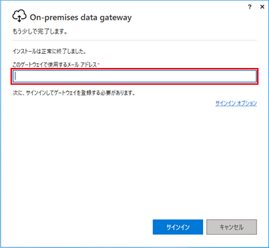
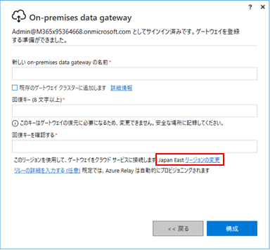
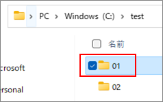
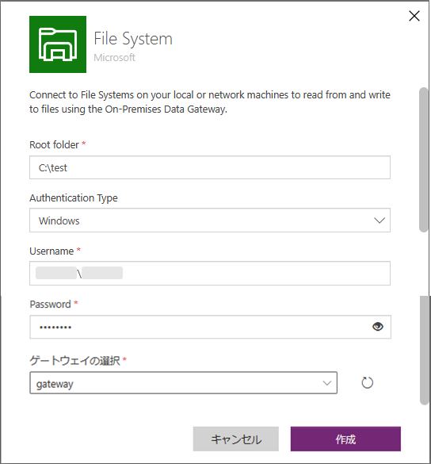
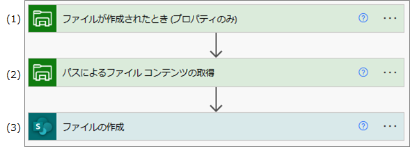
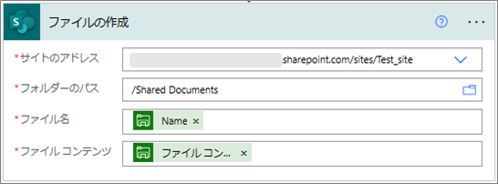
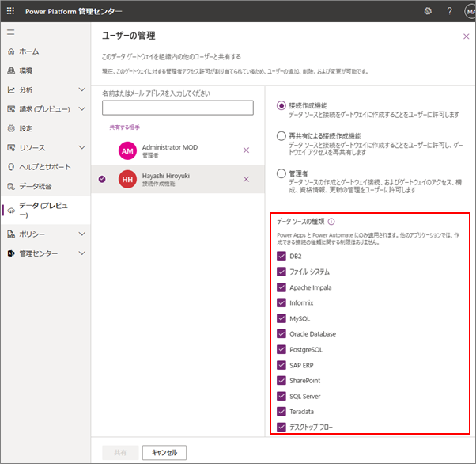

こんにちは、Power Platform サポートの林です。  
本記事では クラウド フローとオンプレミス環境間でデータ連携する方法と、一例としてローカル ファイルをクラウド フローで扱う方法についてもご紹介します。  

<!-- more -->

## はじめに

クラウド フローはクラウド サービスの自動化を実現するイメージをお持ちの方が多いのですが、オンプレミス環境と通信することもできます。クラウドフローとの通信を実現するには、オンプレミス環境のローカルマシンにオンプレミス データ ゲートウェイ (以下、ゲートウェイ) をインストールします。

これによりローカル ファイルが格納されたことをトリガーにクラウド フローを実行することや、クラウド フローで扱ったファイルをローカル マシンに保存することができます。その他、ローカル マシンから接続できるデータ ソース (SQL Server や Oracleなど) のデータ操作もできるようになります。  

今回はローカル マシンにファイルが格納されたことをトリガーにクラウド フローで SharePoint のドキュメント ライブラリにファイルを格納する方法をご紹介させていただきます。  

1. [ゲートウェイのインストール方法](#install)  
2. [利用例) ファイルシステムコネクタを利用したフローの構築](#filesystem)  
3. [よくあるトラブル](#trouble-shooting)  
4. [FAQ](#faq)  

---

## ゲートウェイのインストール方法

### 1. 前提
1. 要件  
Windows 8 以降、Windows Server 2012 R2 以降の端末にインストールできます。詳細は以下の公開情報をご確認いただき、要件を満たしているかご確認ください。  
[オンプレミス データ ゲートウェイをインストールする | Microsoft Learn](https://learn.microsoft.com/ja-jp/data-integration/gateway/service-gateway-install#requirements)   

2. 必要なエンド ポイント  
ゲートウェイは送信ポートのみを利用してクラウドサービスと通信します。  
以下の公開情報をご確認いただき、送信ポートから全てのエンド ポイントに接続できる状態となっているかご確認ください。  
[オンプレミス データ ゲートウェイの通信設定を調整する | Microsoft Learn](https://learn.microsoft.com/ja-jp/data-integration/gateway/service-gateway-communication#ports)  

3. 有償ライセンス  
ゲートウェイのインストール自体にライセンス要件はありません。ただし、ゲートウェイを Power Automate、Power Apps で利用するには、Microsoft 365 のライセンスでは利用できず、Power Platform の有償ライセンスが必要となります。  
有償ライセンスについては以下をご確認ください。  
・[Power Automate の有償ライセンス](https://powerautomate.microsoft.com/ja-jp/pricing/)  
・[Power Apps の有償ライセンス](https://powerapps.microsoft.com/ja-jp/pricing/)  

### 2. ゲートウェイをインストールする
ゲートウェイをダウンロードしインストールします。手順については、以下の公開情報をご確認ください。  
[オンプレミス データ ゲートウェイをインストールする | Microsoft Learn](https://learn.microsoft.com/ja-jp/data-integration/gateway/service-gateway-install#download-and-install-a-standard-gateway)  

##### 補足事項
* 設定時にメール アドレスを入力しますが、入力したアドレスのユーザーが管理者となります。管理者はゲートウェイの利用者の追加、複数のゲートウェイをクラスター化する権限を有します。  
  

* ゲートウェイの登録情報はクラウド上に記録されます。テナントが日本の場合、登録先リージョン(以下、赤枠) が Japan East と表示されているかご確認ください。仮に、Power Platform のリージョンと異なっている場合、ゲートウェイが認識されず利用できないため、ご注意ください。  
  

### 3. プロキシ設定をする
プロキシ サーバー経由でネットワーク通信をする必要がある場合、インストールされた設定ファイルを修正します。修正対象、修正内容は以下の公開情報をご確認ください。  
[オンプレミス データ ゲートウェイのプロキシ設定を構成する | Microsoft Learn](https://learn.microsoft.com/ja-jp/data-integration/gateway/service-gateway-proxy)

---

## 利用例) ファイルシステムコネクタを利用したフローの構築

サンプルとして、以下のフォルダに追加されたファイルを SharePoint のドキュメント ライブラリに格納します。  
  

### 1. ファイルシステムコネクタの接続作成
Power Automate ポータルの接続メニューからファイル システム コネクタの接続を作成します。  
  

|パラメータ名|値|
|---|---|
|Root folder|連携したいファイルの親フォルダを指定します。アクションにてサブフォルダを指定することができます。|
|Authentication Type|Windows 固定|
|Username|Windowsにログインする際のドメイン名とユーザー名を「ドメイン名\ユーザー名」の形式でご指定ください。 端末にログオンしているユーザーのドメインとユーザーの名は whoami コマンドから確認いただけます。 ※ Power Automate のログインアカウントではございませんので、ご注意ください。 ※ ドメイン名とユーザー名の間は \\ (バックスラッシュ)です。/ (スラッシュ) ではない点ご注意ください。|
|Password|上記で指定したユーザーのパスワードをご指定ください。|
|ゲートウェイの選択|インストールしたゲートウェイを選択ください。|

### 2. クラウド フローの作成

##### 全体図

クラウド フローの全体図です。  
  

#### (1) ファイルが作成されたことをトリガーに起動

ファイル システム コネクタの「[ファイルが作成されたとき (プロパティのみ)](https://learn.microsoft.com/ja-jp/connectors/filesystem/#%E3%83%95%E3%82%A1%E3%82%A4%E3%83%AB%E3%81%8C%E4%BD%9C%E6%88%90%E3%81%95%E3%82%8C%E3%81%9F%E3%81%A8%E3%81%8D-(%E3%83%97%E3%83%AD%E3%83%91%E3%83%86%E3%82%A3%E3%81%AE%E3%81%BF))」トリガーを使用します。  
  

|パラメータ名|値|
|---|---|
|フォルダー|接続で指定した Root folder 配下のトリガー対象のフォルダを指定します。 対象フォルダのサブフォルダ内にファイルが追加された場合はトリガーしないので注意してください。|

#### (2) ファイルコンテンツの取得

ファイル システム コネクタの「[パスを使用してファイル コンテンツを取得](https://learn.microsoft.com/ja-jp/connectors/filesystem/#%E3%83%91%E3%82%B9%E3%82%92%E4%BD%BF%E7%94%A8%E3%81%97%E3%81%A6%E3%83%95%E3%82%A1%E3%82%A4%E3%83%AB-%E3%82%B3%E3%83%B3%E3%83%86%E3%83%B3%E3%83%84%E3%82%92%E5%8F%96%E5%BE%97)」アクションを使用します。  

|パラメータ名|値|
|---|---|
|ファイルパス|追加したファイルのファイル コンテンツを取得します。ファイル パスにはトリガーで取得した "Path" を指定します。|

#### (3) SharePoint のドキュメント ライブラリにファイルを格納

SharePoint コネクタの「[ファイルの作成](https://learn.microsoft.com/ja-jp/connectors/sharepointonline/#%E3%83%95%E3%82%A1%E3%82%A4%E3%83%AB%E3%81%AE%E4%BD%9C%E6%88%90)」アクションを使用します。  

|パラメータ名|値|
|---|---|
|サイトのアドレス|任意のサイトを指定してください。|
|フォルダーのパス|格納先のパスを指定してください。|
|ファイル名|トリガーで取得した "Name" を指定します。|
|ファイル コンテンツ|「パスによるファイル コンテンツ」で取得した"ファイル コンテンツ"を指定します。|  

フローの各アクションの設定は以上です。  

---

## よくあるトラブル

### Q. ゲートウェイがオフラインのままで利用できない  
ゲートウェイがオフラインとなる原因はいくつかあります。よくある原因としては、以下の通りです。また最新バージョンのご利用や、再インストールを実施いただくことでも解消することがございますので、ぜひお試しください。  

1. ネットワーク要件を満たしていない  
以下の公開情報をご確認いただき、送信ポートから全てのエンドポイントに接続できる状態となっているかご確認ください。その際、マシンからのネットワークとして、プロキシ サーバーをご利用の場合はプロキシ サーバーにて通信可能となっているかも併せてご確認下さい。  
[オンプレミス データ ゲートウェイの通信設定を調整する | Microsoft Learn](https://learn.microsoft.com/ja-jp/data-integration/gateway/service-gateway-communication#ports)  

1. プロキシの設定がされていない  
プロキシ サーバー経由でネットワーク通信をする必要がある場合、インストールされた設定ファイルを修正します。修正対象、修正内容は以下の公開情報をご確認ください。  
[オンプレミス データ ゲートウェイのプロキシ設定を構成する | Microsoft Learn](https://learn.microsoft.com/ja-jp/data-integration/gateway/service-gateway-proxy)  

1. ゲートウェイのサービスが起動していない  
以下の On-premises data gateway service サービスが起動しているかご確認いただき、起動していない場合は起動します。  
  

### Q. ゲートウェイをインストールしたにもかかわらず、接続作成時に表示されない  

1. ゲートウェイの登録先リージョンが異なっている  
ゲートウェイはインストールすることでクラウド側に登録されますが、Power Platform のリージョンと同じリージョンに存在していないと表示されません。リージョンの確認方法と対応方法については以下の公開情報をご確認ください。  
[ゲートウェイが適切なリージョンにあるかどうかを確認する - Power Automate | Microsoft Learn](https://learn.microsoft.com/ja-jp/troubleshoot/power-platform/power-automate/check-if-gateway-is-the-right-region)  

1. ゲートウェイが共有されていない  
ゲートウェイは管理者以外でも共有することでご利用できます。ゲートウェイの共有は Power Platform 管理センターから実施可能です。ゲートウェイの共有方法は以下の公開情報をご確認下さい。  
[オンプレミスのデータ ゲートウェイの表示と管理 (プレビュー) - Power Platform | Microsoft Learn](https://learn.microsoft.com/ja-jp/power-platform/admin/onpremises-data-gateway-management#manage-users)  
 現在、ユーザーへの共有時に指定できるカテゴリは以下の通りです。 

|カテゴリ|説明|
|---|---|
|接続作成機能|データ ソースの接続作成時に当該ゲートウェイを指定することができます。|
|再共有による接続作成機能|接続作成機能に加え、ゲートウェイを共有することができます。|
|管理者|ゲートウェイの作成、削除、利用を含めたフルコントロール権限を有することができます。カスタムコネクタをゲートウェイ経由でご利用する場合は、管理者のカテゴリを指定して共有する必要があるのでご注意ください。|

### Q. ゲートウェイでデータ ソース間の通信が失敗する様になった  
ゲートウェイ経由でのデータ ソースとの通信が失敗となる原因はいくつかあります。よくある原因としては、以下の通りです。エラー メッセージにも出ていることが多いので、ご確認をお願いします。  

1. ゲートウェイがオフラインとなっている  
1. データ ソースが起動していない  
1. データ ソース側の認証情報が変わった  

### 上記以外のトラブルについては以下の公開情報もご参照ください
 [オンプレミス データ ゲートウェイのトラブルシューティング | Microsoft Learn](https://learn.microsoft.com/ja-jp/data-integration/gateway/service-gateway-tshoot)  

---

## FAQ

### Q. ゲートウェイは自動でバージョンアップされますか  
自動ではバージョンアップされません。Microsoft は最新の 6 リリースのみを積極的にサポートしています。月に一度程度バージョン アップされるため、定期的なバージョン アップをお勧めいたします。  

### Q. ゲートウェイ利用時はアプリの起動が必要ですか  
不要です。マシン起動と同時に必要なサービスが立ち上がるため、インストール後はゲートウェイを利用するための操作は不要です。  

### Q. ゲートウェイを利用して接続できるデータ ソースは何ですか  
2023/5/8 現時点では以下のデータ ソースがご利用いただけます。また、カスタム コネクタについてもゲートウェイ経由で利用できます。  
* Apache Impala
* BizTalk Server
* ファイル システム
* HTTP with Azure AD
* IBM DB2
* IBM Informix
* IBM MQ
* MySQL
* Oracle データベース
* PostgreSQL
* SAP
* SharePoint Server
* SQL Server
* Teradata

[オンプレミス データ ソースに接続する - Azure Logic Apps | Microsoft Learn](https://learn.microsoft.com/ja-jp/azure/logic-apps/logic-apps-gateway-connection?WT.mc_id=Portal-Microsoft_Azure_EMA)  

### Q. 利用可能なデータ ソースを制限することはできますか  
ゲートウェイ共有時に、利用可能なデータ ソースのみ指定することができます。  
  

### 上記以外の FAQ については以下の公開情報もご参照ください
 [オンプレミス データ ゲートウェイに関するよく寄せられる質問 (FAQ) - Power BI | Microsoft Learn](https://learn.microsoft.com/ja-jp/power-bi/connect-data/service-gateway-power-bi-faq)

---
