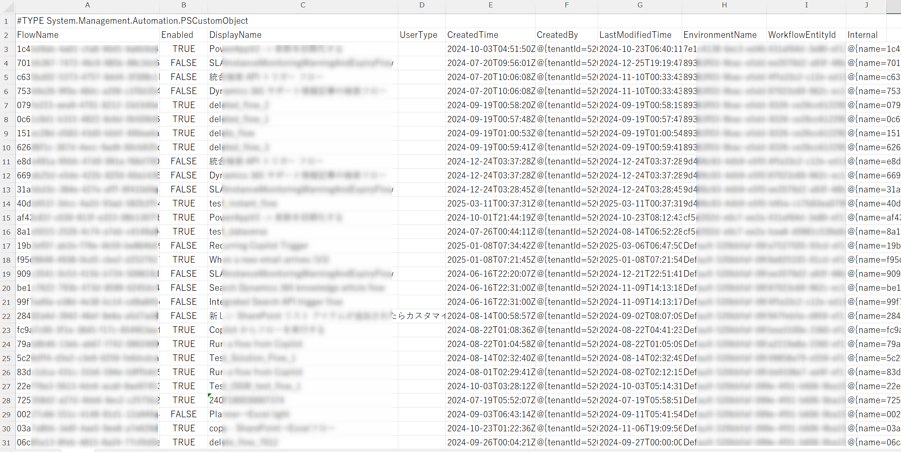
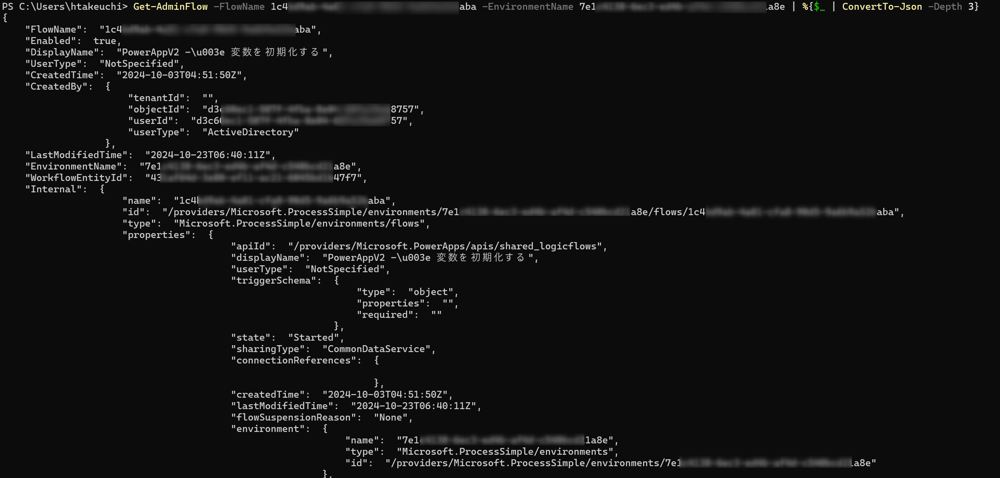
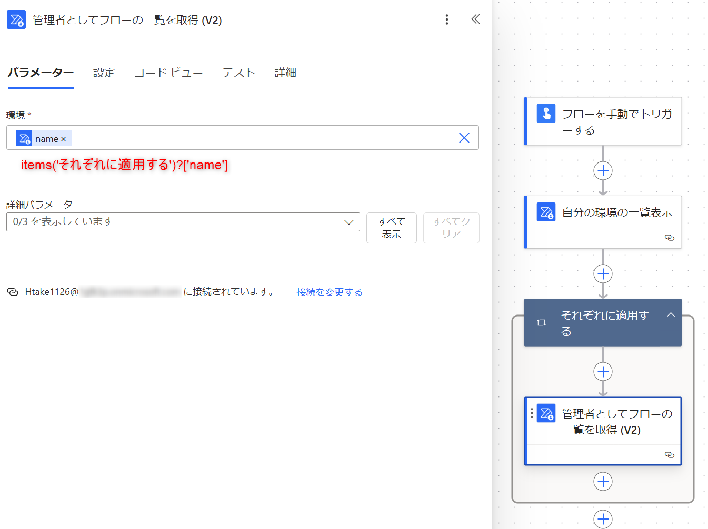
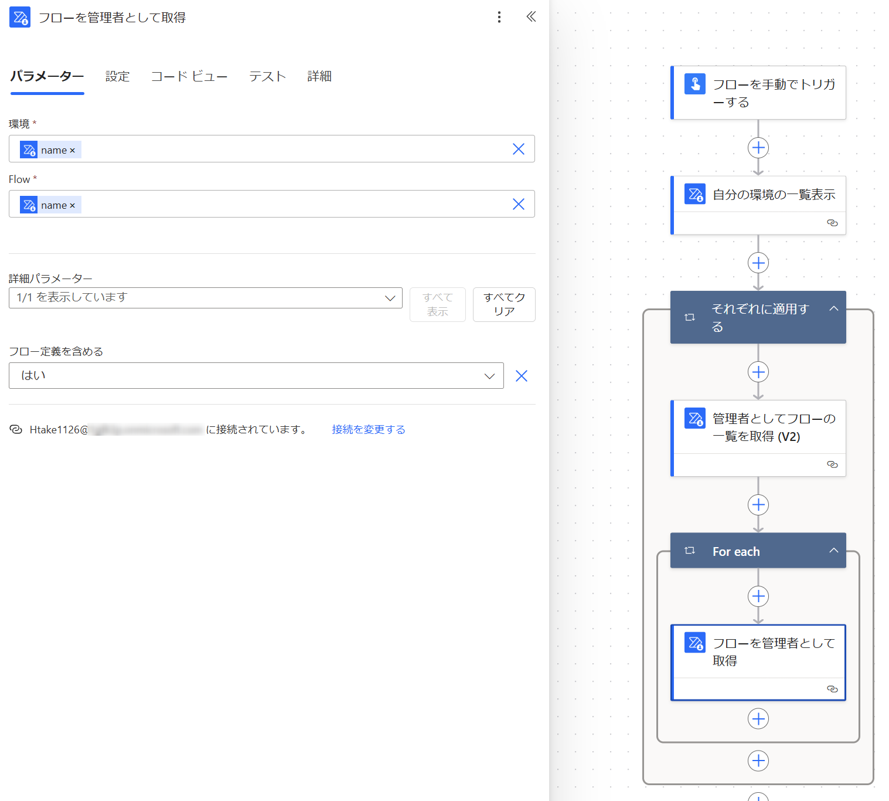

こんにちは、Power Platform サポートチームの竹内です。  
本記事では、Power Automate のクラウドフローをテナント全体で効率的に管理するために、フローの一覧を取得する 3 つの方法を詳しくご案内します。

<!-- more -->

# 目次

- [目次](#目次)
- [1. 概要](#1-概要)
- [2. クラウドフローの一覧を取得する方法](#2-クラウドフローの一覧を取得する方法)
  - [2-1. テナントレベルの分析を利用する](#2-1-テナントレベルの分析を利用する)
  - [2-2. PowerShell を利用する](#2-2-powershell-を利用する)
  - [2-3. Power Automate Management コネクタを利用する](#2-3-power-automate-management-コネクタを利用する)
- [まとめ](#まとめ)

<a id='1-概要'></a>

# 1. 概要
Power Automate をご利用いただく際、管理者がテナント内で作成されたすべてのクラウドフローを把握することについて多くお問い合わせを頂いております。  
本記事では、テナント全体のフローを一元的に把握するための具体的な方法を解説します。  
なお、本記事は管理者 (グローバル管理者、Power Platform 管理者) が実行することを想定しております。  

> [!IMPORTANT]  
> 本記事で紹介しているサンプルコードをご利用いただく際には、本記事末尾に記載のある免責事項を先にご確認ください。    


<a id='2-クラウドフローの一覧を取得する方法'></a>

# 2. クラウドフローの一覧を取得する方法
本記事では、クラウドフローの一覧を取得する具体的な方法として以下の3つを説明します。

- テナントレベル分析
- PowerShell スクリプト
- Power Automate Management コネクタ

<a id='2-1-テナントレベルの分析を利用する'></a>

## 2-1. テナントレベルの分析を利用する

> [!IMPORTANT]  
> この方法は事前にテナントレベルの分析を有効にする必要がございます。  
> 有効にする方法については下記の公開情報をご参照ください。  
> [テナント レベルでの分析 - Power Platform | Microsoft Learn](https://learn.microsoft.com/ja-jp/power-platform/admin/tenant-level-analytics#how-do-i-enable-tenant-level-analytics)


> [!NOTE]  
> この方法は削除済みのフローを取得することはできません。  

1. [Power Platform 管理センター](https://admin.powerplatform.microsoft.com) にサインインします。
2. 左側メニューの [分析] > [Power Automate] を選択します。
3. 表示されるダッシュボードからフローの使用状況や一覧を確認できます。
4. 特にテナント内のフロー一覧を取得する場合、[概要] > [在庫] タブをご確認ください。

  


テナントレベルの分析の詳細については下記の公開情報をご参照ください。  
[Power Automate のテナント レベルの分析 - Power Platform | Microsoft Learn](https://learn.microsoft.com/ja-jp/power-platform/admin/power-automate-analytics-reports)  

<a id='2-2-powershellを利用する'></a>

## 2-2. PowerShell を利用する
PowerShellを使用すると、詳細なフロー情報をCSV形式でエクスポートし、分析に役立てることができます。

1. PowerShell を管理者権限で開きます。
2. 以下のコマンドを順番に実行します。

```PowerShell
Install-Module -Name Microsoft.PowerApps.Administration.PowerShell
Add-PowerAppsAccount # ここで管理者アカウントでログインしてください。
Get-AdminFlow | Export-Csv -Path "flows.csv" -Encoding UTF8
```

実行後に生成された `flows.csv` ファイルを利用し、フローの詳細を把握できます。
CSVファイルには作成者、フロー名、作成日などの詳細な情報が含まれています。  
  

> [!Note]
> Power Platform の PowerShell コマンド実行についての詳細は下記の情報をご確認ください。  
> [Power Apps と Power Automate の PowerShell サポート - Power Platform | Microsoft Learn](https://learn.microsoft.com/ja-jp/power-platform/admin/powerapps-powershell#module-installation-and-sign-in)  
> また、フロー一覧を取得するコマンドの詳細については下記の公開情報をご参照ください。  
> [Get-AdminFlow (Microsoft.PowerApps.Administration.PowerShell) | Microsoft Learn](https://learn.microsoft.com/ja-jp/powershell/module/microsoft.powerapps.administration.powershell/get-adminflow?view=pa-ps-latest)  

> [!NOTE]  
> この方法は削除後 28 日以内のフローを取得することができます。  

各フローの詳細な情報の取得がご入用である場合、下記のコマンドに対象のフローの FlowName と、そのフローが存在する環境の EnvironmentName を代入の上、実行してください。  

```PowerShell
Get-AdminFlow -FlowName *<FlowName>* -EnvironmentName *<EnvironmentName>* | %{$_ | ConvertTo-Json -Depth 3}
```

下記画面のように、フローの詳細な情報を確認することができます。  

  


また、共同所有者や実行専用ユーザーを含めた、フローに関係する人物を一覧化することがご入用である場合、下記の PowerShell コマンドのご利用をご検討ください。  
[Get-AdminFlowOwnerRole (Microsoft.PowerApps.Administration.PowerShell) | Microsoft Learn](https://learn.microsoft.com/en-us/powershell/module/microsoft.powerapps.administration.powershell/get-adminflowownerrole?view=pa-ps-latest)

上記コマンドを用いて、テナント内のフローにループ処理をする際のサンプルコードを下記に記載いたします。  
ご要件に合わせてご利用をご検討ください。  
※ご実行の前には本記事末尾の免責事項をご確認ください。  

```PowerShell
# 環境一覧を取得
$environments = Get-AdminPowerAppEnvironment
 
# 各環境のフローを取得し、オーナーロールを確認
foreach ($env in $environments) {
    $envName = $env.EnvironmentName
    Write-Output "Processing Environment: $envName"
    # フロー一覧を取得
    $flows = Get-AdminFlow -EnvironmentName $envName
    foreach ($flow in $flows) {
        $flowName = $flow.FlowName
        Write-Output "  Checking Flow: $flowName"
        # フローのオーナーロールを取得
        $ownerRoles = Get-AdminFlowOwnerRole -EnvironmentName $envName -FlowName $flowName
        # 結果を表示
        $ownerRoles | ForEach-Object {
            Write-Output "    Role: $($_.RoleType) | Principal: $($_.PrincipalObjectId)"
        }
    }
} 
```

上記コードを実行すると、下記のように各フローについて、所有者や共同所有者、実行専用ユーザーをご確認することができます。
> [!NOTE]  
> テナント内のフロー数が多い場合、処理完了までに長時間を要する可能性がございます。    

  


<a id='2-3-power-automate-management-コネクタを利用する'></a>

## 2-3. Power Automate Management コネクタを利用する
この方法はクラウドフローを用いて、テナント内のクラウドフローを一覧化することが可能です。

1. Power Automate で新規クラウドフローを作成します。
2. 任意のトリガー（例:手動）を選択します。
3. アクションに「Power Automate Management」コネクタを追加し、「管理者としてフローの一覧を取得 (V2)」アクションを選びます。
4. 取得対象の環境を選択してください。
5. アクション実行後、得られたフロー情報をExcelやメール通知など、適切な形で利用できます。

  

テナント内の全環境を対象としてクラウドフローを実行する場合、「自分の環境の一覧表示」アクションと組み合わせてください。
その場合、下記のように設定してください。

「それぞれに適用する」：outputs('自分の環境の一覧表示')?['body/value']  
「管理者としてフローの一覧を取得 (V2)」：items('それぞれに適用する')?['name']  

  
  

「Power Automate Management」コネクタの詳細は下記の公開情報をご覧ください。  
[Power Automate Management - Connectors | Microsoft Learn](https://learn.microsoft.com/ja-jp/connectors/flowmanagement/)  

また、フローの定義情報等の詳細情報までご入用である場合、「フローを管理者として取得」アクションを組み合わせることで実現可能です。  

  

> この方法は削除済みのフローを取得することはできません。

<a id='まとめ'></a>

# まとめ
上記三つの方法から、ご要件に応じて適切な方法をご選択いただき、ご利用ください。  
本記事が適切な管理の一助となりましたら幸いでございます。  


> [!IMPORTANT]  
> ===サンプルコード免責事項===    
> ・本記事で紹介しているサンプルコードは説明のためのサンプルであり、お客様の要望を直接満たすためのご提供ではございません。
> そのため、製品の実運用環境で使用されることを前提に提供されるものではありません。
> 
> ・エラー処理などは含まれておりません。また、弊社にてその動作を保証するものではございません。
> 
> ・サンプル コードおよびそれに関連するあらゆる情報は、"現状のまま" で
> 提供されるものであり、商品性や特定の目的への適合性に関する黙示の保証も含め、
> 明示、黙示を問わずいかなる保証も付されるものではありません。
> 
> ご使用の際には、十分にご検証いただき、ご使用くださいますようお願い申し上げます。
> 
> マイクロソフトは、お客様に対し、サンプル コードを使用および改変するための
> 非排他的かつ無償の権利ならびに本サンプル コードをオブジェクト コードの形式で
> 複製および頒布するための非排他的かつ無償の権利を許諾します。
> 
> 但し、お客様は下記に同意するものとします。
> (1) サンプル コードが組み込まれたお客様のソフトウェア製品のマーケティングのために
>     マイクロソフトの会社名、ロゴまたは商標を用いないこと
> (2) サンプル コードが組み込まれたお客様のソフトウェア製品に有効な著作権表示をすること
> (3) サンプル コードの使用または頒布から生じるあらゆる損害 (弁護士費用を含む) に
>     関する請求または訴訟について、マイクロソフトおよびマイクロソフトの取引業者に対し補償し、
>     損害を与えないこと

---

※ 本記事の内容は執筆時点の情報に基づいています。最新の情報については公式ドキュメントも合わせてご確認ください。

