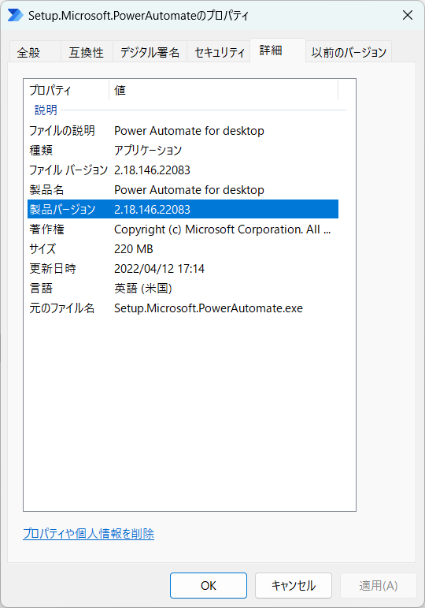
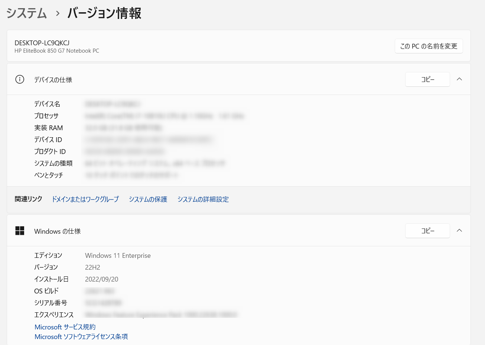
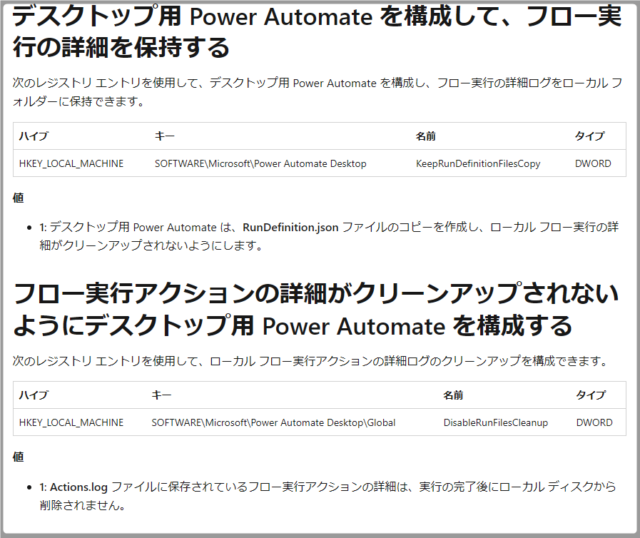
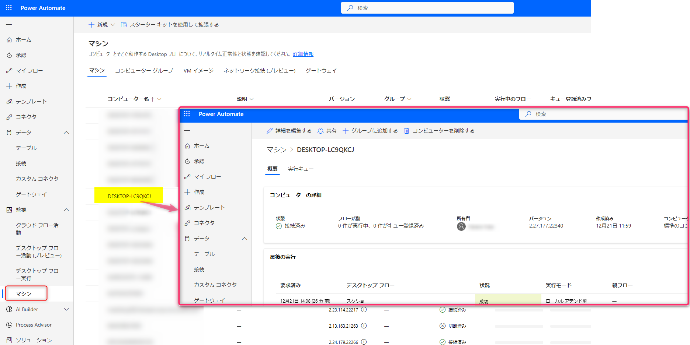
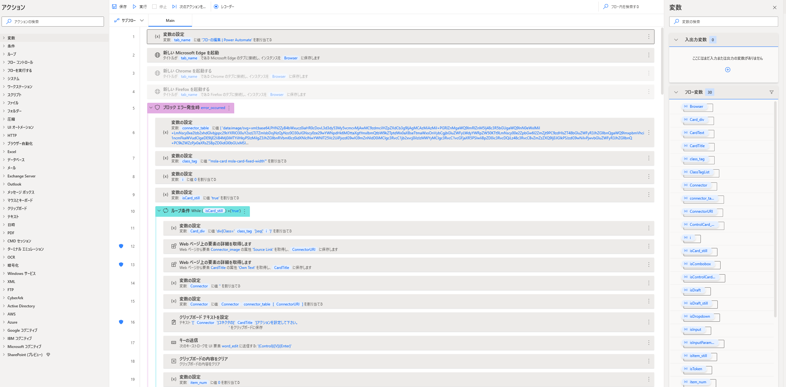

こんにちは。Power Platform サポートの原野です。  
本記事では Power Automate for desktop 関連のお問い合わせの際の、情報取得手順についてご案内いたします。

<!-- more -->
# 目次

1. [概要](#anchor-intro)
1. [情報取得手順詳細](#anchor-how-to-collect)
      1. [Power Automate for desktop のバージョン](#anchor-pad-version)
      1. [OS のバージョン](#anchor-os-version)
      1. [コンピューター ログ](#anchor-computer-log)
      1. [Fiddler ログ](#anchor-fiddler-log)
      1. [マシン登録の情報](#anchor-machine-information)
      1. [リモートデスクトップ設定](#anchor-remote-desktop-setting)
      1. [レジストリの設定](#anchor-registry-setting)
      1. [Power Automate for desktop のフロー](#anchor-desktopflow)
      1. [デスクトップ フローの実行履歴 URL](#anchor-desktopflow-url)
      1. [クラウド フローの実行履歴 CSV](#anchor-cloudflow-run-history-csv)
      1. [クラウド フローのアクションの未加工入力と未加工出力](#anchor-cloudflow-raw-input-output)

# 概要

Power Automate for desktop に関するサポートサービスのお問い合わせの際の、情報取得手順についてご案内致します。

# 情報取得手順詳細

## 1. Power Automate for desktop のバージョン
Power Automate for desktop のバージョンが確認できる画面キャプチャをご提供ください。
1. Power Automate for desktop > ヘルプ > バージョン情報 を選択します。  
     
2. 以下の画面キャプチャを取得してご提供ください。  
 

なお、Power Automate for desktop のバージョンは以下からもご確認いただけます。 
* Power Automate for desktop の exe ファイル > プロパティ > 詳細  
 
  

## 2. OS のバージョン
OS のバージョンが確認できる以下の画面キャプチャをご提供ください。
* システム > バージョン情報 を開き以下の画面キャプチャを取得します。
  

## 3. コンピューター ログ
コンピューター ログの取得方法は大きく分けて３つございます。  
Power Automate コンピューター ランタイムをご利用いただいている場合は a) の方法から、ご利用いただけない場合は b) の方法からログを取得してご提供ください。    

また、RunDefinition.json ファイルと Actions.log ファイルを保持するレジストリを登録いただいている場合は、c) の方法で取得できるログも併せてご提供ください。

### a) Power Automate コンピュータ ランタイムからログを収集する
フロー実行後のログの出力に関して、過去３日間のログが Power Automate コンピューター ランタイムから出力いただけます。  
Power Automate コンピュータ ランタイムからエクスポートしたzipファイルをご提供ください。  
* Power Automate コンピュータ ランタイム > トラブルシューティング > ログのエクスポート を選択します。  

公開情報にも手順の記載がございますので、ご参照いただけますと幸いです。  
[デスクトップ フローのトラブルシューティング - Power Automate | Microsoft Learn](https://learn.microsoft.com/ja-jp/power-automate/desktop-flows/troubleshoot#collect-machine-logs)

### b) 管理者権限のあるアカウントでフォルダからログを収集する
管理者権限のあるアカウントで以下のフォルダ内にあるファイルを zip ファイルにまとめてご提供ください。  
* フォルダ：%ProgramData%\Microsoft\Power Automate\Logs

### c) レジストリを設定いただいている場合に収集できるログ
以下のレジストリを登録いただきマシンを再起動した上で、以下でご案内するフォルダに格納されているファイルを取得してご提供ください。

1. 必要となるレジストリを確認する  
以下の公開情報を参考に、必要となるレジストリが登録されていることをご確認ください。  
公開情報にも手順の記載がございますので、ご参照いただけますと幸いです。  
[Power Automate でのガバナンス - Power Automate | Microsoft Learn](https://learn.microsoft.com/ja-jp/power-automate/desktop-flows/governance#configure-power-automate-for-desktop-to-keep-the-flow-run-details)

	
2．ファイルを取得する  
以下のフォルダに格納されているファイルを取得し、ご提供ください。  
* フォルダ：%localappdata%\Microsoft\Power Automate Desktop\Scripts\{scriptid}\Runs\{runid}  
a) Actions.log：デスクトップ フローに設定された各アクションの実行結果が記載されたログです。  
b) RunDefinition.json：デスクトップ フローの実行開始日、実行終了日、フローの実行結果(成功、失敗)が記載されたログです。  

{ScriptId} にはデスクトップ フローの ID を、{RunId} にはフローの実行 ID を挿入します。  

<デスクトップフローの ID とフローの実行 ID の確認方法>  
Power Automateポータルのデスクトップ フローの実行履歴からデスクトップフローの ID とフローの実行 ID を確認いただけます。

## 4. Fiddler ログ
以下の採取手順をご確認の上でログファイルをご提供ください。  
なお、情報取得の際はキャプチャ対象を Non-Browser に変更いただくようお願いいたします。  
[Fiddler ログの採取手順 (microsoft.com)](https://social.technet.microsoft.com/Forums/ja-JP/fe5f977a-2992-44c3-b643-38ad570a3d18/fiddler-12525124641239825505214622516338918?forum=DCRMSupport)

## 5. マシン登録の情報
該当のマシンの登録情報が確認できる画面キャプチャをご提供ください。

1. Power Automate ポータルの画面 > 監視 > マシン

1. マシンまたはコンピューター グループから該当のコンピューターの詳細が分かる画面キャプチャをご提供ください。

  

## 6. リモートデスクトップ設定 
実行される端末のリモートデスクトップの設定の画面キャプチャをご提供ください。 
* 実行される端末 > システムのプロパティ > リモートデスクトップ  

## 7. レジストリの設定  
以下のキーのレジストリの設定が確認できる画面キャプチャをご提供ください。   
* 実行される端末 > システムのプロパティ > コンピューター\HKEY_LOCAL_MACHINE\SOFTWARE\Microsoft\Power Automate Desktop   
  
※弊社のサポートエンジニアから別のキーの画面キャプチャを依頼された場合は、指示されたキーの画面キャプチャのご提供をお願いいたします

## 8. Power Automate for desktop のフロー  
デスクトップ フローのデスクトップ フローの編集画面から、フロー内のアクション (Ctrl + C) をコピーし、テキストエディター (Ctrl + V) に貼り付けてご提供ください。 
  
一度にコピーできるフローは 1 つだけであるため、フロー内に複数のサブフローがある場合は、サブフローごとに上記の手順を繰り返し、アクションを個別のテキスト ファイルに保存した上でご提供ください。  

ソリューションのエクスポートの詳細に関して、以下に記載がございますのでご参照いただけますと幸いです。    
[Power Automate お問い合わせの際の情報取得手順 | Japan Dynamics CRM & Power Platform Support Blog (jpdynamicscrm.github.io)](https://jpdynamicscrm.github.io/blog/powerautomate/helpful-information-for-powerautomate-sr/#anchor-flowpackage-in-solution)  

※なお、フロー内のアクションをコピーする方法では、コピー対象は、デスクトップフローのステップ情報でございます。  
そのため、入出力変数の定義やフロー内のアクションで使用していない UI 要素など一部の情報がコピーの対象外となります。  
エラーが発生しているアクションで入出力変数を使用している場合や、デスクトップ フロー全体の容量等を確認する必要がある場合は、弊社のサポートエンジニアから以下のソリューションごとエクスポートする方法での共有をお願いする可能性がございます。

< ソリューションごとエクスポートする方法 >  
弊社のサポートエンジニアからソリューションごとエクスポートする方法を依頼された場合は、エクスポートしたソリューション ファイル (zip) をご提供ください。
弊社環境にインポートできるよう、依存関係のあるコンポーネントを含めてご提供をお願い致します。  
1. コピー元テナントでソリューション メニューより、新しいソリューションを追加します。  
2. 作成したソリューション > 既存の追加 から、該当のデスクトップ フローを追加します。  
3. 作成したソリューションの概要画面 >  エクスポート からエクスポートしたソリューション ファイル (zip) をご提供ください。  

 
## 9. デスクトップ フローの実行履歴 URL  
1. マイ フロー>デスクトップ フローから該当のフローを選択します。実行履歴から該当の日時を選択します。  
  
1. URLをコピーしてご提供ください。
エラー時にフローが実行されず実行履歴に残っていない場合は、１の画面のURLをコピーしてご提供いただけますと幸いです。

## 10. クラウド フローの実行履歴 CSV
1. デスクトップ フローを呼び出したクラウドフローの詳細画面を開き、「28 日間の実行履歴」から「すべての実行」を選択します。

2. 「.csv ファイルを取得」を選択し、取得した CSV ファイルをご提供ください。

クラウド フローの実行履歴 CSV の取得方法の詳細に関して、以下に記載がございますのでご参照いただけますと幸いです。  
[Power Automate お問い合わせの際の情報取得手順 | Japan Dynamics CRM & Power Platform Support Blog (jpdynamicscrm.github.io)](https://jpdynamicscrm.github.io/blog/powerautomate/helpful-information-for-powerautomate-sr/#anchor-flowrunhistory-csv)

## 11. クラウド フローのアクションの未加工入力と未加工出力

実行履歴から「デスクトップ用 Power Automate で構築したフローを実行する」アクション等のデスクトップ フローを呼び出すアクションを展開します。  
未加工入力および未加工出力として表示されるテキストをコピーし、ご提供ください。  
  

クラウド フローのアクションの未加工入力と未加工出力の取得方法の詳細に関して、以下にも記載がございますのでご参照いただけますと幸いです。  
[Power Automate お問い合わせの際の情報取得手順 | Japan Dynamics CRM & Power Platform Support Blog (jpdynamicscrm.github.io)](https://jpdynamicscrm.github.io/blog/powerautomate/helpful-information-for-powerautomate-sr/#anchor-raw-input-output)

---

## 補足

本手順は執筆時点でのユーザー インターフェイスを基に紹介しています。バージョンアップによって若干の UI の遷移など異なる場合があります。その場合は画面の指示に従って進めてください。

---
