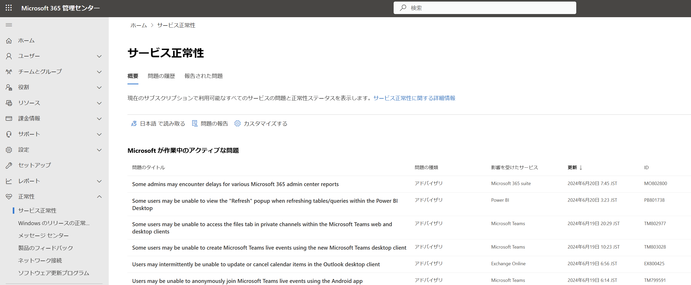
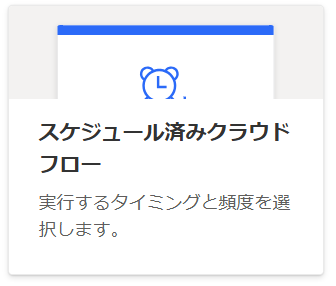
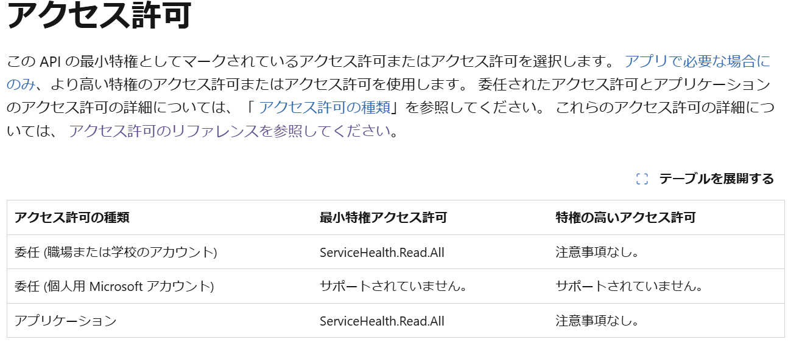
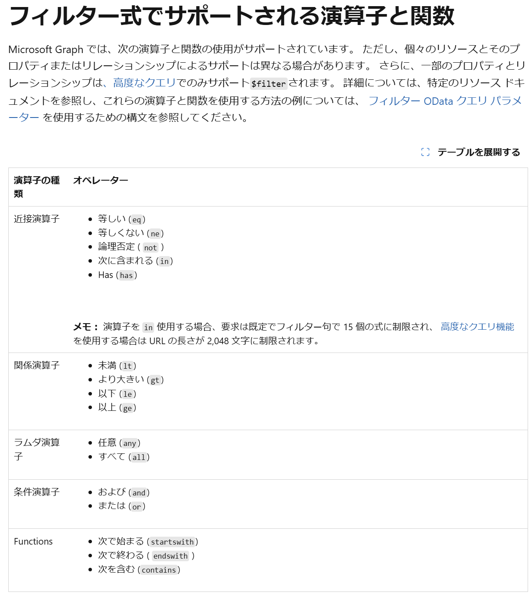

# Power Automate クラウド フローを使用して、Microsoft のサービス正常性に関する更新情報を取得する方法

こんにちは、Power Platform サポートチームの竹内です。
この記事では、Power Automate クラウドフローと Microsoft Graph API を使用して、Microsoft 365 管理センター内にて発信されるサービス正常性の更新情報を取得する方法についてご紹介いたします。

<!-- more -->
# 目次

1. [はじめに](#anchor-intro)
2. [本記事で構築するフローの概要](#anchor-overview-of-the-flow)
3. [Microsoft Graph API を使用して、サービス正常性情報を取得する](#anchor-retrieve-health-data)
4. [取得したサービス正常性情報を活用する](#anchor-use-health-data)

<br>

<a id='anchor-Intro'></a>

# はじめに
---
## Microsfot 365 管理センターのサービス正常性情報とは
Microsfot 365 管理センターのサービス正常性（[リンク](https://admin.microsoft.com/Adminportal/Home?#/servicehealth)） とは、利用者のサブスクリプションで利用可能なすべてのサービスの問題と正常性ステータスを表示することができます。

下画像のように各サービスで発生している問題の有無を表すステータスや、何か問題がある場合にはその問題の内容と Microsoft がその問題に対して取り組んでいることを Microsoft が公表しています。  

  

<br>

## 今回の目的
本記事では利便性向上のため、クラウドフローを用いて、サービス正常性の情報の中から特定のサービスに発生した問題の情報のみを取得する方法についてご紹介します。更新情報を定期的に監視するフローを構築することで、常に最新の正常性情報を取得することができます。また Microsoft Teams 等の他のコネクタを用いることにより、取得した情報を通知するなどの応用をすることも可能となります。  
サービス正常性情報の取得には標準のコネクタが用意されておりませんので、 今回は Microsoft Graph APIを用います。Power Automate における Microsoft Graph API の利用方法等についての詳細はこちらの記事（[Power Automate クラウド フローを使用して、Microsoft Graph API を実行する方法](https://jpdynamicscrm.github.io/blog/powerautomate/Graph-API/#HTTP-%E3%82%B3%E3%83%8D%E3%82%AF%E3%82%BF%E3%82%92%E4%BD%BF%E7%94%A8%E3%81%99%E3%82%8B) ）をご参照ください。  

<br>

## 必要なライセンス
---
今回作成するフローではプレミアム コネクタを使用します。そのため、本記事でご紹介するフローを使用するためにはプレミアム コネクタが使用可能なライセンスをお持ちいただく必要がございます。ライセンスの詳細についてはこちらのドキュメント（[Power Automate の価格 | Microsoft Power Platform](https://www.microsoft.com/ja-jp/power-platform/products/power-automate/pricing)）をご参照ください。  

<br>

<a id='anchor-overview-of-the-flow'></a>

# 本記事で構築するフローの概要
---
今回は定期的にフローを実行して更新情報の有無を確認するためのフローを作成します。
そのため、スケジュール済みクラウドフローを構築します。

  

構築するフローの全体像は下画像のようです。  

  

まず、[繰り返し] コネクタで最新情報を取得するための実行間隔を設定します。ここでは例として 15 分と設定します。  
次に、[過去の時間の取得] コネクタでその設定した時間間隔分、前回実行したときから時間が経っているので、前回実行した時間を取得します。先ほどの例ですと、15 分前の時間を取得します。  
そして、[HTTP] コネクタを使用し、サービス正常性情報を取得します。ここについては詳細を後述いたします。  
最後に、[JSON の解析]コネクタを使用することで、取得した情報をその後のフローで利用しやすい形にパースします。  
以上が今回構築するフローの全体像となります。ここからは、今回のポイントである、[HTTP] コネクタ内で Microsoft Graph API を使用して、サービス正常性情報を取得することについて解説いたします。  

<br>

<a id='anchor-retrieve-health-data'></a>

# Microsoft Graph API を使用して、サービス正常性情報を取得する
---
## サービス正常性情報の一覧表示を取得する
今回は、[問題の一覧表示](https://learn.microsoft.com/ja-jp/graph/api/serviceannouncement-list-issues?view=graph-rest-1.0&preserve-view=true&tabs=http) という API を利用します。この API に対するアクセス許可は下画像のようになっております。

  

今回は、アプリケーションのアクセス許可を使用して Microsoft 365 管理センターにアクセスします。フローに付与した認証情報を使用することで、ユーザーに割り当てられたサブスクリプションに依らず、任意のサブスクリプションでのサービス正常性情報を取得することができるようになります。そこで今回は HTTP コネクタを使用して API にアクセスします。  

アクセス許可や、それによるコネクタの選択についての詳細については、[こちらの記事（Power Automate クラウド フローを使用して、Microsoft Graph API を実行する方法）](https://jpdynamicscrm.github.io/blog/powerautomate/Graph-API/#HTTP-%E3%82%B3%E3%83%8D%E3%82%AF%E3%82%BF%E3%82%92%E4%BD%BF%E7%94%A8%E3%81%99%E3%82%8B) をご参照ください。  

## 取得した一覧情報にフィルタをかけて、所望の情報のみを取得する
上述の方法で取得した一覧情報は全サービスの問題情報になります。この中から、所望のサービスに関する情報のみを抽出する方法についてご紹介いたします。

Microsoft Graph では、[こちらのドキュメント](https://learn.microsoft.com/ja-jp/graph/query-parameters) に記載があるように、クエリパラメーターを使用して応答をカスタマイズすることができます。クエリパラメーターとは、取得した応答情報に対して操作を加えるためのパラメータであり、必要な情報のみを抽出したり、データの簡単な加工を行うことができるものです。  

今回はクエリパラメーターの中でも [\$filter クエリパラメーターを使用する](https://learn.microsoft.com/ja-jp/graph/filter-query-parameter?tabs=http) ことで、取得した一覧情報にフィルタをかけます。$filter クエリパラメーターでサポートされる演算子などは上記リンクや下記画像をご参照ください。  

  

例として、ここでは Dynamics と Power Platform （除く Power BI）のサービスに関する情報のみを取得する際の API をご紹介いたします。後述の取得できる「サービス正常性情報」の項目と合わせてご参照ください。

`
https://graph.microsoft.com/v1.0/admin/serviceAnnouncement/issues?$filter=startDateTime gt @{body('過去の時間の取得')} and (contains(service, 'Dynamics') or contains(service,'Power ') or not contains(service, 'Power BI'))
`

## 取得できるサービス正常性情報
ここまでの方法で取得できるサービス正常性の情報（JSON データ）は以下のようになります。
（[問題の一覧表示 - 応答](https://learn.microsoft.com/ja-jp/graph/api/serviceannouncement-list-issues?view=graph-rest-1.0&preserve-view=true&tabs=http#response-1) から引用）
```{JSON}
{
  "@odata.context": "https://graph.microsoft.com/v1.0/$metadata#admin/serviceAnnouncement/issues",
  "@odata.nextLink": "https://graph.microsoft.com/v1.0/admin/serviceAnnouncement/issues?$skip=100",
  "value": [
    {
      "startDateTime": "2020-11-13T21:00:00Z",
      "endDateTime": "2020-11-14T17:15:00Z",
      "lastModifiedDateTime": "2020-11-14T18:20:24.767Z",
      "title": "Limited number of users unable to send or receive email through the Exchange Online service",
      "id": "EX226792",
      "impactDescription": "Users may have been unable to send or receive email through the Exchange Online service.",
      "classification": "Incident",
      "origin": "Microsoft",
      "status": "ServiceRestored",
      "service": "Exchange Online",
      "feature": "Mailflow - delayed delivery from Internet",
      "featureGroup": "E-Mail timely delivery",
      "isResolved": true,
      "details": [
        {
          "name": "NotifyInApp",
          "value": "True"
        }
      ],
      "posts": [
        {
          "createdDateTime": "2020-11-12T07:07:38.97Z",
          "postType": "Regular",
          "description": {
            "contentType": "Html",
            "content": "Title: Limited number of users unable to send or receive email through the Exchange Online service\n\nUser Impact: Users may be unable to send or receive email through the Exchange Online service."
          }
        }
      ]
    }
  ]
}
```
上記応答中の "title" がサービスに発生した問題のタイトル（概要）を示しており、その内容や原因調査に関する更新情報があると "posts" の配列の中に履歴投稿が追記されていきます。  
各プロパティの更なる詳細については、こちらのドキュメント（[serviceHealthIssue リソースの種類 - Microsoft Graph v1.0 | Microsoft Learn](https://learn.microsoft.com/ja-jp/graph/api/resources/servicehealthissue?view=graph-rest-1.0#properties) ）をご参照ください。

<br>

<a id='anchor-use-health-data'></a>

# 取得したサービス正常性情報を活用する
---
ここまでで取得したサービス正常性の応答情報 JSON データをクラウドフローで活用したい場合、[JSONの解析] コネクタを使用して解析します。
なお、JSONの解析コネクタの詳細についてはこちらのドキュメント（[データの操作の実行 - Azure Logic Apps | Microsoft Learn](https://learn.microsoft.com/ja-jp/azure/logic-apps/logic-apps-perform-data-operations?tabs=standard#parse-json-action)） をご参照ください。

解析したデータの中から、必要なプロパティを選択して他のコネクタで利活用することができます。例えば、取得した情報を Microsoft Teams のメッセージ内に含めて任意のチャネルに投稿したり、Microsoft Outlook からメールを送信することなどができます。  

<br>

---
# おわりに

Power Automate を用いて情報の収集時に必要な一連の操作を自動化することで、業務の効率化を図ることができます。
今回紹介した例は Graph API を利用してサービス正常性情報の取得をしましたが、取得する情報を変更したりすることによって様々な応用をすることができます。 ぜひ、色々なシーンで活用してみてください。

この記事が皆さまの自動化の一助になりましたら幸いです。
