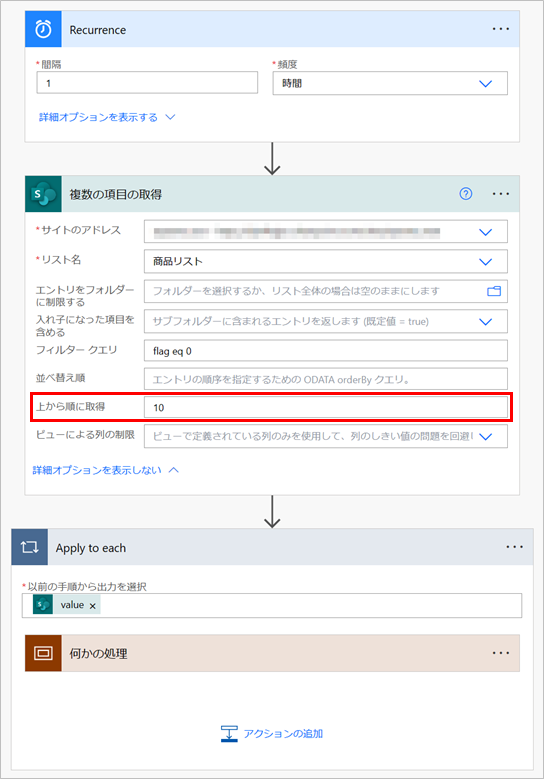

# 低速フローのトラブル シューティング

こんにちは、Power Platform サポートの瀬戸です。
今回は、「クラウド フローの処理がいつまで経っても終わらない」ときに試していただける改善策をご案内いたします。

<!-- more -->

## なぜ「いつまで経っても終わらない」のか
時間がかかるようなアクションは使っていないはずなのに、今まではすぐに処理が完了していたのに、クラウド フローが何日経っても完了しない。

そんなときは、フローが Power Automate のスループットの制限に抵触した可能性が考えられます。

フローが制限に抵触すると、そのフローは実行中でも低速の状態になります。制限を超えないような速度で実行されるようになるので、数日たってもフローが実行中…ということがよくあります。

そこで今回は、フローの低速状態を避けるための改善策をご案内いたします。

■■ 目次 ■■
1. [Power Automate の制限](#power-automate-の制限)

## Power Automate の制限
改善策の前に、Power Automate の制限についてご案内いたします。
Power Automate には、サービスを皆さまへ安定的に提供するために、様々な制限が設けられています。

参考：[制限と構成 - Power Automate | Microsoft Learn](https://learn.microsoft.com/ja-jp/power-automate/limits-and-config)

中でも、抵触することが多いと感じるものに「24 時間あたりのアクション要求数」の制限が挙げられます。

※ 「24 時間あたりのアクション要求数」の制限の例  
|ライセンス|パフォーマンス プロファイル|24時間あたりのアクション要求数|
|---|---|---|
|Power Automate Free Office 365 に含まれる使用権　など|低|10,000|
|Power Automate per user など|中|100,000|
|Power Automate per flow|高|500,000|

パフォーマンス プロファイルが「低」の場合、制限値は「10,000」です。
数千件のデータを扱うとあっという間に抵触してしまいます。
例えば、1,000 行の CSV ファイルを読み込み、Apply to each で行ごとに処理をする場合、Apply to each の内側のアクションが 10 個あるだけで、実行されるアクション要求数が 10,000 を超えてしまいます。

### フローのアクション要求数を数えてみる
「アクション要求数」は、大まかに言うと「アクションの数」です。

詳しい数え方は、下記公開情報をご参照ください。(アクション要求数と Power Platform 要求数は数え方が同じです)  
[「何が Power Platform 要求と見なされますか?」](https://learn.microsoft.com/ja-jp/power-platform/admin/power-automate-licensing/types#what-counts-as-power-platform-request)

フローのアクション要求数が求められたら、以下の式で 24時間あたりのアクション要求数が分かります。

式： フローのアクション要求数 × 24時間あたりのフロー実行回数 ＝ 24時間あたりのアクション要求数

実際のアクション要求数は再試行やページングで増えますが、この時点でフローの制限値を超えている場合は、対策が必要です。

## 改善策
### フローの実行回数を減らす
例えば、1 時間に 1 回起動するスケジュールトリガーを、2 時間に 1 回起動するよう変更します。

1 番簡単に実施できて最も効果がありますので、実行頻度の削減はぜひご検討ください。

### 繰り返しの回数を減らす
Apply to each や Do until で処理するデータが数百件、数千件に及ぶ場合は、その繰り返し回数を減らすことをご検討ください。以下に、繰り返し回数を減らすための案をご紹介いたします。

#### フィルター クエリを使う
繰り返しを行う前に対象のデータ件数を減らしておけば、繰り返しの回数を減らせます。
SharePoint コネクタの「複数の項目の取得」アクションなど、フィルター クエリを指定できるアクションでは、できる限りフィルタークエリを使用して不要なデータを取得しないようにしましょう。

※ フィルター クエリを使った例  

参考：

* SharePoint
  * [フィルター クエリの例](https://learn.microsoft.com/ja-jp/sharepoint/dev/business-apps/power-automate/guidance/working-with-get-items-and-get-files#filter-queries)
  * [SharePoint REST サービスでサポートされる OData クエリ演算子](https://learn.microsoft.com/ja-jp/sharepoint/dev/sp-add-ins/use-odata-query-operations-in-sharepoint-rest-requests#odata-query-operators-supported-in-the-sharepoint-rest-service)
* Excel
  * [「フィルタリング機能」の行に、サポートされる OData クエリの記載があります](https://learn.microsoft.com/ja-jp/connectors/excelonlinebusiness/#known-issues-and-limitations-with-actions)
* Dataverse
  * [行を一覧にする アクションの使用例](https://learn.microsoft.com/ja-jp/power-automate/dataverse/list-rows#filter-rows)
  * [Web API の観点での OData クエリの例](https://learn.microsoft.com/ja-jp/power-apps/developer/data-platform/webapi/query-data-web-api#%E7%B5%90%E6%9E%9C%E3%81%AE%E3%83%95%E3%82%A3%E3%83%AB%E3%82%BF%E3%83%BC)

#### アレイのフィルター処理 を使う
フィルター クエリを使えない場合は、代わりに「データ操作」コネクタの「アレイのフィルター処理」アクションを使って、繰り返しを行う前にデータ件数を減らすことができます。

※ アレイのフィルター処理を使った例  

その他にも、処理が異なるリストをあらかじめ 2 つに分けておく、といった活用もできます。繰り返し処理内の「条件」アクションが必要なくなるので、アクション要求数の削減になります。

※ 処理が異なるリストを分けておく例  

参考：[Power Automate でデータ操作を使用する (ビデオを含む) - Power Automate | Microsoft Learn](https://learn.microsoft.com/ja-jp/power-automate/data-operations#use-the-filter-array-action)

#### 1 度に繰り返す回数を減らす
例えば、1 度に 全件処理するのではなく、10 件の データを 1 時間に 1 回処理するよう設計します。

フローが制限に抵触しないよう、意図的に処理をゆっくりにする考え方です。フィルター クエリと合わせて使用し、未処理のデータだけを取得する必要があります。

※ 10 件だけ処理する例

#### 集計に XPath を活用する
例えば SharePoint リストの特定の列の合計を求めたい場合、Power Automate には配列を 1 度に集計するようなアクションや関数が無いため、繰り返し処理で集計する必要があります。

しかし、Power Automate の関数、xml と xpath を活用すると繰り返し処理無しで集計ができます。
つまりアクション要求数の削減になります。

詳しい実現方法は以下の記事で解説しておりますので、ご参照ください。

■■■記事へのリンク■■■

### CSV ファイルの利用を避ける
アクション要求数を削減する観点では、フローでの CSV ファイルの読み込みは避けることをお勧めいたします。
Power Automate には CSV ファイルを 1 つのアクションで読み込むような機能はご用意がございません。
そのため、CSV ファイルを読み込む処理を作りこむ必要があります。

参考：[Power Automate で CSV ファイルを取り込む | Japan Dynamics CRM & Power Platform Support Blog](/blog/powerautomate/Import-Csv-With-Standard-Connectors/)

上記記事の例からも分かる通り、変数を用意して…条件分岐して…とやっているだけでアクション要求数を消費してしまうので、アクション要求数を削減したい場合は、できるかぎり SharePoint リスト、Dataverse をはじめとしたデータベース、Excel ファイルなどの利用をお勧めします。

### 待機を入れて実行を遅くする。
　→スケジュールトリガー(1時間に1回など)や自動トリガーが高頻度で起動する場合は効果が薄そう）
　→コネクタの制限とか、短時間あたりの制限を避けるには効果がある。

## 最後に