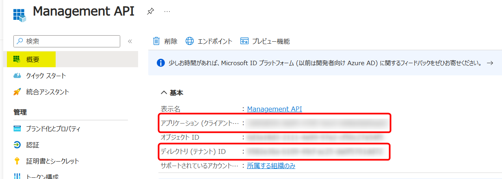
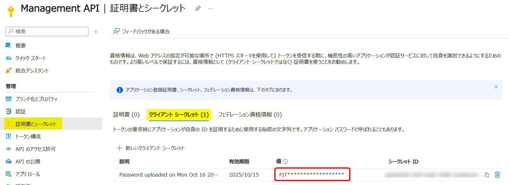
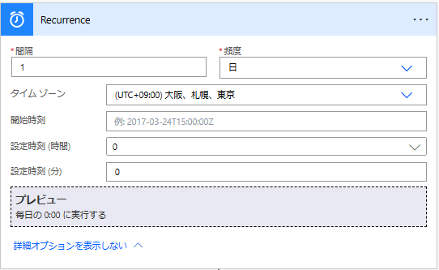
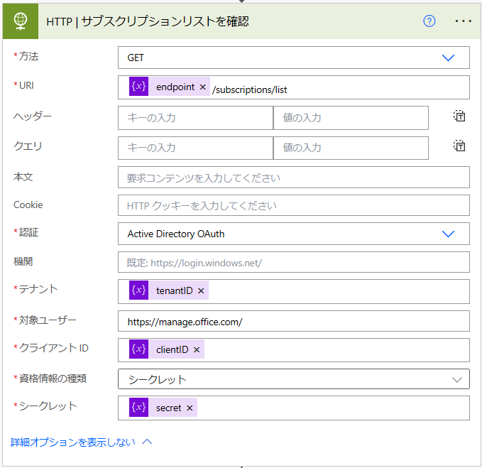
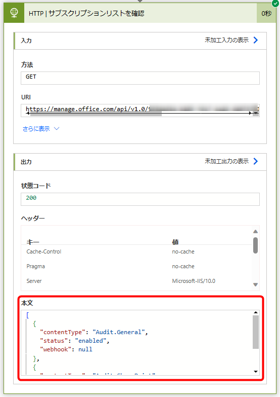
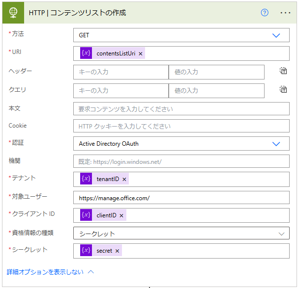
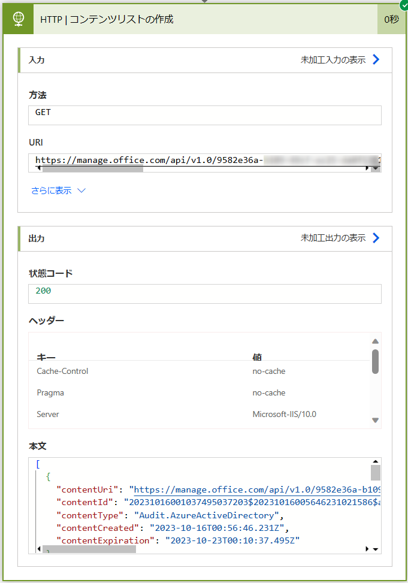
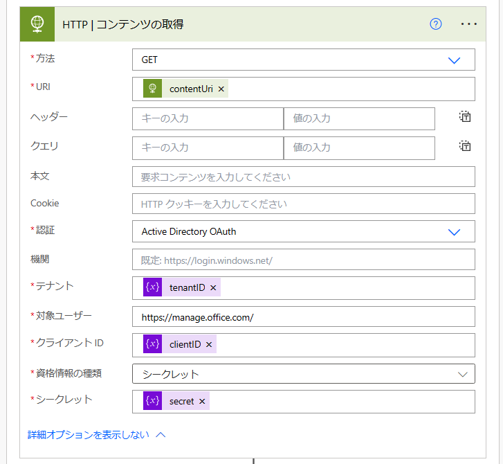
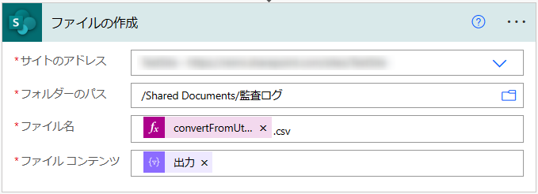

# クラウド フローで Microsoft Purview の監査ログを取得する方法

こんにちは、Power Platform サポートの清水です。  
今回は、よくお問い合わせをいただく題材の一つとして、クラウド フローを使用して、Microsoft Purview の監査ログを取得する方法について紹介します。  

2023 年 10 月現時点では、監査ログを取得できるようなコネクタ・アクションは存在しないため、監査ログを取得するには、[Office 365 Management API](https://learn.microsoft.com/ja-jp/office/office-365-management-api/) を使用する必要があります。  
少し複雑なフローになりますが、最後までお付き合いいただければと思います。  

## 必要なライセンスについて
プレミアム コネクタを使用するフローとなりますので、有償ライセンスが必要です。  
以下のいずれかのライセンス/環境があれば、フローを実行可能です。  

- Power Automate Premium (※ 旧名: Power Automate per user with attended RPA)  
- Power Automate Process
- Power Automate per user (※ 2023/8/1~ レガシー)
- Power Automate per flow (※ 2023/8/1~ レガシー)
- 従量課金制環境  

## 必要な権限について
Office 365 Management API を使用するために必要なアクセス許可を付与する際、テナント管理者の同意が必要となります。  
同意の付与には、グローバル管理者の権限が必要です。

## 手順の概要
フローは大きく 7 つのステップで構成されます。  

0. 事前準備
Office 365 Management API を使用する準備として、Azure AD へのアプリケーションの登録およびアクセス許可の付与などを行います。  
ここでは Power Automate は使用いたしません。  
1. 事前準備で取得したパラメータを変数に格納  
2. Office 365 Management API で既存のサブスクリプションの確認  
監査ログを API から取得するために、まずはサブスクリプションを開始する必要があります。  
既に開始済みで有効な状態であれば、サブスクリプションを新しく開始する必要はないので、本ステップでは、既存のサブスクリプションがあるかどうかを確認します。  
3. (既存のサブスクリプションが存在しない場合) Office 365 Management API でサブスクリプションの開始  
手順 1 で既存のサブスクリプションの一覧を取得したので、目的のサブスクリプションがないか、無効な状態の場合には、サブスクリプションを開始します。  
4. Office 365 Management API でコンテンツ リストの取得  
コンテンツ (監査ログ) 自体を取得するために、まずは取得可能なコンテンツ リストを取得する必要があります。  
このコンテンツ リストで得られた値を使用して、後続のステップでコンテンツ自体を取得していきます。
5. Office 365 Management API でコンテンツの取得  
コンテンツを取得し、変数に格納していきます。  
6. CSVファイルの作成・保存  
CSV ファイルを作成し、クラウド ストレージに保存したら完了です。  

それでは、詳細な手順について見ていきましょう。  

## 0. 事前準備
**0-1．アプリの登録**  
Office 365 Management API の利用を開始するため、[Office 365 Management API の使用を開始する](https://learn.microsoft.com/ja-jp/office/office-365-management-api/get-started-with-office-365-management-apis#register-your-application-in-azure-ad) の下記の箇所を実施してください。  

- [Azure portal を使用してアプリケーションを Azure AD で登録する](https://learn.microsoft.com/ja-jp/office/office-365-management-api/get-started-with-office-365-management-apis#use-the-azure-portal-to-register-your-application-in-azure-ad)
※リダイレクト URI は空のまま作成します。  
- [アプリケーションの新しいキーを生成する](https://learn.microsoft.com/ja-jp/office/office-365-management-api/get-started-with-office-365-management-apis#generate-a-new-key-for-your-application) 
- [アプリが Office 365 Management APIにアクセスするために必要な許可を指定します。](https://learn.microsoft.com/ja-jp/office/office-365-management-api/get-started-with-office-365-management-apis#specify-the-permissions-your-app-requires-to-access-the-office-365-management-apis)  
※今回は HTTP コネクタを使用するため、手順 3 では「b. アプリケーションのアクセス許可」を選択してください。

手順の完了後、フローで使用する以下 3 つの値を控えておきます。  

- アプリケーション (クライアント) ID  
- ディレクトリ (テナント) ID  

- 作成したシークレットの値  


**0-2．Office 365 Management API のエンドポイントの確認**  
Office 365 Management API のエンドポイントを以下から確認します。  
[アクティビティ API の操作](https://learn.microsoft.com/ja-jp/office/office-365-management-api/office-365-management-activity-api-reference#activity-api-operations)  

今回使用する検証用のテナントでは、パブリック クラウドを使用しているため、"Enterprise プラン" の URL を使用します。  
```HTTP
https://manage.office.com/api/v1.0/{tenant_id}/activity/feed/{operation}
```
- `{tenant_id}` 部分には、ご使用のテナント ID を指定します。  
- `{operation}` 部分には、これから使用する API の "パス" を指定します。  

**0-3．Office 365 Management API のコンテンツタイプの確認**  
このフローで取得したい監査ログの種類を以下から確認します。  
[Office 365 管理アクティビティ API の操作](https://learn.microsoft.com/ja-jp/office/office-365-management-api/office-365-management-activity-api-reference#working-with-the-office-365-management-activity-api)  

本ブログでは、`Audit.AzureActiveDirectory` を対象とすることとします。  

## 1. 事前準備で取得したパラメータをフローの変数に格納
ここからフローの作成に入っていきます。  

**1-1．トリガーを決定し、フローを一から作成**  
今回は日次でログを取得することにしたいので、繰り返しトリガーを選択します。  
トリガーの設定は要件に合わせてご設定ください。  

  

**1-2．事前準備で取得した 5 つの値を変数に格納**  
変数コネクタ「変数を初期化する」アクションを 5 つフローに追加し、それぞれ以下のように設定します。

- テナント ID

  

|パラメータ|値|
|---------|--|
|名前|tenantID|
|種類|文字列|
|値|0-1 で取得した「ディレクトリ (テナント) ID」|

- クライアント ID  

  

|パラメータ|値|
|---------|--|
|名前|clientID|
|種類|文字列|
|値|0-1 で取得した「アプリケーション (クライアント) ID」|

- シークレット

  

|パラメータ|値|
|---------|--|
|名前|secret|
|種類|文字列|
|値|0-1 で取得した「シークレット」|

- エンドポイント

  

|パラメータ|値|
|---------|--|
|名前|endpoint|
|種類|文字列|
|値|0-2 で取得したエンドポイントの "/{operation}" の直前まで<br>例: https://manage.office.com/api/v1.0/@{variables('tenantID')}/activity/feed|

- コンテンツタイプ

  

|パラメータ|値|
|---------|--|
|名前|contentType|
|種類|文字列|
|値|0-3 で取得した「コンテンツ タイプ」<br>例: `Audit.AzureActiveDirectory`|

## 2．Office 365 Management API で既存のサブスクリプションの確認  
監査ログを API から取得するために、まずはサブスクリプションを開始する必要があります。  
既に開始済みで有効な状態であれば、サブスクリプションを新しく開始する必要はないので、本ステップでは、既存のサブスクリプションがあるかどうかを確認します。  

ここでは、以下の API を使用します。  
[現在のサブスクリプションのリストの作成](https://learn.microsoft.com/ja-jp/office/office-365-management-api/office-365-management-activity-api-reference#list-current-subscriptions)  

**2-1．サブスクリプション リストの作成**  
HTTP コネクタ「HTTP」アクションをフローに追加し、API のリファレンスに従って、以下のように設定します。  

  

|パラメータ|値|
|---------|--|
|方法|GET|
|URI|`@{variables('endpoint')}`/subscriptions/list|
|認証|Active Directory OAuth|
|テナント|動的なコンテンツ > `tenantID`|
|対象ユーザー|`https://manage.office.com/`|
|クライアント ID|動的なコンテンツ > `clientID`|
|資格情報の種類|シークレット|
|シークレット|動的なコンテンツ > `secret`|

まずはここまででフローを実行してみましょう。  
フローの実行が成功し、下図赤枠のような出力が得られました。  

  

詳しく見てみると、以下のような JSON が出力されています。  
```JSON
[
  {
    "contentType": "Audit.General",
    "status": "enabled",
    "webhook": null
  },
  {
    "contentType": "Audit.SharePoint",
    "status": "enabled",
    "webhook": null
  }
]
```
`Audit.General` と `Audit.SharePoint` のサブスクリプションがリストされていて、どちらも status が `enabled` になっていますね。  
`Audit.General` と `Audit.SharePoint` のコンテンツタイプのサブスクリプションは有効のようですが、今回取得したい `Audit.AzureActiveDirectory` については開始されていないようなので、次のステップで追加していきます。  

## 3. (既存のサブスクリプションが存在しない場合) Office 365 Management API でサブスクリプションの開始

まずは、既存のサブスクリプションが存在するかどうかを「条件」アクションでチェックします。  

条件の結果が「はい」の場合、既存の有効なサブスクリプションが存在しないので、Office 365 Management API を使用して、新たにサブスクリプションを開始します。  
ここでは、以下の API を使用します。  
[サブスクリプションの開始](https://learn.microsoft.com/ja-jp/office/office-365-management-api/office-365-management-activity-api-reference#start-a-subscription)  

**3-1. 既存の有効なサブスクリプションを抽出**  
データ操作コネクタ「アレイのフィルター処理」アクションを追加し、以下のように設定します。  
以下のアクションでは、`HTTP | サブスクリプションリストを確認` アクションの出力から、status が `enabled` かつ contentType が `contentType 変数の値` に等しいオブジェクトのみを抽出します。  

  

|パラメータ|値|
|---------|--|
|差出人|動的なコンテンツ > `HTTP \| サブスクリプションリストを確認` - `本文`|
|条件|[詳細設定モードで編集] をクリック > 下式を入力 <br> `@and(equals(item()?['status'], 'enabled'), equals(item()?['contentType'], variables('contentType')))`|

**3-2．既存の有効なサブスクリプションが存在するかどうかを判定**  
コントロールコネクタ「条件」アクションを追加し、以下のように設定します。  
以下のアクションでは、`アレイのフィルター処理` アクションの出力が空かどうかを判定します。  

  

|パラメータ|値|
|---------|--|
|左辺|式 > `empty(body('アレイのフィルター処理'))`|
|条件|次の値に等しい|
|右辺|式 > `true`|

**3-3．サブスクリプションの開始**  
`はいの場合` 内にHTTP コネクタ「HTTP」アクションをフローに追加し、API のリファレンスに従って、以下のように設定します。  

  

|パラメータ|値|
|---------|--|
|方法|POST|
|URI|`@{variables('endpoint')}`/subscriptions/start?contentType=`@{variables('contentType')}`|
|ヘッダー|`Content-Type`: `application/json; utf-8`|
|認証|Active Directory OAuth|
|テナント|動的なコンテンツ > `tenantID`|
|対象ユーザー|`https://manage.office.com/`|
|クライアント ID|動的なコンテンツ > `clientID`|
|資格情報の種類|シークレット|
|シークレット|動的なコンテンツ > `secret`|


## 4. Office 365 Management API でコンテンツリストの取得  
無事サブスクリプションが開始できたので、続いて、目的のコンテンツ タイプで現在取得できるコンテンツ一覧を取得します。  
ここでは、以下の API を使用します。  
[利用可能なコンテンツのリストの作成](https://learn.microsoft.com/ja-jp/office/office-365-management-api/office-365-management-activity-api-reference#list-available-content)  

API のリファレンスを読むと、取得したいコンテンツの時間範囲をパラメータとして指定できるようですが、時間範囲は 24 時間以内とするよう推奨されています。  
そのため、本フローでは、フロー実行日の前日 24 時間分のコンテンツを取得するよう設定します。  

**4-1．startTime を前日の 00:00 JST (UTC: 15:00) に指定**  
変数コネクタ「変数を初期化する」アクションを追加し、以下のように設定します。  

  

|パラメータ|値|
|---------|--|
|名前|startTime|
|種類|文字列|
|値|`@{addDays(convertFromUtc(utcNow(), 'Tokyo Standard Time'), -2, 'yyyy-MM-dd')}`T15:00:00Z|

**4-2．endTime を前日の 23：59 JST (UTC: 14:59) に指定**  
変数コネクタ - 変数を初期化するアクションを追加し、以下のように設定します。  

  

|パラメータ|値|
|---------|--|
|名前|endTime|
|種類|文字列|
|値|`@{addDays(convertFromUtc(utcNow(), 'Tokyo Standard Time'), -1, 'yyyy-MM-dd')}`T14:59:59Z|

**4-3．コンテンツリストの取得**  
HTTP コネクタ「HTTP」アクションをフローに追加し、API のリファレンスに従って、以下のように設定します。  

  

|パラメータ|値|
|---------|--|
|方法|GET|
|URI|`@{variables('endpoint')}`/subscriptions/content?contentType=`@{variables('contentType')}`&startTime=`@{variables('startTime')}`&endTime=`@{variables('endTime')}`|
|認証|Active Directory OAuth|
|テナント|動的なコンテンツ > `tenantID`|
|対象ユーザー|`https://manage.office.com/`|
|クライアント ID|動的なコンテンツ > `clientID`|
|資格情報の種類|シークレット|
|シークレット|動的なコンテンツ > `secret`|

さて、ここまでで一度フローを実行してみましょう。  

フローが正常に実行され、`HTTP | コンテンツリストの作成` アクションまで正常に完了しました。  

  

さらに「HTTP | コンテンツリストの作成」アクションの本文を詳しく見てみると、以下のようなデータが取得されています。  
```JSON
[
  {
    "contentUri": "https://manage.office.com/api/v1.0/{tenantID}/activity/feed/audit/20231016001037495037203$20231016005646231021586$audit_azureactivedirectory$Audit_AzureActiveDirectory$jpn0016",
    "contentId": "20231016001037495037203$20231016005646231021586$audit_azureactivedirectory$Audit_AzureActiveDirectory$jpn0016",
    "contentType": "Audit.AzureActiveDirectory",
    "contentCreated": "2023-10-16T00:56:46.231Z",
    "contentExpiration": "2023-10-23T00:10:37.495Z"
  },
  {
    "contentUri": "https://manage.office.com/api/v1.0/{tenantID}/activity/feed/audit/20231016010437450010083$20231016044336610021746$audit_azureactivedirectory$Audit_AzureActiveDirectory$jpn0016",
    "contentId": "20231016010437450010083$20231016044336610021746$audit_azureactivedirectory$Audit_AzureActiveDirectory$jpn0016",
    "contentType": "Audit.AzureActiveDirectory",
    "contentCreated": "2023-10-16T04:43:36.610Z",
    "contentExpiration": "2023-10-23T00:10:37.495Z"
  },
  {
    …
```

このデータをどう活用していくのかを確認するために、Office 365 Management API のリファレンスを見てみると、上記のコンテンツ リストに含まれる `contentUri` に対して GET 要求を行うことで、コンテンツ (=アクションまたはイベントのコレクション) が取得できるようです。  

そこで、次のアクションでは、コンテンツリスト内の各 contentUri に対して GET 要求を行っていきます。  

## 5. Office 365 Management API でコンテンツの取得  
コンテンツの取得には、以下の API を使用します。  
[コンテンツの取得](https://learn.microsoft.com/ja-jp/office/office-365-management-api/office-365-management-activity-api-reference#retrieving-content)  

リファレンスの "応答のサンプル" を見てみると、一つの contentUri に対して GET 要求を行うと、配列形式で複数のコンテンツが返却されるようです。  
今回は、複数の contentUri に対して繰り返し GET 要求を行い、得られた配列を 1 つの CSV に出力したいので、事前に CSV 作成のための変数を用意しておき、各 contentUri から得られた配列は変数に格納していくこととします。  

**5-1．配列変数を 2 つ用意**  
変数コネクタ「変数を初期化する」アクションを 2 つフローに追加し、それぞれ以下のように設定します。  
ここで、Power Automate の「変数の設定」アクションでは自己参照ができないため、配列を結合しながら CSV にまとめていくために、2 つの変数を用意しています。  

  

|パラメータ|値|
|---------|--|
|名前|contents|
|種類|アレイ|
|値|空欄のまま|

  

|パラメータ|値|
|---------|--|
|名前|contentsAll|
|種類|アレイ|
|値|空欄のまま|

**5-2．GET 要求を繰り返すためのループアクションを作成**  
コントロールコネクタ「Apply to each」アクションをフローに追加し、以下のように設定します。  

  

|パラメータ|値|
|---------|--|
|以前の手順から出力を選択|動的なコンテンツ > `HTTP \| コンテンツリストの作成` > `本文`|

**5-3．コンテンツの取得**  
Apply to each 内で HTTP コネクタ「HTTP」アクションを追加し、以下のように設定します。  

  

|パラメータ|値|
|---------|--|
|方法|GET|
|URI|式 > `items('Apply_to_each')?['contentUri']`|
|認証|Active Directory OAuth|
|テナント|動的なコンテンツ > `tenantID`|
|対象ユーザー|`https://manage.office.com/`|
|クライアント ID|動的なコンテンツ > `clientID`|
|資格情報の種類|シークレット|
|シークレット|動的なコンテンツ > `secret`|

**5-4．contentsAll 変数の値を一時的に contents 変数に退避**  
Apply to each 内で変数コネクタ「変数の設定」アクションを追加し、以下のように設定します。  


|パラメータ|値|
|---------|--|
|名前|contents|
|値|動的なコンテンツ > `変数` > `contentsAll`|

**5-4．contents 変数の値と「HTTP | コンテンツの取得」アクションの本文を結合して contentsAll に格納**  
Apply to each 内で変数コネクタ「変数の設定」アクションを追加し、以下のように設定します。  
配列の結合には、[`union` 関数](https://learn.microsoft.com/ja-jp/azure/logic-apps/workflow-definition-language-functions-reference#union) を使用します。  

  

|パラメータ|値|
|---------|--|
|名前|contentsAll|
|値|式 > `union(json(body('HTTP_\|_コンテンツの取得')), variables('contents'))`|

## 6. CSVファイルの作成・保存  
これで監査ログの値を全て取得できたので、最後に CSV を作成してクラウド ストレージに保存します。  

**6-1．CSV ファイルの作成**  
データ操作コネクタ「CSV テーブルの作成」アクションを追加し、以下のように設定します。  

  

|パラメータ|値|
|---------|--|
|開始|動的なコンテンツ > `変数` > `contentsAll`|

**6-2．CSV ファイルの保存**  
今回は SharePoint のドキュメントライブラリに保存しますが、こちらはアクションの一例ですので、任意のストレージに保存してください。  
SharePoint コネクタ「ファイルの作成」アクションを追加し、以下のように設定します。  

  

|パラメータ|値|
|---------|--|
|サイトのアドレス|任意のサイト|
|フォルダ―のパス|任意のパス|
|ファイル名|任意のファイル名(拡張子: .csv)|
|ファイル コンテンツ|動的なコンテンツ > `CSV テーブルの作成` > `出力`|

## まとめ  
長大なフローになりましたので、最後にフローの全体像を貼っておきます。  
全体の構成に誤りがないか、以下のキャプチャと見比べて確認してみてください。  

今回は `Audit.AzureActiveDirectory` のコンテンツ タイプを対象に API を実行しましたが、SharePoint など他のコンテンツ タイプについても同じ構成のフローで実行できますので、ぜひカスタマイズして便利なフローを作ってみてください。  


## 補足
Power Autoamte のテンプレートギャラリーには、"[Office 365 の監査ログで特定の詳細を監視してアラートを送信](https://make.powerautomate.com/galleries/public/templates/4a7ea95259f1404e95855f6b053360b1/office-365-%E3%81%AE%E7%9B%A3%E6%9F%BB%E3%83%AD%E3%82%B0%E3%81%A7%E7%89%B9%E5%AE%9A%E3%81%AE%E8%A9%B3%E7%B4%B0%E3%82%92%E7%9B%A3%E8%A6%96%E3%81%97%E3%81%A6%E3%82%A2%E3%83%A9%E3%83%BC%E3%83%88%E3%82%92%E9%80%81%E4%BF%A1)" というテンプレートがありますが、こちらは古い API を使用しているため、現時点では使用が推奨されておりません。
監査ログの取得については、Office 365 Management API でのフローの作成をご検討ください。
