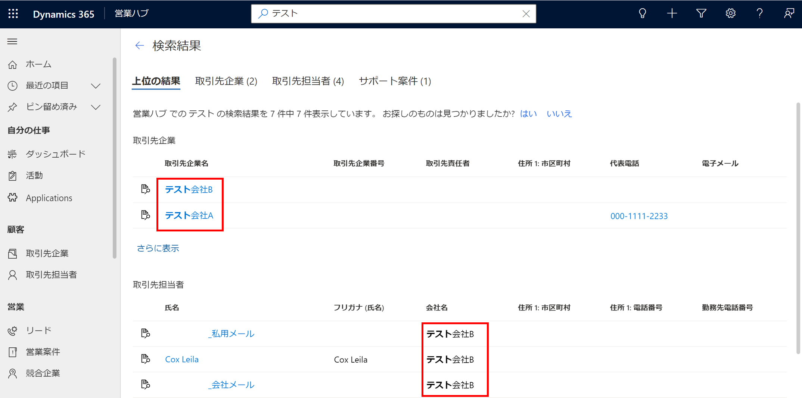
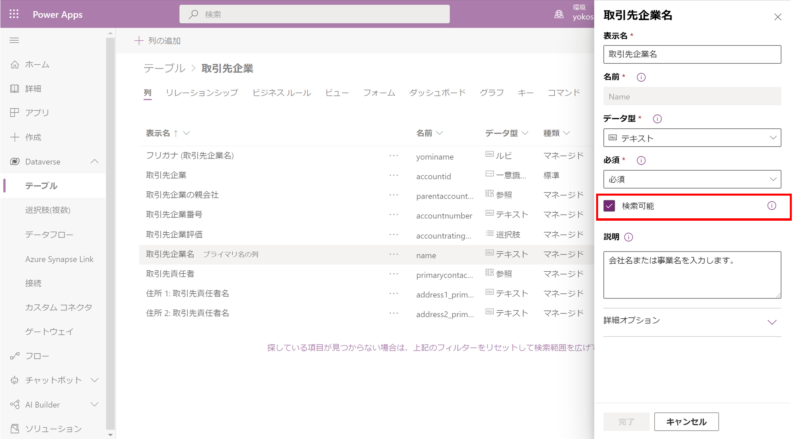
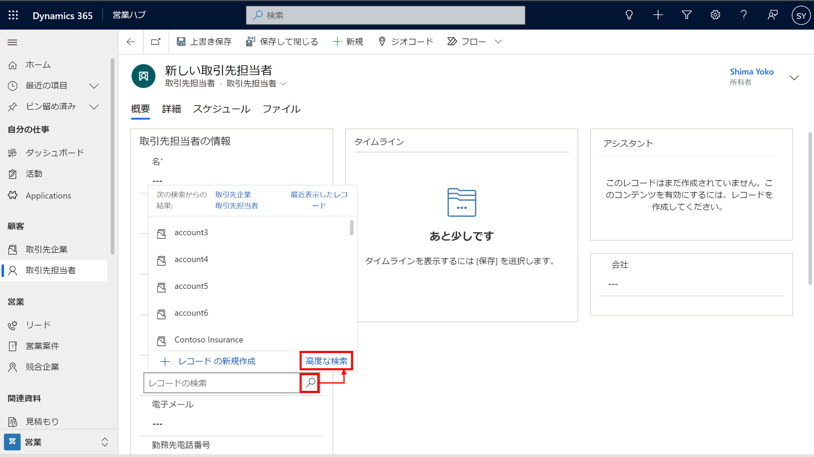

#  2021 年 Wave2 で追加されたモデル駆動アプリの検索方法まとめ

こんにちは、Power Platform サポートチームの島です。

Power Platform の半期に一度の大規模リリース (Wave2) が日本リージョンで 10 月 11 日 (月) から一般公開されました。
本記事では、このリリース内で行われた更新のうち、モデル駆動型アプリ / Dynamics 365 における検索についてご案内いたします。
<!-- more -->
Wave2 では、以下 2 つの検索方法が追加・更新されております。
1. Dataverse 検索 (関連性検索)
2. 高度なルックアップ

サポートチームでもたくさんのお問合せをいただいているこれらの検索方法について、それぞれ詳しくご紹介いたします！

## Dataverse 検索
---
Wave2 より、運用環境において既定で Dataverse 検索が有効化されるようになりました。

### そもそも、Dataverse 検索とは？
以下のキャプチャのように、画面上部のヘッダに表示されている検索欄が Dataverse 検索 (関連性検索) です。

実際にこちらを検索してみると、以下のようにキーワードを入力するだけで関連エンティティを含めた検索ができます。

ちなみに、Wave2 以前では、この検索欄は「カテゴリ別検索」または「簡易検索」と呼ばれ、ヘッダの虫眼鏡マークからご利用いただくことができました。

このカテゴリ別検索から、より検索性や操作性を向上させた機能が Dataverse 検索です。

### Dataverse 検索では具体的に何を検索しているのか？
Dataverse 検索で検索対象を決定する仕組みについてご案内いたします。

Dataverse 検索では、**テーブル (エンティティ) × 列 (フィールド)** をそれぞれ検索対象として指定できます。

**1. 検索対象のテーブル**
Dataverse 検索では、検索対象のテーブルを指定することができます。
環境の詳細設定画面、または Power Apps のソリューション設定画面から指定ができるのですが、今回はソリューション設定画面をご紹介いたします。
Power Apps ([https://make.powerapps.com](https://make.powerapps.com)) からソリューションを選択し、「概要」> 「Dataverse 検索」>「検索インデックスの管理」より、検索対象のテーブルを指定いただけます。
なお、Dataverse 検索の対象テーブル自体はソリューションに含まれる要素ではないため、ソリューションは任意のものをご選択いただければ問題ございません。

**2. 検索対象の列**
検索対象の列も、環境の詳細設定画面の他、Power Apps のテーブル設定画面からご確認いただけます。
テーブルの各列を選択し「検索可能」をチェックいただくことで、検索対象に指定される列を指定いただけます。

既定の状態でも、主要なテーブル・主要な列は検索対象として指定されていますが、
カスタムテーブルなどを作成いただいている場合にはぜひ検索対象に追加の上、検索をご活用ください。

## 高度なルックアップ
---
Wave2 より、検索 (ルックアップ) 列の入力時に高度なルックアップをご利用いただけるようになりました。

1. 列の入力時に虫眼鏡マークをクリック後、「高度な検索」を選択ください。

2. 図のように、高度なルックアップウィンドウが表示されます。

高度なルックアップウィンドウでは、入力フィールドに適したテーブルのビューから、登録したいデータを選択することができます。
今までも、1. の画面で表示されている小さいウィンドウから対象データを検索することができましたが、大画面かつビューを選択できるようになったことで、よりデータの絞り込みがしやすくなりました。
複数選択や、複数テーブルの検索もできますので、ぜひご利用ください。

#### よくいただくお問合せ
---
### 各検索方法を無効化する方法
Dataverse 検索に関しては、以下の画像のように、Power Platform 管理センターから有効 / 無効を切り替えることができます。

高度なルックアップに関しては通常の方法で無効化することはできません。
セキュリティ リスクの懸念から無効化を検討されている場合には、どちらの検索もユーザーに適切な権限が付与されているレコードのみ検索することができるので、ぜひご安心いただければと思います。

### 一部の環境で Dataverse 検索が有効化されていない
現在のところ、Dataverse 検索は運用環境 (Production 環境) のみで有効化されています。
サンドボックス環境など、その他の環境では既定で機能が無効化されています。これらの環境で Dataverse 検索をご利用の場合には、「各検索方法を無効化する方法」でご紹介した画面から機能を有効化することができるので、ぜひお試しください。
なお、設定を有効化してから、実際に検索に利用するインデックスが構築されるまでには数時間以上 (きわめて大規模な環境の場合、最大数日) かかる場合があります。

### Dataverse 検索を有効にするとキャパシティの使用量が増えた
Dataverse 検索では内部的に検索インデックスを作成していますが、この検索インデックスは Dataverse ストレージ容量内部のデータベースの容量を使用します。
そのため、Dataverse 検索を有効化した後、検索インデックスが構築されることでキャパシティ (Dataverse ストレージ容量) が増加します。
具体的な増加量については、インデックス構築対象のテーブル・列・データ量にもよるためご案内をしておりません。
ただし増加量は RelevanceSearch テーブルに反映されますので、もし環境ごとのキャパシティをご確認いただいた際に当該テーブルの使用量が増加している場合には、Dataverse 検索の対象となるテーブル・列を減らしていただくことをご検討ください。
なお、Dataverse 検索の対象を減らしていただいた後、実際に削減がキャパシティに反映されるまでに最大 24 時間が必要です。

公開情報 [新しい容量ストレージモデル](https://learn.microsoft.com/ja-jp/power-platform/admin/capacity-storage#faq) より「よくあるご質問」>「DataverseSearch テーブルとは、またどうすればそれを減らすことができますか」にもご案内がございますので、ぜひご参照ください。
※本記事公開時点では、DataverseSearch を RelevanceSearch と読み替えいただけますと幸いです。

## 関連する公開情報
---
・Dataverse 検索の概要について
[自分の環境に Dataverse 検索を構成する](https://learn.microsoft.com/ja-jp/power-platform/admin/configure-relevance-search-organization)
・Dataverse 検索のリリースについて
[管理者およびモデル駆動型アプリ開発者向けの簡素化された Dataverse 検索の構成](https://learn.microsoft.com/ja-jp/power-platform-release-plan/2021wave2/power-apps/simplified-dataverse-search-configuration-admins-model-driven-app-makers)
・高度なルックアップのリリースについて
[モデル駆動型 Power Apps のすべてのユーザー向けの高度なルックアップ機能](https://learn.microsoft.com/ja-jp/power-platform-release-plan/2021wave2/power-apps/advanced-lookup-capabilities-all-end-users-model-driven-power-apps)
・2021年 Wave2 を含む、リリース計画の全体
[Dynamics 365 および Microsoft Power Platform のリリース計画](https://learn.microsoft.com/ja-jp/dynamics365/release-plans/)

## おわりに
---
以上、Wave2 で追加された 2 種類の検索方法についてご紹介いたしました。
Power Platform / Dynamics 365 では、今後も様々な機能追加が予定されています。
こちらのブログでも追加機能をご紹介していきますので、ぜひご活用いただけますと幸いです！
