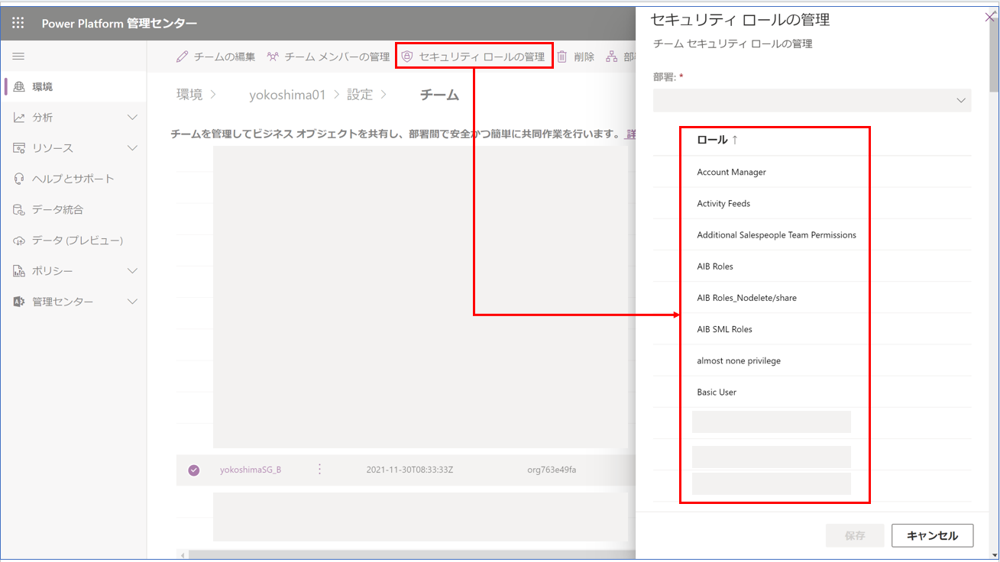
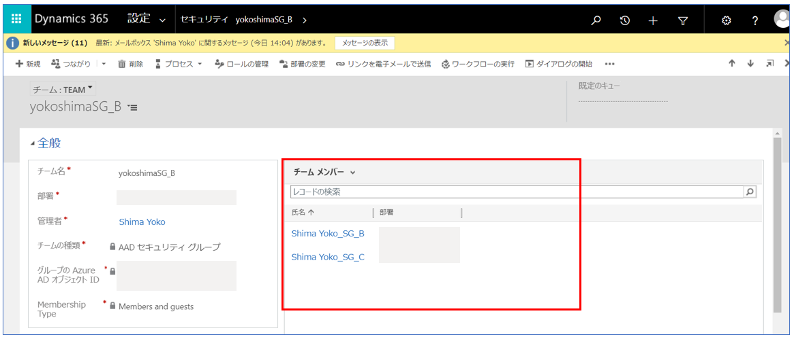

#  Dataverse グループ チームの活用方法＆注意点

こんにちは、Power Platform サポートチームの島です。

Dataverse では、Azure AD グループ チームを作成することで、セキュリティ グループへのユーザー所属状態によって、ロールを自動的に付け外しすることができます。
「特定の管理者用セキュリティ グループに所属するユーザーに、自動的にシステム管理者ロールを付与する」というような運用も可能です。
<!-- more -->
つまり、Azure AD グループ チームを利用いただくことで、**グループ チーム配下の Dataverse ユーザーを、Azure AD グループから一元管理**することが可能となります。

そこでこの記事では、使い方、またサポートでよくいただくグループ チーム関連のご質問についてご案内します。

## そもそも、チームとは？
---
Dataverse では、グループ チームを含め、4 種類のチームという概念を持ち、この中にユーザーを所属させることができます。
それぞれについて簡単にご紹介します。

**1. 所有者チーム**
セキュリティ ロールを割り当てることのでき、レコードを所有できるチームです。
グループ チームと似ていますが、Azure AD グループとは連動しないため、ユーザーを明示的に指定して追加する必要があります。
またDataverse 上の「部署」というオブジェクトに紐づいて自動作成されます。(なのでグループ チームの操作を何もしていなくても、環境に最低ひとつはこの所有者チームが存在します。)
**2. アクセス チーム**
セキュリティ ロールを割り当てることができず、レコードも所有しないチームです。
ただ、アクセス チーム自体がレコードへのアクセス権を持つため、セキュリティ ロールに依存しないアクセス件制御を行うことができます。
**3. Azure AD グループ チーム (Office グループ / セキュリティ グループ)**
セキュリティ ロールを割り当てることのでき、レコードを所有できるチームです。また、Azure AD グループと連動します。
種類として Office グループ チームと セキュリティ グループ チームの 2 つに分かれますが、記事執筆時点ではグループの種類による機能差はありません。

上記の内容をまとめると、以下のように各チームを比較できます。

Azure AD グループチームの特色は、文字通り Azure AD グループと連携でき、**グループ チーム配下の Dataverse ユーザーを、Azure AD グループから一元管理**できることです。

## Azure AD グループチームで具体的にできること
---
Azure AD グループチームでできること、メリットについて具体的にご紹介します。

### 1. Azure AD グループとの連携
Azure AD グループチームでは、セキュリティ グループや Office グループとの同期が可能です。
Azure AD グループチームは Power Platform 管理センターから作成することができますが、このときに対応するAzure AD グループを選択することで、チームとグループを紐づけることができます。

**【手順】**
1. Power Platform 管理センターで 設定 > ユーザーとアクセス許可 > チーム を選択ください。

2. 「チームの作成」を選択ください。
3. 作成時の入力項目を以下の通り入力ください。この後チームを作成することで、入力したグループとチーム同士が紐づきます。
・チームの種類 : AAD セキュリティ グループ または AAD Office グループを選択ください。
・グループ名 : 対応するAzure AD グループ名を選択ください。

ちなみに、以下の項目はグループ チームとは関係がありませんが、ご参考までに入力内容を紹介いたします。
・チーム名、説明 : 任意のものを入力ください。
・部署 : Dataverse の部署を作成いただいている場合は適宜ご要件に合わせて選択ください。作成していない場合はデフォルトの部署が 1 つだけ表示されますので、その部署を選択ください。
・管理者 : ご要件に合わせて管理者となるユーザーをご選択ください。
・メンバーシップの種類 : Azure AD グループ メンバーシップを入力する欄です。**後のセクションでもご説明します！**

チームを作成すると、紐づけた Azure AD グループのメンバーのうち環境に対してアクセス権があるユーザーが、自動的に Dataverse のグループ チームに追加されます。
また、異動などでチームのメンバーでなくなったユーザーは、自動的にグループ チームのメンバーからも削除されます。

#### 2. セキュリティ ロールの紐づけ
Azure AD グループ チームに対してセキュリティ ロールを紐づけることで、配下の Dataverse のユーザーに対してそのロールを継承させることができます。

**[手順]**
1. Power Platform 管理センターで 設定 > ユーザーとアクセス許可 > チーム を選択後、任意のチームを選択ください。
2. セキュリティ ロールの管理 を選択ください。
3. 下図のように割り当てるセキュリティ ロールの一覧が表示されるので、任意のロールを選択ください。

このセキュリティ ロールの割り当て機能により、「管理者用のグループ チームにはシステム管理者ロールを付与する」「開発者用のグループ チームには Environment Makerを付与する」というように、チームごとに一括でロールを割り当てることが可能になります。
加えて 1 でご説明したように、チームのメンバーは Azure AD と同期して自動で決定されるので、この 2 つの機能を組み合わせることで、要件に即したロールの一括付与を自動で実行できるようになります。

## よくいただくお問合せ
---
上記の通り、Azure AD グループ チームは、ユーザーおよびロールの一元管理が可能な強力な機能です。
こちらの機能をよりご活用いただきたいため、サポート チームでよくいただく質問をおまとめいたしました。ぜひご確認ください。

### グループ チーム作成時、メンバーシップに何を指定すればよいのかわからない
グループ チームのメンバーシップは、Azure AD 側のグループのメンバーシップに対応するものです。
選択肢ごとにの具体的な設定内容は以下の通りです。
(1) メンバー ： Azure AD グループに所属するメンバー (ゲストユーザーを除く) です。
(2) ゲスト : Azure AD グループに所属するゲストユーザーです。
(3) メンバーとゲスト : (1)と(2)の両方をメンバーとする選択肢です。
(4) 所有者 : Azure AD グループの所有者です。通常、管理者など要件に合わせたユーザーを明示的に指定することで割り当てられます。

グループ チームをご活用いただく場合、通常はメンバーのロールを一元管理することが目的の場合が多いので、(1)または(3)を選んでいただくケースが最も多いかと存じます。

### Azure AD グループに所属するメンバーのうち、一部のメンバーしかグループ チームに所属していない
グループ チームを作成したタイミングと、実際に Dataverse 上のユーザーオブジェクトがグループに割り当てられるタイミングが異なることで、メンバーが一部しか所属していないように見えている可能性があります。
実際に、Dataverse 上のユーザーオブジェクトがグループに所属するのは、グループ チーム作成後、当該ユーザーが最初に環境のキャンバス アプリまたはモデル駆動アプリにアクセスしたタイミングです。
そのため、グループ チームを作成したあと、チームのメンバーを以下のように確認された際には、グループ チーム作成後にアプリにアクセスしたことのあるメンバーしか表示されません。

チームのメンバーがアプリにアクセスしていくことで、いずれは全員がメンバーに追加されますので、ご安心ください。

### ユーザーに対してロールが継承されていないように見える
Power Platform 管理センターまたはユーザーの設定画面で、ユーザーのセキュリティ ロールをご確認いただけますが、こちらの画面ではあくまでユーザー本人に対して直接割り当てられたセキュリティ ロールのみが表示されます。
そのためチームから継承されたロールをご確認いただくことができませんが、正しい手順を実施いただき、かつユーザーがアプリに既にアクセスしていれば、ユーザーに対してロールが継承されますので、ご安心ください。

ユーザーに対して直接付与されたロールと継承されたロールの両方を確認されたい場合には、特定データのフォームを開いた上で上部リボンの「アクセス権の確認」を選択いただくことで、当該データに関連するユーザーのすべての権限をご確認いただくことが可能です。

## おわりに
---
以上、Azure AD グループ チームの概要、およびよくいただくお問合せについてご案内しました。
グループ チームを利用しない場合、ユーザーひとりひとりにアクセス権を付与する必要があるため、ユーザー数やセキュリティ ロール数が多い組織だと運用が煩雑になりがちです。
ぜひグループ チームを運用に導入いただき、効率的なユーザー管理にご活用ください！