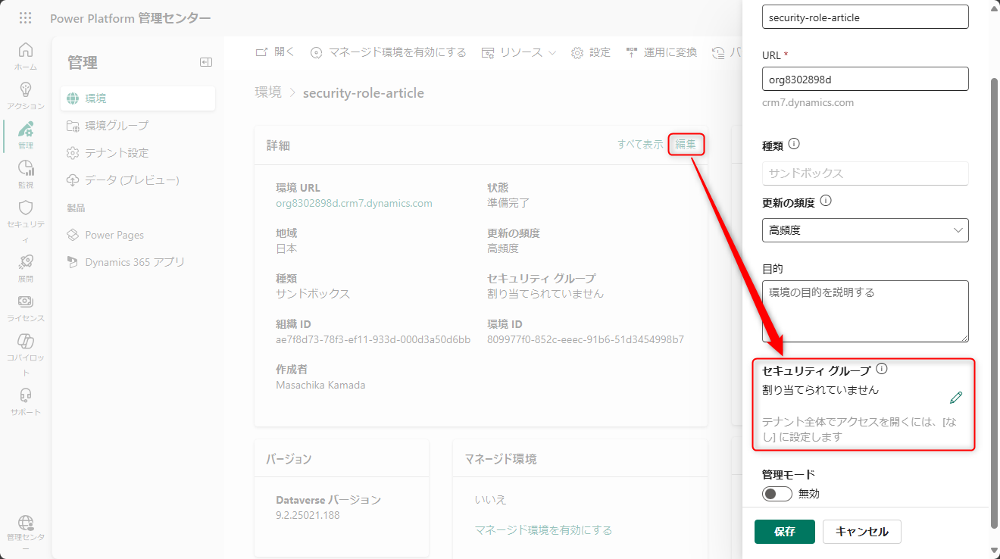
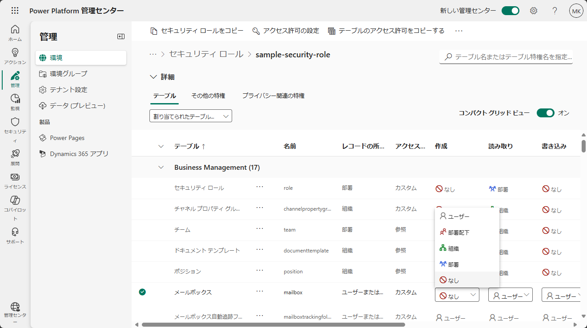

# セキュリティ グループとセキュリティ ロールによる Dataverse 環境のアクセス権制御方法

こんにちは、Power Platform サポートチームの鎌田です。

今回は、Power Platform、特に Dataverse を作成した環境に対して、セキュリティ グループやセキュリティ ロールを使ってアクセスを制御する方法についてご紹介いたします。

ビジネスユースで Dynamics 365 CRM やモデル駆動アプリを導入する場合、セキュアな環境管理のために必須となるのがこのアクセス権制御です。
特に Dataverse の導入にあたりセキュリティ面を検討されている方は、ぜひご覧ください！

## アクセス権制御方法の概要

Dataverse 環境のアクセス権は、おおまかに以下の構造で制御されています。

1. **ライセンス** : テナントごとに、**各ユーザーが Power Platform 製品を利用できるか**を決定します。
2. **セキュリティ グループ** : テナントの各環境ごとに、**ユーザーがその環境を利用できるか**を決定します。
3. **セキュリティ ロール** : 環境の Dataverse 内の各テーブルごとに、**環境における具体的なユーザーのアクセス権**を決定します。

例えば上記の図のように、同じテナント内に複数のグループと複数の環境が存在し、それぞれ環境にグループが割り当てられているとします。
* グループ A (サポート部門) とグループ B (管理部門)
* 環境A (サポート部門用の環境) と環境 B (管理部門用の環境)

このとき、下記の 1 から 3 のアクセス権制御を組み合わせることで、ユーザーに対してどの環境でのどのような操作を許可するかを制御できます。

1. **ライセンス** :
グループ A 内のサポート部門のユーザーは、ライセンスを所有しているため、Power Platform 製品を利用できます。
グループ B 内のユーザーは、今回の図の場合ライセンスを保有していないため、Power Platform 製品を利用できません。
2. **セキュリティ グループ** :
サポート部門用の環境 A に対して、グループ A がセキュリティ グループとして設定されている場合、グループ A のユーザーは環境 A にアクセスすることができますが、管理部門用の環境 B のセキュリティ グループとしては登録されていないため、アクセスすることができません。
3. **セキュリティ ロール** :
グループ A のユーザーに対してセキュリティ ロールを付与することで、ユーザーがアクセスできるテーブルやアプリ、実行可能な操作を制限できます。
たとえば図中のユーザーにサポート部門用のセキュリティ ロールが割り当てられ、システム管理者が割り当てられていないとき、ユーザーはシステム管理に使うテーブルにはアクセスができません。

本記事では 2 と 3 について紹介します。

## セキュリティ グループについて

Power Platform 環境には、デフォルトではテナントに所属する全ユーザーがアクセスできますが、環境にセキュリティ グループを割り当てることで、**割り当てられたセキュリティ グループに所属するユーザーのみにアクセスを限定**することができます。
たとえば、「IT部門」用の環境を作成したときに、「IT部門」のセキュリティ グループを割り当てることで、その他の営業部門などのユーザーのアクセスを禁止することができます。このように、グループごとに環境の利用可否を制御したい場合に、セキュリティ グループが役立ちます。

セキュリティ グループの割り当ては、環境作成時にオプションで指定できる他、Power Platform 管理センターから既存の環境に対しても指定できます。
ただし、既存の環境にセキュリティ グループを割り当てた場合、セキュリティ グループに所属していないユーザーはすべて無効化されるのでご注意ください。

## セキュリティ ロールについて

上記でご説明したセキュリティ グループでは、ユーザーに対して環境単位でのアクセス可否を決定します。
これに対して、ユーザーに割り当てることで、**環境内でユーザーが行える操作を決定**するのがセキュリティ ロールです。
Power Platform では、要件に合わせたさまざまな既定のセキュリティ ロールが存在します。特によく使用されるセキュリティ ロールの例を以下に紹介します。

* システム管理者 : 環境におけるすべての操作を実行できるロール。
* Basic User : 環境における一般的なアプリの利用ができるロール。管理操作が制限される他、自分以外のユーザーが作成したデータに対するアクセスも制限されます。
* システム カスタマイザー : 環境をカスタマイズするためのロール。多くの管理操作を実行できますが、自分以外のユーザーが作成したデータを参照できません。

またこちらの公開情報にも、より多くのセキュリティ ロールのご説明が記載されているので、ぜひご覧ください。 
参考: [環境のリソースに対するユーザー セキュリティの構成](https://learn.microsoft.com/ja-jp/power-platform/admin/database-security)

### セキュリティ ロールの仕組みとカスタマイズ

セキュリティ ロールは、Dataverse 上の各テーブルやその他の機能の使用等に対する **特権** (アクセス権) をひとまとめにしたものです。
Power Platform 管理センターから環境を開き、[設定] > [ユーザーとアクセス許可] > [セキュリティ ロール] から特定のセキュリティ ロールを開くことで、下図のように特権がどのように付与されているかを確認することができます。 
各特権の項目に対して、作成・読み取り・書き込み等の動作ごとに、特権の種類を [なし / 部署 / 組織 / 部署配下 / ユーザー] に設定できます。 
参考: [セキュリティ ロールおよび特権](https://learn.microsoft.com/ja-jp/power-platform/admin/security-roles-privileges)

前述のように、システム管理者や Basic User といった定義済みのセキュリティ ロールが存在するものの、カスタマイズにより細かく特権を定義することが可能です。これにより、お客様の使用シナリオやニーズに合わせて、柔軟なアクセス制御が可能となります。

例えば、
- サポート部門の担当者には、自分が担当する「サポート案件」を参照可とする
- サポート部門の管理者は、全員のサポート案件を参照可とする
- 経理部門の担当者には、サポート案件自体参照させたくない

というような要件がある場合、サポート案件に対するアクセス許可を変更したロールを 3 種類作成し、各ユーザーに割り当てることで要件が実現できます。

定義済みセキュリティ ロールでは、モデル駆動型アプリで実際に使用されよく目にするテーブル以外にも、設定に関するものやプライバシー関連など、多数のアクセス制御が設定されています。そのため、カスタムでのセキュリティ ロールを作成する場合は、定義済みのセキュリティ ロールをコピーし、それをベースに修正が必要な特権のみ変更する運用が推奨されています。

## その他

### チーム単位でのセキュリティ ロールの割り当て

ユーザーに直接セキュリティ ロールを割り当てるのではなく、Dataverse 上に作成した **チーム** に対してもセキュリティ ロールの割り当てが可能です。
これにより、チームに所属するユーザー全員に対して、チームに付与されたセキュリティ ロールが継承されます。(チームのセキュリティ ロールが継承されていても、Power Platform 管理センターのユーザーごとのセキュリティ ロールには表示されません) 
また、このチームを Microsoft Entra ID のセキュリティ グループと紐づけることで、Microsoft Entra ID と Power Platform でユーザー管理の体制を統一することができます。 
参考: [Microsoft Dataverse チームの管理](https://learn.microsoft.com/ja-jp/power-platform/admin/manage-teams)

### フィールドレベルのセキュリティ付与

本記事でご紹介したテーブルごとのアクセス制御とは別に、更に細かく Dataverse テーブルの列ごとにアクセス制御を設定することができます。
住所や電話番号など、特に重要で管理に留意する必要のある情報を扱う際に有効な機能です。 
参考: [アクセスを制御する列レベルのセキュリティ](https://learn.microsoft.com/ja-jp/power-platform/admin/field-level-security)

### セキュリティ グループを環境に割り当てた際のメンバー同期

セキュリティ グループを環境に割り当てると、グループに所属するライセンスを保有するユーザーが、自動的に環境に追加されるようになります。
ただし以下のように、注意が必要な挙動もあります。

* ライセンスを保有しないユーザーは環境に追加されない
* 入れ子のセキュリティ グループのメンバーは、グループに「Microsoft Entra ID グループ チーム」が割り当てられている場合を除いて、自動的に環境に追加されない
* ユーザーがグループから削除された際、Power Platform 側のユーザーは無効化される

以下の公開情報に注意点の記載がございますので、ぜひご参照ください。 
参考: [環境へのユーザー アクセスのコントロール: セキュリティ グループおよびライセンス](https://learn.microsoft.com/ja-jp/power-platform/admin/control-user-access)

## おわりに

以上、Dataverse でのユーザーアクセスの制御についてご案内いたしました。
こちらの記事が皆様のセキュアな環境管理のお役に立ちましたら幸いです。
