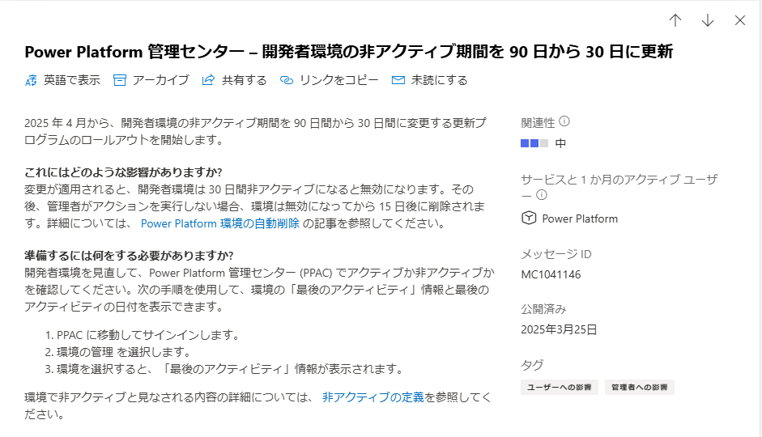
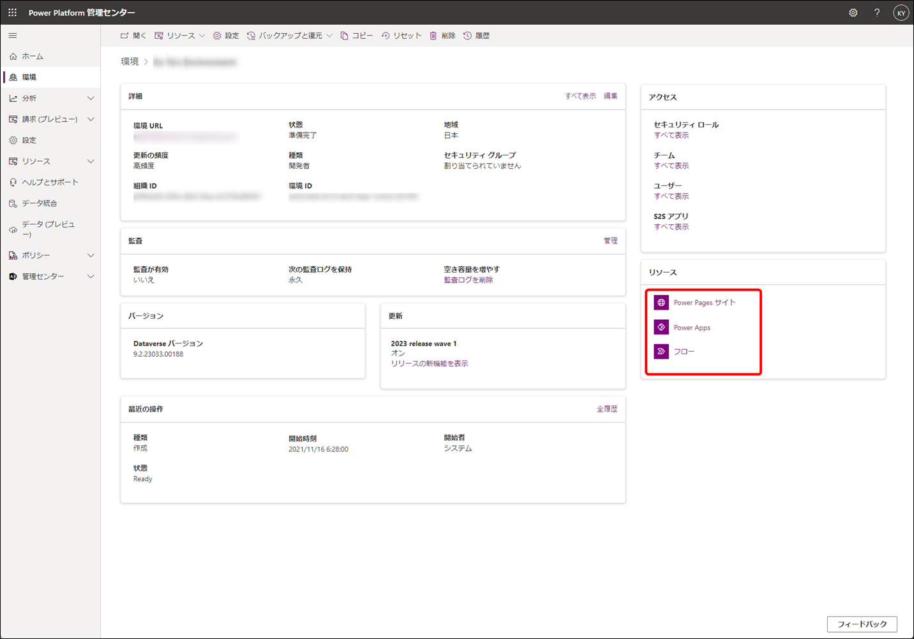

こんにちは、Power Platform サポートの山田です。 
今回は、Power Platform の開発者環境の自動削除について、下記項目の順にご説明いたします。  

1. 開発者環境の自動無効化/削除メカニズムとは  
2. 自動無効化/削除条件  
3. 自動無効化/削除メカニズム自体の無効化の可否  
4. 無効化/削除された環境の復元
5. 環境の状態遷移
6. ご案内メール  
7. ご案内メールを受信された際の対応   
8. よくあるご質問  

下記公開情報を基にご説明いたします。   
[Automatic deletion of Power Platform environments (英語)](https://learn.microsoft.com/en-us/power-platform/admin/automatic-environment-cleanup)   
[Power Platform 環境の自動削除 (上記の日本語訳)](https://learn.microsoft.com/ja-jp/power-platform/admin/automatic-environment-cleanup)   
各項目について公開情報内にも詳細を記載しておりますのでご参照ください。 
なお、英語のページが更新されてから、日本語訳のページに同様の内容が反映されるまでに時間がかかる場合がございます。 
そのため、最新情報については英語版も併せてご確認いただけますと幸いでございます。
 
 
<!-- more -->  

--------------------------------------------------------------------------------------------------------------------------------

## 1. 開発者環境の自動無効化/削除メカニズムとは
本メカニズムによって、ユーザーによる活動のない期間 (=非アクティブ期間) が30日間（※）続いた場合、対象の開発者環境が無効化されます。  
開発者環境は30日間非アクティブになると無効になります。  
無効化状態が15日（※）継続しますと、対象環境が自動削除されます。  

無効化された環境では、アプリやフロー、チャットボット等がご利用いただけません。  

 
※2025年4月から、期間が上述のものに変更されました。
本変更については、MC1041146にてアナウンスさせていただいております。  
[MC1041146](https://admin.microsoft.com/Adminportal/Home#/MessageCenter/:/messages/MC1041146)  
  
 

## 2. 開発者環境の自動無効化/削除条件  
対象環境におけるユーザーのアプリ起動などの活動が設定期間中に実施されない場合、自動削除の対象となります。 
対象の活動は下記の通りです。

-  ユーザーの活動: アプリの起動、フローの実行、Power Virtual Agents ボットとのチャット
- 作成者の活動: アプリ、フロー 、Power Virtual Agents ボット、カスタム コネクタの作成、読み取り、更新、削除
- 管理者の活動: コピー、削除、バックアップ、復元、リセットなどの環境操作
 

## 3. 開発者環境の自動無効化/削除メカニズム自体の無効化の可否
本メカニズムは無効化いただくことが出来ません。 
何卒ご理解いただけますと幸いでございます。  
 

## 4. 自動無効化/削除された環境の復元
環境無効化後、15日以内であれば環境の再有効化が可能でございます。  
また、環境削除後も、7日以内であれば環境の復元が可能でございます。  
どちらも Power Platform 管理センターよりご実施いただけます。  

**無効となった開発者環境の再有効化**  
① Power Platform 管理センター にサインイン  
② 環境 > 無効化された 開発者環境を選択  
③ 環境ページで 「環境を再度有効にする」を選択  
 
**削除された開発者環境の復元**  
① Power Platform 管理センター にサインイン  
② 環境 > 「削除された環境を復元する」を選択  
③ 復元する対象環境 > 復元 を選択  
 

環境の復元の詳細については下記公開情報をご参照ください。  
[環境の回復](https://learn.microsoft.com/ja-jp/power-platform/admin/recover-environment)  
 

## 5. 環境の状態遷移
### 状態の種類
環境の状態は、以下5つの種類があり、状況にて自動で変更されます。
 
1. 準備完了
2. 準備完了 (無効化まであと x 日)
3. 準備完了 (操作が必要)
4. 無効 (削除まであと x 日)
5. 無効 (操作が必要)
 
### 環境の自動削除までの流れ
開発者環境は、一定期間以上環境を利用しない場合、自動削除されます。  
環境が無効化から削除されるまで、環境の状態も以下のように変更されます。
 
[準備完了] → [準備完了 (無効化まであと x 日)] → [準備完了 (操作が必要)] → [無効 (削除まであと x 日)] → [無効 (操作が必要)]
 
### 各状態のご案内
1. 準備完了  
環境がアクティブとなっている、一定期間以上未使用になっていない環境の状態です。  
 
2. 準備完了 (無効化まであと x 日)  
環境を30日間非アクティブな状態が続く場合、自動削除される前に [環境の無効化] が行われます。  
その際に状態は、無効化までの日数が記載された [無効化まであと x 日] で変更されます。  
 
3. 準備完了 (操作が必要)  
2の [準備完了 (無効化まであと x 日)] で日数の [x 日] が [0 日] となった後、[準備完了 (操作が必要)] に変更されます。  
 
4. 無効 (削除まであと x 日)  
3の 準備完了 (操作が必要) から15日間環境に対して何かのアクションをしない場合、[自動削除] が行われます。  
その際に状態は、自動削除までの日数が記載された [削除まであと x 日] で変更されます。  
 
5. 無効 (操作が必要)  
4の 無効 (削除まであと x 日) で日数の [x 日] が [0 日] となった場合、[無効 (操作が必要)] に変更されます。  
無効 (操作が必要) 後には、環境は自動削除されます。  
 

## 6. ご案内メール
対象環境の無効化が実施される7日前より、その旨についてのご案内メールが次のユーザーに通知されます。  

- 環境の管理者
- 対象開発者環境の作成者  

詳細なタイムラインについては公開情報もご確認ください。  
[Timeline for unused environments（英語）](https://learn.microsoft.com/en-us/power-platform/admin/automatic-environment-cleanup#timeline-for-unused-environments)  
[未使用環境のタイムライン (上記の日本語訳)](https://learn.microsoft.com/ja-jp/power-platform/admin/automatic-environment-cleanup#timeline-for-unused-environments)
 

## 7. 無効化対象のご案内メールを受信された際の対応
下記2通りの方法にて、無効化対象となる非アクティブな期間のカウントを一旦リセットいただけます。  

- 対象環境において、アプリやフローのご実行など上述のユーザー活動を実施
- Power Platform 管理センターの対象環境ページにて、「環境活動をトリガーする」を実行    
 

## 8. よくあるご質問
**Q：開発者環境とは何か。無効化された場合、どのような影響があるか?**  
A：開発者環境は、Power Apps開発者プランライセンスを持つユーザーが作成できます。  
無効化されると、環境内に作成されていたアプリやフロー、チャットボット等がご利用いただけなくなります。  
開発者環境の詳細については、下記公開情報をご参照ください。  
[Power Apps 開発者プランにサインアップ](https://learn.microsoft.com/ja-jp/power-apps/maker/developer-plan)  
 

**Q：開発者環境にて無効化される際に配信される通知メールを配信停止することは可能か?**  
A：恐れ入りますが、メール配信を停止することのできる機能はございません。  
製品動作としてご理解賜りますようお願い申し上げます。  
 

**Q：Power Platform 管理センターの対象環境ページにて、「環境活動をトリガーする」の実行は、通常ユーザにて操作可能なものか?**  
A：Power Platform 管理センターにて開発者環境の「環境活動をトリガーする」を実行できるユーザーは以下の通りでございます。  

- 対象開発者環境の作成者
- グローバル管理者
- Power Platform 管理者
- Dynamics 365 管理者  
 

**Q：「環境活動をトリガーする」を実行すると、有効期限は何日まで延びるのか?**  
A：非アクティブ期間がリセットされ、有効期限は30日間延長されます。  
その30日の期間中に、対象環境におけるユーザーのアプリ起動などの活動が実施されない場合、再び環境は無効化され自動削除の対象となります。  
 

**Q：無効化される環境内のアプリ等の詳細については、どこから確認できるか?**  
A：下記より対象環境内のアプリ等をご確認いただけます。  
Power Platform 管理センター > 環境 > 対象環境 > リソース  
  
 
         
**Q：再有効化した場合、無効化前の情報が維持されるか?**  
A：再有効化後または復元後は、無効前の情報が維持されます。  
完全に削除されてしまいますと、無効化前の情報は復元できなくなりますのでご注意ください。  
 

免責事項  
※本情報の内容（添付文書、リンク先などを含む）は、作成日時点でのものであり、予告なく変更される場合があります。  
