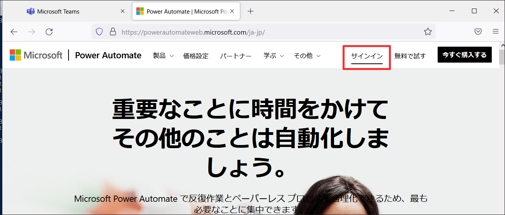

# Power Automate/Power Appsの試用版・無償版を禁止する方法

こんにちは、Power Platform サポートチームの網野です。

<br>
今回はよく寄せられるお問い合わせの一つ、Power Automate、Power Apps の無償版・試用版を利用不可にする方法についてご案内いたします。<br>
<br>
<!-- more -->

---

# 目次
1. [対象ライセンス](#anchor-license)
1. [ライセンスの種類](#anchor-license-type)
1. [事前準備](#anchor-preparation)
1. [コマンドの実行](#anchor-command)
1. [実行結果](#anchor-result)
1. [制限事項](#anchor-limitation)
1. [FAQ](#anchor-faq)

<br>

<a id='anchor-license'></a>

## 対象ライセンス
ご案内するコマンドを実行しますと、以下のすべてのプランが制限されます。
- Power Automate Free
- Power Apps コミュニティプラン
- Power Automate 試用版
- Power Apps 試用版

<br>

<a id='anchor-license-type'></a>

## ライセンスの種類
ライセンスにはユーザーが自身で取得するライセンスと管理者により付与されるライセンスの２つがあります。<br>

- Internal ：ユーザーが自身で取得する無償版・試用版ライセンス<br>
- Viral： 管理者により付与される無償版・試用版ライセンス<br>

ユーザーが自身で取得することは禁止し、管理者からの無償版・試用版ライセンス付与は許可したい場合には、Internal のみを無効化してください。<br>

<a id='anchor-preparation'></a>

## 事前準備
### PowerShell モジュールのインストール
1. Power Apps の PowerShell モジュールを [こちらの手順](https://docs.microsoft.com/ja-jp/power-platform/admin/powerapps-powershell#installation) に従ってインストールします。

### 現在の設定を確認<br>
1. 以下のコマンドを実行し、無償版・試用版が無効化されているかどうか確認します。<br>
   ```powershell 
   Get-AllowedConsentPlans
   ```
   利用不可としたい<br>
   ※Internal と Viral のライセンスが共に有効である場合（＝無償版、試用版が利用可能な状態）<br>
    <br>
   ※Internal と Viral のライセンスが共に無効である場合（＝無償版、試用版が利用不可の状態）<br>
    <br>
<br>
1. ライセンス一覧を表示するコマンドを実行し、テナント内に無償版、試用版ライセンスを利用しているアカウントがいるかどうかを確認します。<br>
   ```powershell 
   Get-AdminPowerAppLicenses -OutputFilePath <ファイルパス＋ファイル名>
   ```

<a id='anchor-command'></a>

## コマンドの実行
以下のコマンドを実行し、無償版、試用版のライセンスを無効化し、利用停止にします。
```powershell 
Remove-AllowedConsentPlans -Types "Internal"
Remove-AllowedConsentPlans -Types "Viral"
```
<br>

<a id='anchor-result'></a>

## 実行結果
ライセンスを持たないアカウントで Power Automate ポータルへ接続を試みます。

   <br>
   <br>
   以下のようにエラーが表示され、ポータル画面へアクセスすることができません<br>
   <br>

<a id='anchor-limitation'></a>

## 制限事項
「Remove-AllowedConsentPlans」 のコマンド実行した後も Microsoft 365 管理センター から確認した場合は、ライセンスが付与されたままのように見えます。<br>
しかしながら、内部的には無償・試用版のライセンスが無効化されております。<br>
<br>
無効化作業をした後のライセンス状況の確認は、以下の「テナント内のユーザーとライセンスの一覧を確認するコマンド」にてご確認ください。<br>
   ```powershell 
   Get-AdminPowerAppLicenses -OutputFilePath <ファイルパス＋ファイル名>
   ```

<a id='anchor-faq'></a>

## FAQ
### <font color=blue>Q. コマンド実行前に取得された無償版、試用版のライセンスはどうなるのか</font>
   コマンド実行時に付与済みのライセンスがはく奪され、利用できなくなります。<br>
   <br>
### <font color=blue>Q. コマンド実行前に有償ライセンスやOffice付帯ライセンスが付与されている場合はどうなるのか</font>
   有償ライセンスやOffice付帯ライセンスには影響を与えませんので、引き続きご利用いただけます。<br>
   <br>
### <font color=blue>Q. コマンド実行前に「無償版」ライセンスで作成したフローやアプリはどうなるのか</font>
   フローやアプリは削除されず残り続けます。<br>
   作成者にOffice付帯ライセンスなど他のPower Automateのライセンスが付与されている場合は、コマンド実行前と変わらずフローの編集・実行を行うことができます。<br>
   作成者にPower Automateのライセンスが一つも付与されていない場合は、バックグラウンド処理にてフローが無効になります。<br>
   <br>
### <font color=blue>Q. コマンド実行前に「試用版」ライセンスで作成したフローやアプリはどうなるのか</font>
   フローやアプリは削除されず残り続けます。<br>
   作成者にPower Automateの有償ライセンス付与されている場合は、コマンド実行前と変わらずフローの編集・実行を行うことができます。<br>
   作成者にPower Automateの有償ライセンスが付与されていない場合は、プレミアムコネクタなど有償ライセンスが必要な機能がご利用できなくなります。<br>
   <br>
### <font color=blue>Q. コマンド実行すると他の製品には影響を与えないか</font>
  Power Automate 、 Power Apps の無償版、試用版のみに影響があります。<br>
    <br>


<br>

---
Hope to acceralate your business with Power Automate!