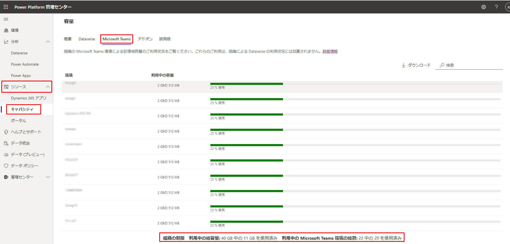
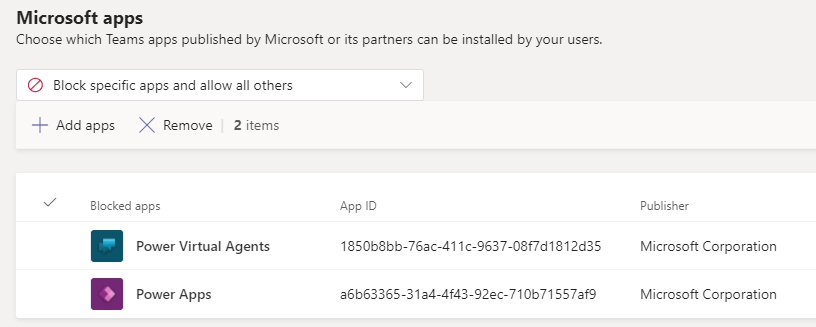
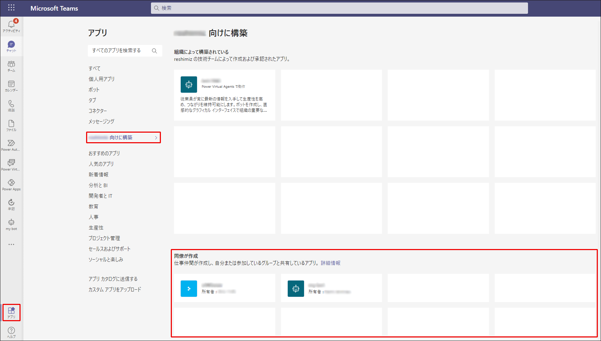

#  Dataverse for Teams 環境の管理方法

こんにちは、Power Platform サポートチームの清水です。

今回は、2020 年 9 月に 新たに Teams に統合された Power Platform の機能について、その管理・制御方法やよくお問合せいただく内容に関して、詳しくご説明いたします。

ライセンスが Teams に組み込まれているという性質上、管理にお困りの方も多いかと思います。
この記事が皆様のお役に立ちましたら幸いです。
<!-- more -->

## Dataverse for Teams の概要
---

Dataverse for Teams 環境とは、Teams のチームに紐づく Power Platform の環境です。

チームの所有者が環境の管理者となり、チームのメンバーは環境上でアプリやフロー、チャットボットを作成・使用することができます。
参考: [Microsoft Dataverse for Teams 環境について](https://learn.microsoft.com/ja-jp/power-platform/admin/about-teams-environment)

Dataverse for Teams の環境は、Teams を通してのみ作成されます。
例えば以下のような場合に、選択したチームの Dataverse for Teams 環境が自動で作成されます。
- Teams 上の Power Apps アプリを使用して、で初めて環境に紐づくアプリを作成したとき
- Teams 上の Power Virtual Agents アプリを使用して、初めて環境に紐づくボットを作成したとき
- Teams のアプリ カタログから初めて Power Apps アプリ (※1) をインストールしたとき

なお、Teams のチームと Dataverse for Teams の環境は 1:1 で紐づけられます。
そのため、一つのチームで複数の環境を持つことはできません。
また、異なるチームの Dataverse for Teams 環境にアクセスすることもできません。


### 環境の制限

Dataverse for Teams 環境には以下の制限があります。
- Microsoft 365 のライセンス数に応じたテナント毎の環境数の制限
    テナント毎の環境数の上限は以下の式で決定されます。
    ``` 5 + (1 * Microsoft 365 のライセンス数 / 20) ```
    また、ライセンス数に関わらず、環境数の上限は 10,000 (※2) となります。

- 環境ごとのストレージ制限
    各環境は、最大で 2 GB または 100 万行のデータを格納することが可能です。
- テナントごとのストレージ制限
    テナント毎のストレージ容量の上限は以下の式で決定されます。
    ``` 10 GB + (環境数 * 2 GB) ```
    また、ストレージ容量の上限は 19.5 TB となります。

各テナントで作成可能な環境数は、Power Platform 管理センターからご確認ください。

Power Platform 管理センター > リソース > キャパシティ > Microsoft Teams


制限を超えて環境やストレージ容量を使用したい場合は、[Dataverse へのアップグレード](https://learn.microsoft.com/ja-jp/power-platform/admin/about-teams-environment#upgrade-process)をご検討ください。

### 環境へのゲストアクセス
Teams チームにゲストユーザーを招待している場合、ゲストユーザーは以下のような権限を持ちます。

- アプリやボット、その他リソースの閲覧
- アプリやボットの実行
- 自身が作成したレコードへのフルアクセス
    ※他のユーザーが作成したレコードへのアクセス権は持ちません。

## 特定のユーザーにだけ環境を作成させたい
---

最初に説明した通り、Dataverse for Teams 環境は、Teams 上でのアプリやボットの作成を通して作成されます。
そのため、環境を作成させたくない場合、Teams 上でのアプリやボットの作成を禁止する、すなわち、Teams からのPower Apps および Power Virtual Agents の使用を禁止する必要がございます。

Teams からの Power Apps/Power Virtual Agents の使用を禁止するには、Teams 管理センターからアプリのアクセス許可ポリシーの設定を行い、環境作成を許可しても良いユーザーにだけ以下 2 つのアプリを許可するよう設定してください。


参考: [Microsoft Teams のアプリのアクセス許可ポリシーを管理する](https://learn.microsoft.com/ja-jp/microsoftteams/teams-app-permission-policies)

## 環境の作成は禁止したいけど、アプリは使わせたい
---
Teams 上の Power Apps/Power Virtual Agents アプリを禁止としても、引き続きアプリやボットを使用することは可能です。
まず、アプリやボットの使用を許可するには、組織全体のカスタム アプリ設定にて、カスタムアプリとの対話を許可してください。
参考: [組織全体のカスタム アプリ設定](https://learn.microsoft.com/ja-jp/microsoftteams/teams-custom-app-policies-and-settings#org-wide-custom-app-setting)

### [同僚が作成] からアプリを取得する


以下のいずれかの条件に合致するアプリまたはボットは、Teams の[アプリ] > [テナント向けに構築] > [同僚が作成] からインストールすることが可能です。

| Power Apps | Power Virtual Agents |
| ---------- | --------------------- |
| 1. ユーザーが作成したアプリ<br>2. ユーザーに直接共有されたアプリ (グループや組織全体への共有は NG)<br>3. 直近 1 週間以内に使用したアプリ | 1. ユーザーが作成したボット<br>2. ユーザーが所属するグループで作成されたボット |

Dataverse for Teams 環境で作成したアプリやボットを [同僚が作成] からユーザーがインストールできるようにするには、それぞれ以下の Teams アプリを許可してください。


これらの Teams アプリと、先に説明した環境作成が行われる Teams アプリの違いは、それぞれ以下の通りです。

|アプリ | 機能 |
| ----- | ----- |
| Power Apps | Power Apps 自体の機能を提供します。<br> アプリの作成や編集、管理は全てこのアプリにより行われます。 |
| Shared Power Apps | Power Apps で作成されたアプリを表示・使用する機能を提供します。<br>このアプリを使用することで、Teams 上の [アプリ] > [テナント向けに構築] > [同僚が作成] にアプリが表示されるようになり、個人の Teams 上で使用することが可能になります。 |

| アプリ | 機能 |
| ----- | ----- |
|Power Virtual Agents | Power Virtual Agents 自体の機能を提供します。<br> ボットの作成や編集、管理は全てこのアプリにより行われます。 |
| Shared Power Virtual Agents | Power Virtual Agents で作成されたボットを表示・使用する機能を提供します。<br>このアプリを使用することで、Teams 上の [アプリ] > [テナント向けに構築] > [同僚が作成] にボットが表示されるようになり、個人の Teams 上で使用することが可能になります。 |

※参考: [Teams 管理センターで Microsoft Power Platform アプリを管理する](https://learn.microsoft.com/ja-jp/microsoftteams/manage-power-platform-apps)

## 環境を監視するには？
---

センター オブ エクセレンス (CoE) キットを使用すると、Dataverse for Teams の環境の監視およびクリーン アップが可能となります。
参考: [Microsoft Dataverse for Teams 環境管理](https://learn.microsoft.com/ja-jp/power-platform/guidance/coe/teams-governance)

CoE スターター キットとは、Power Platform での管理や開発を支援するためのツールです。
[GitHub リポジトリ](https://github.com/microsoft/powerapps-tools/tree/master/Administration/CoEStarterKit) からダウンロードでき、Power Platform のソリューションとしてインストールされます。
詳細については、[公開情報](https://learn.microsoft.com/ja-jp/power-platform/guidance/coe/overview) をご参照ください。

※注意事項


## 注釈
(※1) [公開情報](https://learn.microsoft.com/ja-jp/power-apps/teams/use-sample-apps-from-teams-store)に記載のサンプル アプリをインストールすると、Dataverse for Teams 環境が自動で作成されます。
(※2) Microsoft 365 のライセンス数が 200,000 を超えるテナントに関しては、上限を引き上げたい場合、サポートまでお問合せください。

---
