# Dataverse と Exchange Online のサーバー側同期

こんにちは、Power Platform サポートチームの鎌田です。
Dynamics 365 で使用される Dataverse と Outlook のメール サーバーである Exchange サーバーを同期させることで、予定、連絡先、およびタスクを Dynamics 365 と Outlook でシームレスに連携することができます。
本記事では、Dataverse と Exchange Online のサーバー側同期についてご案内いたします。

<h2 id="content">目次</h2>

- [Power Platform 環境へのメールボックスの同期](#sync-mailbox-to-power-platform-environment)
- [Dynamics 365 App for Outlook](#dynamics-365-app-for-outlook)
- [メールの追跡](#sync-email)
- [予定の追跡](#sync-shedule)
- [個人設定](#personal-settings)
- [Dynamics 365 から電子メールを送信](#send-email)
- [補足](#additional-information)
- [参考情報](#references)

<h2 id="sync-mailbox-to-power-platform-environment">Power Platform 環境へのメールボックスの同期</h2>

Power Platform 管理センターからメールボックスを同期することで、Outlook のメールを Dynamics 365 アプリで閲覧できたり、Outlook と同じように Dynamics 365 アプリからメールを送信できたりするようになります。

1. [Power Platform 管理センター](https://admin.powerplatform.microsoft.com/environments) より環境を開く
2. [設定] > [サーバー プロファイル] をクリック 
3. Microsoft Exchange Online (既定) が存在することを確認 
4. [設定] に戻り [メールボックス] をクリック 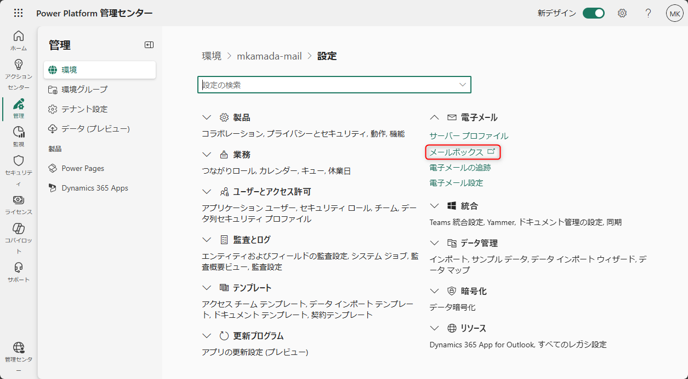
5. 同期したいメールボックスにチェックを入れ、① [編集] をクリック 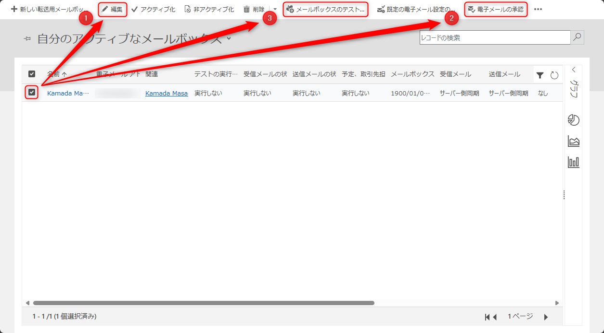
6. 受信メール、送信メール、(メール以外も同期が必要な場合は) 予定、取引先担当者、タスクを [サーバー側同期] に変更して [保存して閉じる] 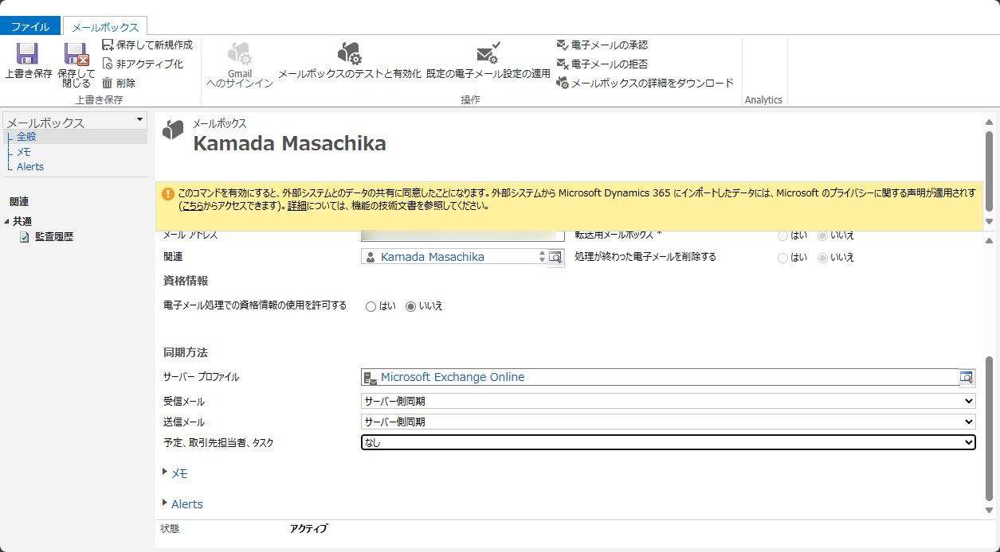
7. ステップ 5 の画像の ② [電子メールの承認] をクリック、ポップアップが出てきたら [OK] をクリック
8. ステップ 5 の画像の ③ [メールボックスのテストと有効化] をクリック
9. [電子メール アクセス構成のテスト] は同期したいレコードの種類を選び、[OK] をクリック
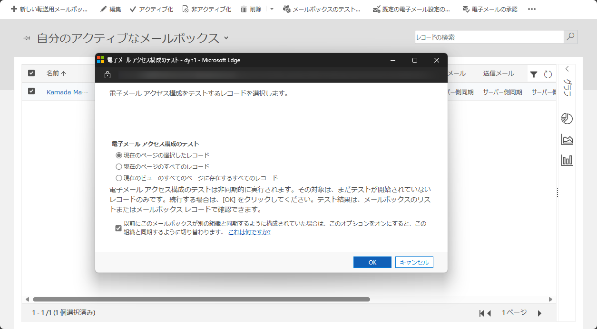
10. テストの実行状態が [進行中] から [成功] になったら完了 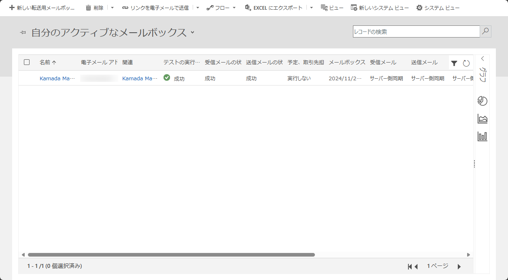
11. Outlook にもサーバー側同期の完了を通知するメールが届いていることを確認 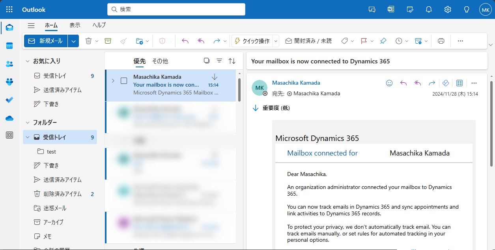

<h2 id="dynamics-365-app-for-outlook">Dynamics 365 App for Outlook</h2>

Dynamics 365 App for Outlook は Outlook から Dynamics 365 のレコードを閲覧、作成、編集、削除などができるアプリ (アドイン) です。Outlook から Dynamics 365 での追跡時の関連を設定したり、テーブルへレコードを作成したりできます。

1. Power Platform 管理センターより [設定] > [Dynamics 365 App for Outlook] をクリック 
2. Dynamics 365 App for Outlook を追加するユーザーにチェックを入れ、[OUTLOOK へのアプリの追加] をクリック (対象ユーザーに割り当てられているセキュリティ ロールの中に use dynamics 365 app for outlook の特権がついている必要があります) 
3. [状態] が [保留中] から [Outlook に追加済み] になったら完了 (完了までに 10 分から 30 分程度時間がかかります) 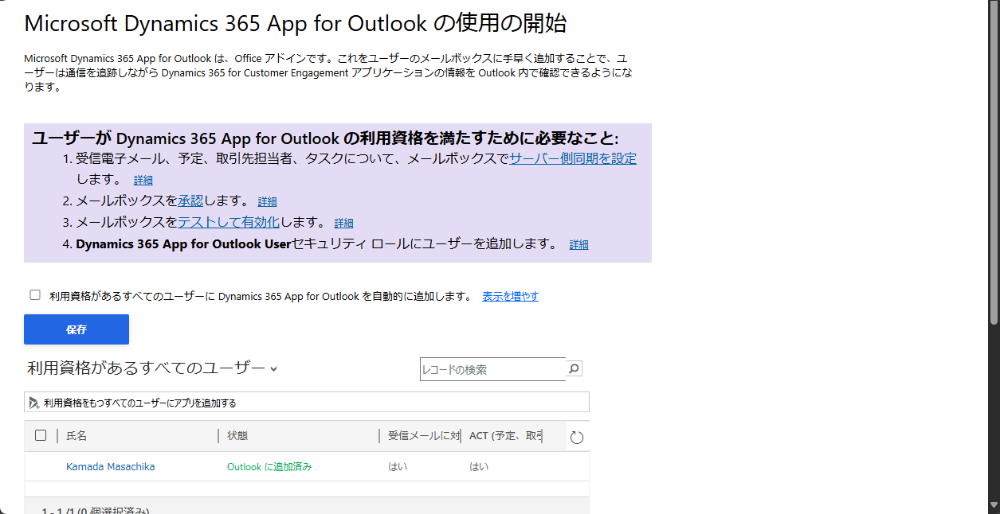
4. [Outlook](https://outlook.office365.com/mail/) でメールを開き、[Dynamics 365] のアプリのアイコンが表示されることを確認 
5. 初めて開くと認証画面が表示されるので、[許可] をクリックして認証 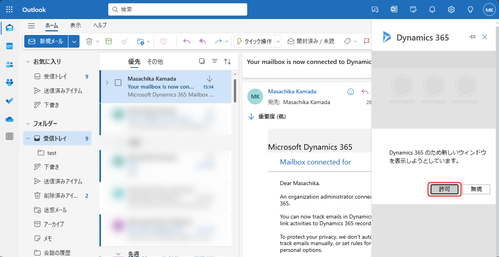

<h2 id="sync-email">メールの追跡</h2>

以下のいずれかの方法でメールの追跡が可能です。

- 追跡したいメールを選択した状態で **分類** をクリックし、Track To Dynamics 365 の分類を付与することで、対象のメールを追跡できます。Dynamics 365 へ正しく連携できなかった場合、分類のタグが Tracked To Dynamics 365 (Undeliverable) になります。 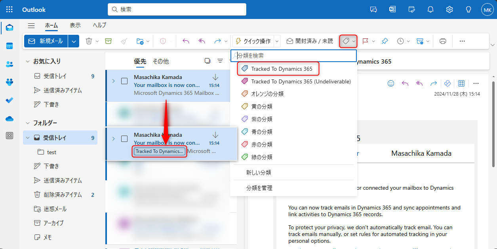

- Dynamics 365 App for Outlook を利用してメールを追跡することもできます。追跡対象外のメールで [関連を設定せずに追跡] とすると上の方法と同じく Track To Dynamics 365 の分類タグがつき、メールを追跡できます。 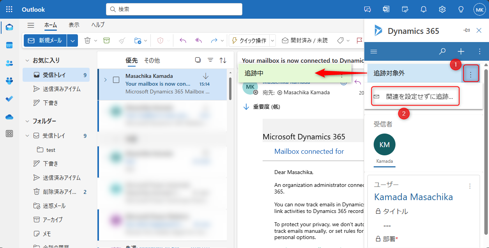

Dynamics 365 アプリの [営業ハブ] > [活動] > [すべての電子メール] より、上記の方法で追跡した電子メール レコードが確認できます。同期には場合によって 5 分から 15 分程度時間がかかることがあります。
 

<h2 id="sync-shedule">予定の追跡</h2>

Outlook より [予定表] を開き、追跡対象の予定を右クリックして先ほどのメールの追跡と同様に Track To Dynamics 365 の分類を付与することで、対象の予定を追跡できます。 
Dynamics 365 アプリの [営業ハブ] > [活動] > [すべての予定] より、上記の方法で追跡した予定レコードが確認できます。同期には場合によって 5 分から 15 分程度時間がかかることがあります。 

<h2 id="personal-settings">個人設定</h2>

Dynamics 365 アプリの個人設定の [電子メール] タブから設定できる項目についてご紹介します。 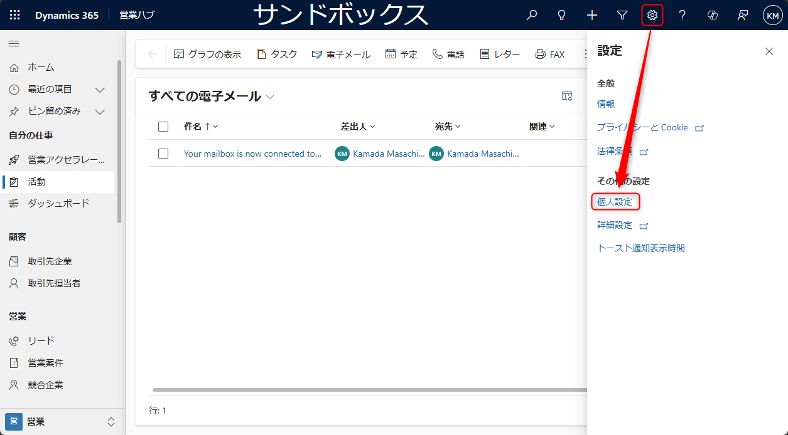

<h3 id="track">[Microsoft Dynamics 365 で追跡する電子メール メッセージを選択してください] > [追跡]</h3>

同期されたメールボックスのうち、どの電子メール メッセージを追跡するかを設定できます。デフォルトで [Dynamics 365 電子メールに対する返信の電子メール メッセージ] に設定されています。 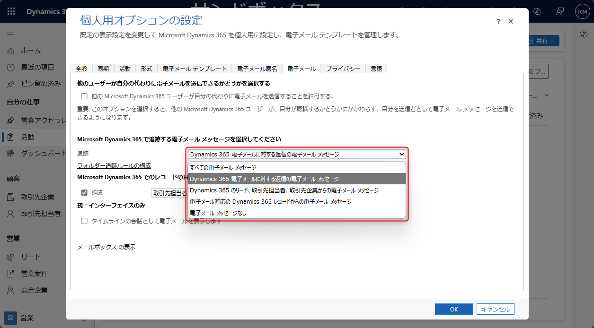

<h3 id="configure-folder-tracking-rules">[Microsoft Dynamics 365 で追跡する電子メール メッセージを選択してください] > [フォルダー追跡ルールの構成]</h3>

Outlook の指定したフォルダーと Dynamics 365 の特定のレコードを紐づけることができます。例えば以下のように test というフォルダーのメールを test company という取引先企業と連携したい場合などです。 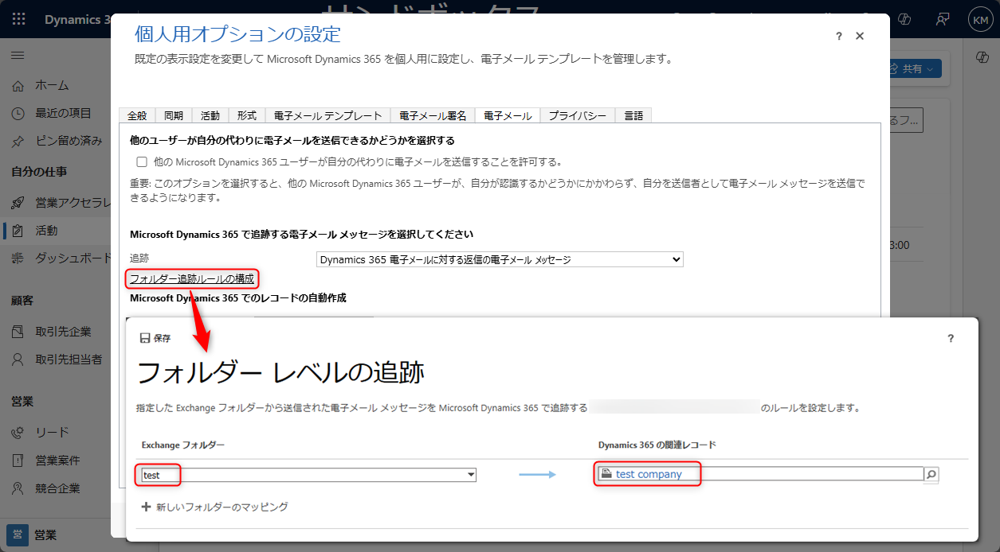 これにより、以下のように test company という取引先企業のレコードに test というフォルダー内のメールが連携され、タイムラインから閲覧できるようになります。 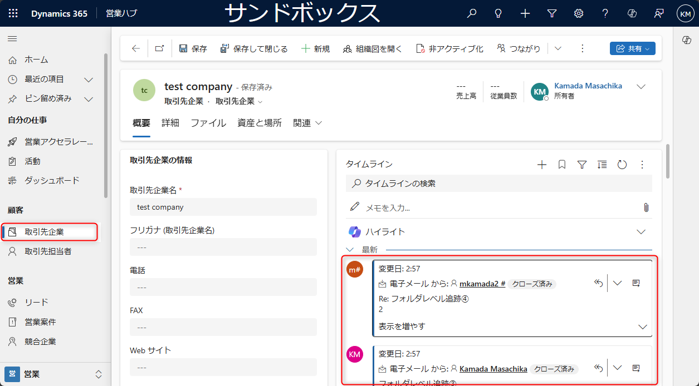 上記の機能を有効にするためには、以下の通り Power Platform 管理センターで [設定] > [電子メールの追跡] > [フォルダー レベルの追跡] をオンにする必要があります。 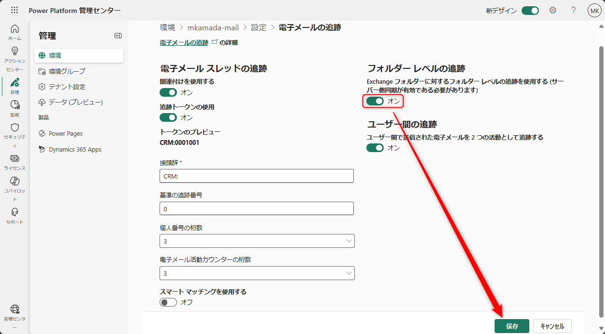

<h3 id="configure-folder-tracking-rules">[Microsoft Dynamics 365 でのレコードの自動作成]</h3>

[Microsoft Dynamics 365 でのレコードの自動作成] では、追跡するメールの送信者を取引先担当者またはリードとして、レコードを自動作成することができます。例えば、取引先担当者を自動作成するように設定した場合、[メールの同期](#sync-email) の操作により、そのメールの送信者である Microsoft Power Platform が取引先担当者として自動で作成されます。 

<h2 id="send-email">Dynamics 365 から電子メールを送信</h2>

これまで紹介してきた操作は、Exchange から Dataverse への同期でしたが、逆に Dataverse から Exchange への同期も可能なため、Dynamics 365 アプリから電子メールを送信することも可能です。 [活動] > [電子メール] とクリックすると下図のように [新しい電子メール] の画面が開きます。宛先や件名、本文を埋め、[送信] ボタンを押すことで同期しているメールボックスからメールを送信することができます。正しく送信されているかどうかは Outlook の送信済みアイテムより確認できます。
 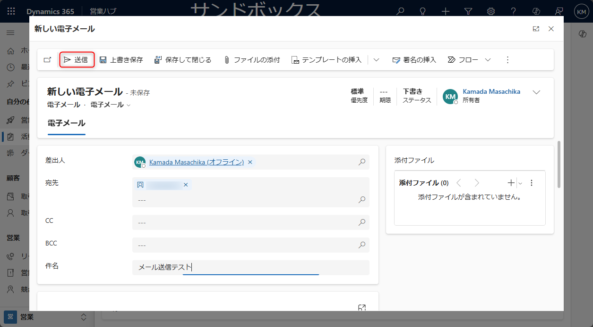

<h2 id="additional-information">補足</h2>

- [Power Platform 環境へのメールボックスの同期](#sync-mailbox-to-power-platform-environment) のステップ 9 のチェックボックスは、これから同期するメールボックスを別の環境で同期したときに、現在の環境の接続を解除して新しい環境に同期しなおすためのものです。メールボックスは一つの環境にしか同期できません。

- Dynamics 365 アプリ内の活動エンティティにて電子メール レコードを削除しても、Outlook 内の同期元メールは削除されません。また、Outlook から追跡中の電子メールを削除しても、Dynamics 365 アプリ側の電子メール レコードは削除されません。 参考: [Dynamics 365 for Outlook で追跡されたレコードを削除する > 電子メール メッセージ](https://learn.microsoft.com/ja-jp/dynamics365/outlook-addin/user-guide/delete-records-that-have-been-tracked#email-messages)

- 同期済みのメールボックスに対して同期を解除したい場合、[Power Platform 環境へのメールボックスの同期](#sync-mailbox-to-power-platform-environment) のステップ 6 の画面で [同期方法] のうち連携を解除したい項目を [なし] に設定し、[上書き保存] を押下します。

- [Power Platform 環境へのメールボックスの同期](#sync-mailbox-to-power-platform-environment) のステップ 7 のメールボックスの承認は、[Power Platform 管理センター] > [設定] > [セキュリティ ロール] より [代理メールボックス承認者] を付与することで、グローバル管理者または Exchange 管理者でなくても、システム管理者セキュリティ ロールを持っていれば代理で実施することができるようになります。 参考: [Exchange Online への接続 > アクセス許可モデル](https://learn.microsoft.com/ja-jp/power-platform/admin/connect-exchange-online#permissions-model) 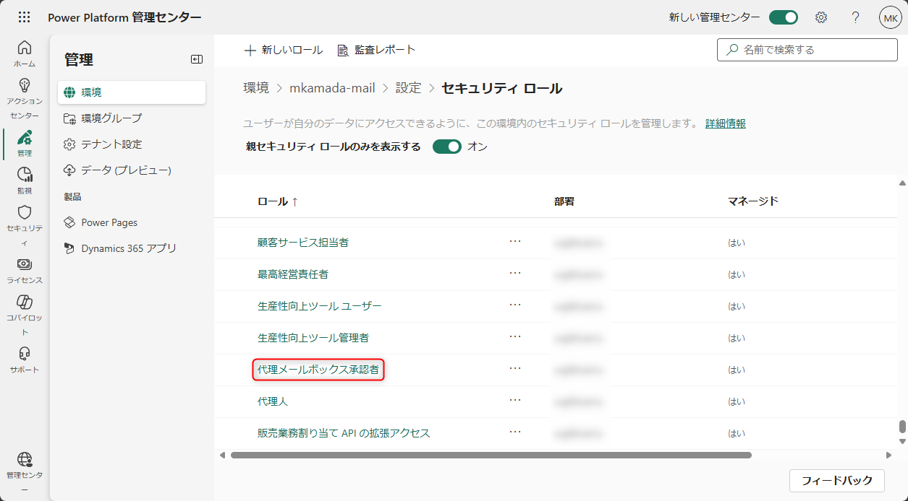

<h2 id="troubleshooting">トラブルシューティング</h2>

Dynamics 365 App for Outlook によりメールを Dataverse に同期する際に、"[追跡] と [関連を設定] は現在無効になっています..." というメッセージが表示され正常に同期できない場合の対処手順をご紹介します。

1. ブラウザの InPrivate モードで期待通りの動作となるか確認
2. 期待通りの動作とならない場合、ユーザーに割り当てられているセキュリティ ロールの中に use dynamics 365 app for outlook の特権がついていることを確認 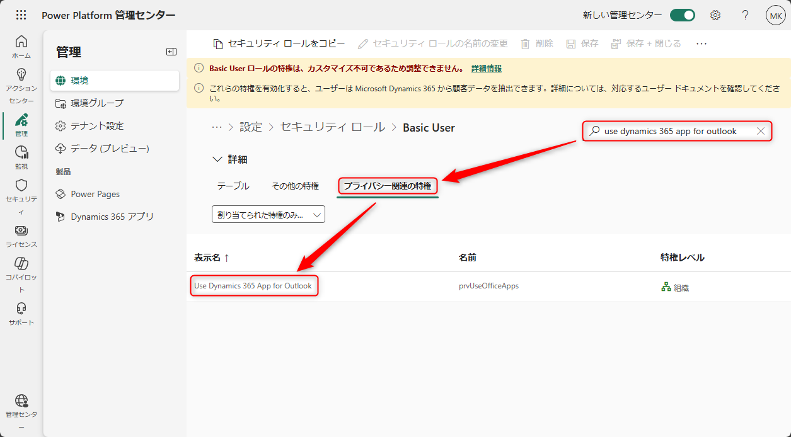
3. 再度 [Power Platform 環境へのメールボックスの同期](#sync-mailbox-to-power-platform-environment) と [Dynamics 365 App for Outlook](#dynamics-365-app-for-outlook) の設定を実施
4. ステップ 1 で期待通りの動作となっている場合、下図のように Outlook のアプリ管理画面から Dynamics 365 App for Outlook の接続先の環境を確認 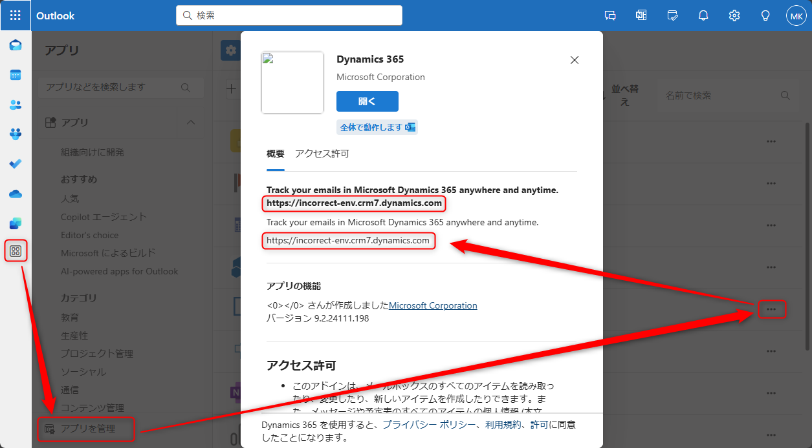
5. Power Platform 管理センターから同期を設定した環境と異なる環境が接続対象となっている場合、ブラウザの設定より、[Cookie とサイトのアクセス許可] > [Cookie とサイト データ] > [すべての Cookie とサイト データを表示する] から Outlook に関連するキャッシュを削除 (Edge の場合) 
6. 事象が解決しない場合、サポート窓口にお問い合わせください

<h2 id="references">参考情報</h2>

- [電子メール、予定、取引先担当者、およびタスクのサーバー側同期の設定](https://learn.microsoft.com/ja-jp/power-platform/admin/set-up-server-side-synchronization-of-email-appointments-contacts-and-tasks)
- [Exchange Online への接続](https://learn.microsoft.com/ja-jp/power-platform/admin/connect-exchange-online)
- [Dynamics 365 App for Outlook の展開およびインストール](https://learn.microsoft.com/ja-jp/dynamics365/outlook-app/deploy-dynamics-365-app-for-outlook)
