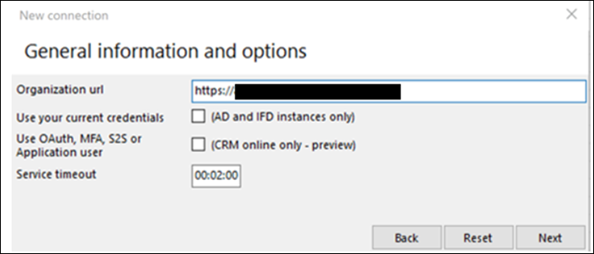
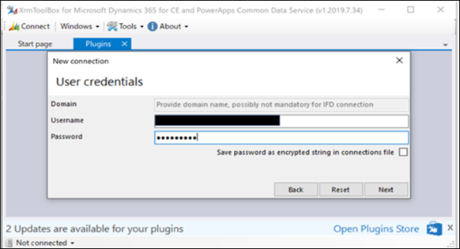
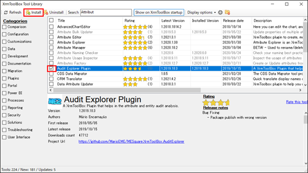
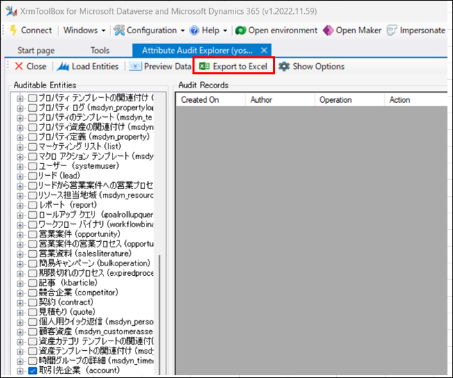

#  Dataverse の監査ログをエクスポートする方法

こんにちは、Power Platform サポートチーム鈴木です。  

Dataverse の監査ログは、レコードに対する変更履歴を監査概要ビューで表示することができます。  
Dataverse の監査ログの取得や、確認方法については下記公開情報をご参照ください。  
(ご参考 : [Dataverse 監査を管理する](https://learn.microsoft.com/ja-jp/power-platform/admin/manage-dataverse-auditing))  

サポートチームでは、監査概要ビューの内容をエクスポートしたい、というお問合せをいただくことがありますが、2023年4月現在では、Dataverse 監査ログのエクスポート機能を提供していません。
そこで、今回は XRMToolBox というサードパーティ製のツールを使用したエクスポート方法をご紹介します。  
XRMToolBox 自体は、当社提供のツールではないため、詳細な使用方法やエラーに対する対処は製品提供元へご確認いただく必要があることをご了承いただいた上で、ご利用いただけますと幸いです。  

## 事前準備  
---
XRMToolBox とは、Dataverse に接続し、操作できる Windows アプリケーションとなります。  
事前にインストールし、接続設定を行うことで、Web API でしか実行できないような Dataverse 環境に対する様々なアクションを GUI 操作によって可能にします。  

1. XRMToolBox を以下のサイトよりダウンロードします。  
    URL: https://www.xrmtoolbox.com/

2. XRMToolBox アプリケーションを開きます。  

3. Configuration タブより Manage connections を選択します。  
    

4. New Connection > Connection Wizard をクリックします。  

5. Organization url に対象の Dataverse 環境の URL を入力し、Next をクリックします。  
    

6. 環境にサインイン可能な Username と Password を入力し、Next を選択します。  
    

7. Connection に任意の名前を入力し、Finish を選択します。  

8. Connection が作成されたことを確認し、Connections Manager ウィンドウを閉じます。  

これで、XRM ToolBox のインストールと Dataverse 環境への接続が完了です。  

## ツールのインストール
---
XRM ToolBox には、様々なツールが存在しますが、今回は監査ログをエクスポートするための、Attribute Audit Explorer というツールを使用します。  
Attribute Audit Explorer の詳細については、下記をご参照ください。  
(ご参考 : [Audit Explorer Plugin](hhttps://www.xrmtoolbox.com/plugins/MESquare.XrmToolBox.AuditExplorer/))  

1. Configuration > Tool Libraryを開き、Audit Explorer Plugin にチェックし Install をクリックします。  
    

2. Tool Library ウィンドウを閉じます。  

## Audit Explorer Plugin を使用して、Dataverse の監査ログをエクスポートする。  
---
1. Tools ウィンドウ で Attribute Audit Explorer をダブルクリックで開きます。  
    

2. 「Do you want to connect to an organization first?」というダイアログが表示された場合は「はい」を選択し、作成した Connection 先を選び Connect をクリックしてください。  

3.  Load Entities をクリックします。  
   

4. 監査が有効化されているテーブルが表示されますので、ログを取得したいテーブルと取得する監査ログの日時を選択します。  
    *Before が取得終了日、After が取得開始日になりますので、ご注意ください。  
   

5. Export to Excel をクリックすると、監査ログが csvファイル形式で出力されます。  
   

なお出力する列は、オプションで選択可能です。  
   

## エクスポートした監査ログの確認
---
エクスポートした csv ファイルでは、各フィールドの値を一覧で確認できます。  
   

## おわりに
---
Microsoft 365 のコンプライアンスセンターから Dataverse に関する監査ログを確認し、エクスポートする方法もあります。  
しかし現時点では、Dataverse 環境に関しては監査概要ビューから確認することで、レコードに対する変更履歴が分かりやすく表示されるため、ご利用いただいているユーザー様も多数いらっしゃるかと思います。  
監査概要ビューでは提供していないエクスポート機能が、XRMToolBox を利用することで可能となりますので、ぜひご活用いただけますと幸いです。  