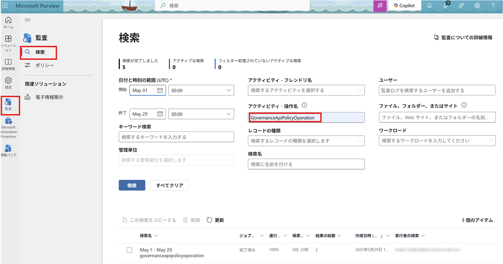
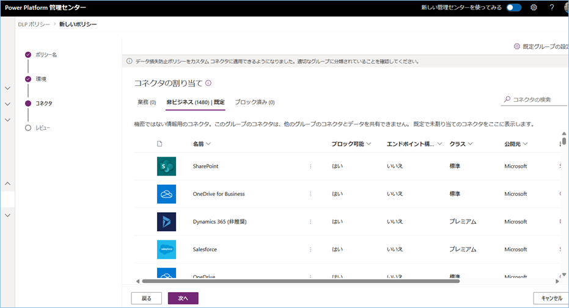

こんにちは、Power Platform サポートチームの宮﨑です。  
本記事では、DLP ポリシーに関する様々な Q&A についてご案内いたします。

<!-- more -->
# 目次

- [目次](#目次)
- [概要](#概要)
    - [Q1. DLP ポリシーとは](#anchor-about-dlp)
    - [Q2. 個別環境に複数の DLP ポリシーが適用された場合](#anchor-multi-dlp-applied)
    - [Q3. DLP ポリシーの変更履歴を確認する方法](#anchor-dlp-edit-history)
    - [Q4. 新しいコネクタが追加されたときの分類](#anchor-default-new-connector-classification)
    - [Q5. DLP ポリシーに設定されているコネクタの一覧を出力する](#anchor-export-all-connectors)
    - [Q6. DLP ポリシーを作成してから適用されるまでの時間](#anchor-time-to-be-applied)
    - [Q7. アプリとフローへの DLP ポリシーの影響](#anchor-affect-to-app-flow)
      - [1. アプリやフローを設計する段階での影響](#anchor-affect-to-app-flow-create)
      - [2. アプリやフローを実行する段階での影響](#anchor-affect-to-app-flow-run)
- [補足](#補足)

# 概要
今回はよくあるお問い合わせとして、DLP ポリシーに関する様々な Q&A についてご案内いたします。

# Q1. DLP ポリシーとは
DLP ポリシーとは、「Data Loss Prevention (データ損失防止) ポリシー」の略で、企業や組織の重要なデータを守るための仕組みです。  

Power Platform では、様々な「コネクタ」を使用して Microsoft 365 や 外部サービスとデータをやり取りすることが可能です。  
便利な反面、誤って社内機密を外部に送ってしまうというリスクも存在しています。  

DLP ポリシーはこのようなリスクを防ぐために、コネクタの利用範囲を制限することができます。  
具体的には、「社内データは SharePoint や Outlook などのビジネスコネクタだけと連携可能」や、「SNS系コネクタは使用禁止」というルールを設定できます。  

(参考：[データの消失防止 (DLP) ポリシー](https://learn.microsoft.com/ja-jp/power-platform/admin/wp-data-loss-prevention))

# Q2. 個別環境に複数の DLP ポリシーが適用された場合

ある環境に対して、テナント全体に適用される DLP ポリシーとその環境のみに適用される DLP ポリシーが存在した場合の挙動について、詳細をご説明します。

## 評価の基本ルール
1. すべての DLP ポリシーが同時に評価され、**最も制限の厳しい設定が優先**されます。  
特に「ブロック済み」に分類されているコネクタは、他の DLP ポリシーで許可されている場合でも使用はできません。  
例えば、全体に適用されている DLP ポリシーにおいて HTTP コネクタが「ブロック済み」に分類されている場合、  
個別環境の DLP ポリシーで許可されていたとしても、使用することはできません。

2. 同じコネクタが、ある DLP ポリシーでは「業務」、別の DLP ポリシーでは「非ビジネス」と分類されていた場合：
    そのコネクタは **単体では使用可能ですが、他のコネクタと一緒に使うことができなくなります**。  
    これは、Power Platform ではアプリやフロー内で使用されるすべてのコネクタが、同じ「分類グループ」に属している必要があるためです。

    具体的には：

    - 「業務」に分類されているコネクタ同士は 併用可能  
    - 「非ビジネス」に分類されているコネクタ同士は 併用可能  
    - 「業務」と「非ビジネス」にまたがるコネクタは **併用不可**

    となっています。

(参考：[Microsoft Learn - DLP ポリシーの組み合わせ効果](https://learn.microsoft.com/ja-jp/power-platform/admin/dlp-combined-effect-multiple-policies))

 
## 実際の例
以降では、簡単な例を用いてより具体的な挙動について解説します。

### 前提 
テナント全体に適用されている DLP ポリシーをグループ A 、個別環境に適用されている DLP ポリシーをグループ B という前提のもと、進めていきます。

### 実際の挙動
こちらが、グループＡとグループＢでのコネクタ分類と、それに基づく実際の挙動をまとめた表になります。
 
| コネクタ名       | グループＡ (全体 DLP) | グループＢ (個別 DLP) | 個別環境での実際の挙動                       |
|------------------|------------------------|------------------------|------------------------------------------------------|
| Salesforce       | 業務               | ブロック済み           | 使用不可(「ブロック済み」が優先)                          |
| Dropbox          | ブロック済み             | 非ビジネス           | 使用不可(「ブロック済み」が優先)                          |
| Excel Online (Business)    | 業務               | 業務               | 他の「業務」コネクタとの併用可能                             |
| Office 365 Outlook          | 非ビジネス             | 非ビジネス             | 他の「非ビジネス」コネクタとの併用可能                             |
| SharePoint       | 業務               | 非ビジネス             | 単体使用は可能。他のコネクタとの併用不可。          |

このように、**同じコネクタでもポリシーごとに分類が異なる場合、アプリやフロー内でのコネクタ使用に制限が生じてしまいます**。  
そのため、環境に適用する DLP ポリシーの数は最小限に抑えることが推奨されております。  
また、同じコネクタに対して異なる分類 (業務／非ビジネス／ブロック済み) を設定しないようご留意ください。

# Q3. 設定した DLP ポリシーの変更履歴を確認する方法

DLP ポリシーの変更内容については、**Microsoft Purview** の「**監査ログ**」から確認いただけます。

以下の手順で変更履歴を取得することが可能です。

1. アクセス権をもつアカウントで、Microsoft Purview 管理センターにアクセスしてください。
2. 「監査＞検索」を選択し、「アクティビティ – 操作名」に「GovernanceApiPolicyOperation」を入力してください。
3. 検索対象となる時間範囲を指定して「検索」を選択いただくことで、指定の時間範囲内の DLP ポリシーの変更履歴を確認することが可能です。

表示されますデータの例等の詳細につきましては、下記の公開情報をご参照ください。 
(参考：[Microsoft Learn - Microsoft Purview のソリューションの概要を使用して Power Platform 管理ログを表示する](https://learn.microsoft.com/ja-jp/power-platform/admin/admin-activity-logging#activity-category-data-policy-events))

# Q4. 新しいコネクタが追加されたときの分類

新しいコネクタがリリースされたとき、そのコネクタはデフォルトで「**非ビジネス | 既定**」に分類されます。

DLP ポリシーを作成するにあたって、「業務」や「ブロック済み」にコネクタを移動することはできますが、
最初から「業務」と「ブロック済み」に分類されるコネクタはございません。

デフォルトで分類されるグループを変更されたい場合は、以下の公開情報に手順がございますので、ご参照ください。 
(参考：[Microsoft Learn - データポリシーを管理する](https://learn.microsoft.com/ja-jp/power-platform/admin/prevent-data-loss?tabs=new#change-the-default-data-group))

# Q5. DLP ポリシーに設定されているコネクタの一覧を出力する

以下のブログにて、DLP ポリシーに設定されたコネクタの一覧を CSV ファイルに出力する方法をご案内しておりますので、ご参照ください。
[DLP ポリシーに設定されているコネクタの一覧を出力する | Japan Dynamics CRM & Power Platform Support Blog](https://jpdynamicscrm.github.io/blog/powerplatform/Output-dlp-policy-connector-list/)

# Q6. DLP ポリシーを作成してから適用されるまでの時間

DLP ポリシーを作成してから、実際に適用されるようになるまでに**最大 24 時間**かかります。

ほとんどの場合、1 時間ほどで反映されますが、ポリシーの適用範囲によっても変動いたします。 
ご使用のアプリ、フローの数が多いほど、変更が完全に有効になるまでの時間が長くなります。

公開情報については、以下をご参照ください。
(参考：[Microsoft Learn - 待機時間に関する考慮事項](https://learn.microsoft.com/ja-jp/power-platform/admin/wp-data-loss-prevention#latency-considerations))

# Q7. アプリとフローへの DLP ポリシーの影響

DLP ポリシーの追加・更新により、既存のアプリやフローにどのような影響がありうるかをご案内いたします。

## アプリやフローを設計する段階での影響

アプリやフローを構築する際、同じグループに属さないコネクタや、ポリシーでブロックされたコネクタを追加しようとすると、以下のようなエラーメッセージが表示されます。

## アプリやフローを実行する段階への影響

アプリやフローは、作成当時の DLP ポリシーに従って設計されています。  
DLP ポリシーが更新されると、**更新後の DLP ポリシーで再評価されます**。  
その結果、それまでには問題がなかったアプリやフローの構成が違反として扱われる場合があります。

最新の DLP ポリシーに違反しているアプリやフローを実行しようとすると、以下のような状態になります。

- Power Automate の場合  
  **違反するフローは実行できなくなり、「中断（Suspended）」状態** になります。  
  この状態では、DLP ポリシー違反を解消するまで、フローは実行できません。

- Power Apps の場合  
  同じグループに属さないコネクタや、ブロックされたコネクタを含む**アプリを開くことはできなくなります**。

(参考：[Microsoft Learn - アプリとフローへのデータ ポリシーの影響](https://learn.microsoft.com/ja-jp/power-platform/admin/dlp-impact-policies-apps-flows))

---

# 補足

本手順は執筆時点でのユーザー インターフェイスを基に紹介しています。  
バージョンアップによって UI の遷移などが若干異なる場合があります。  
その場合は画面の指示に従って進めてください。  

