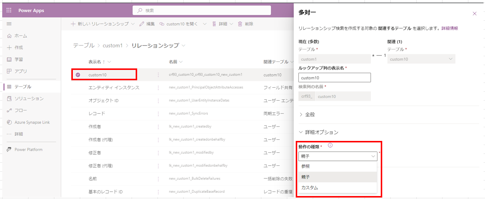
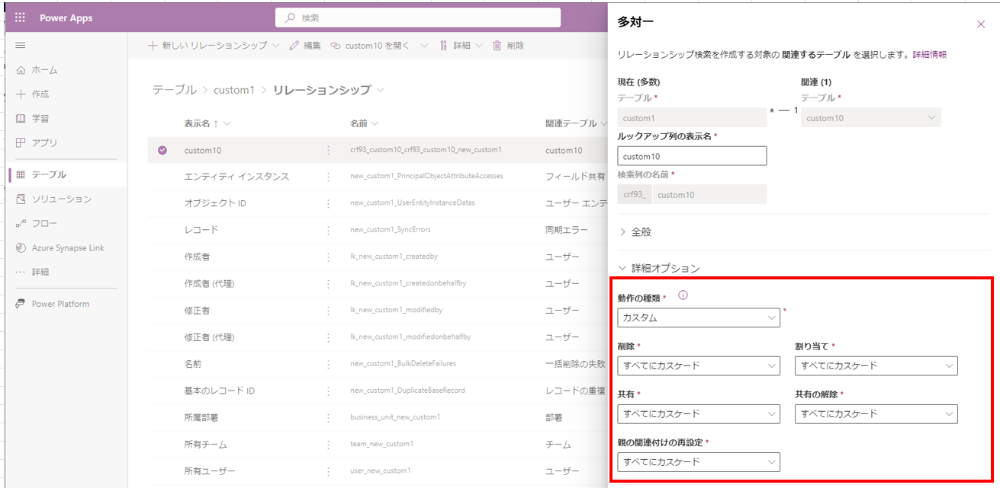
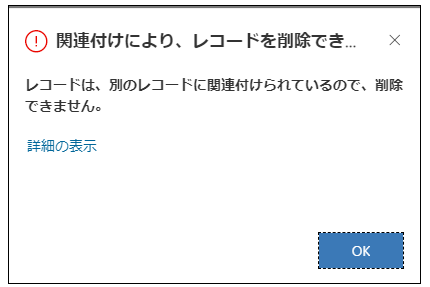
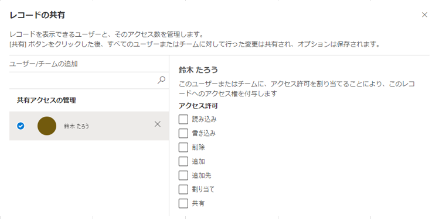
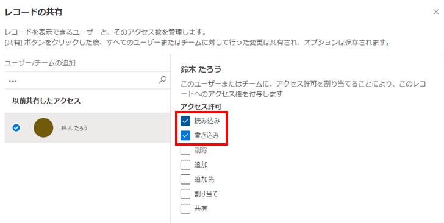

#  テーブルのリレーションシップとカスケード

こんにちは、Power Platform サポートチーム鈴木です。  

Datavers のテーブルとテーブルは、1:N、もしくはN:N の関連付けが可能です。  
関連付けされたテーブル定義のことを、リレーションシップと呼びますが、今回はテーブル間のリレーションシップにおける、カスケード(伝播)処理について、具体的な動作とともにご紹介します。  
<!-- more -->

## リレーションシップの確認
---
テーブル間のリレーションシップの作成、変更、確認は、Power Apps にてテーブル > リレーションシップから確認できます。  
      

1:N の1側のテーブルから確認する場合も、N側のテーブルから確認する場合も同じで、どちらか一方で設定を変更した場合は、もう一方の設定に引き継がれます。  

## カスケード設定について
---
各リレーションシップのカスケード処理は、リレーションシップをクリックして表示される詳細オプションから確認できます。  

動作の種類と選択可能なカスケード処理は、以下の通りです。  
      
      

### 親子(上位下位)
リレーションシップが親子に設定されているときは、親レコードから子レコードへすべての処理がカスケードされます。  
      
  

### 参照
リレーションシップが参照に設定されているときは、削除処理のみ「リンクの削除」か「制限」を選択できます。  
      

### カスタム
リレーションシップがカスタムに設定されているときは、各処理を自由に定義できます。  
      

## カスケード設定の各動作について
---
各カスケード処理について 1:N の場合の動作を説明します。  

### 削除
---
1側のレコードを削除したときに、関連付けられた N側のレコードはどうなるでしょうか？  
#### ・すべてにカスケード
1側のレコードを削除すると、N側のレコードも削除されます。  

#### ・リンクの削除
1側のレコードを削除すると、N側のレコードは削除されませんが、関連付けが解除されます。  
つまり1側の参照先をもたない、N側のレコードが残ります。  

#### ・制限
1側のレコードを削除しようとすると、関連付けられた N側のレコードが存在するため、削除できません。  
以下のようなエラーメッセージが表示されます。  
      

### 割り当て
---
1側のレコードの所有者を変更したときに、関連付けられた N側の所有者はどうなるでしょうか？  

#### ・すべてにカスケード
1側のレコードの所有者を変更すると、N側のレコードの所有者も1側と同じ所有者に変更されます。  
※変更する所有者にN側のアクセス権がない場合は、1側の所有者として指定することはできません。  

#### ・アクティブにカスケード
1側のレコードの所有者を変更すると、N側のアクティブレコードの所有者は、1側と同じ所有者に変更されます。  
N側が非アクティブレコードだった場合は、N側のレコードの所有者は変更されません。  
※変更する所有者にN側のアクセス権がない場合は、1側の所有者として指定することはできません。  

#### ・ユーザー所有にカスケード
1側のレコードの所有者を変更すると、N側のレコードの所有者が1側の元の所有者と同じだった場合は、1側と同じ所有者に変更されます。  
N側が1側のレコードの元の所有者と異なる場合は、N側のレコードの所有者は変更されません。  
※変更する所有者にN側のアクセス権がない場合は、1側の所有者として指定することはできません。  

#### ・カスケードなし
1側のレコードの所有者を変更しても、N側のレコードの所有者は変更されません。  

### 共有
---
テーブルにアクセス権のないユーザーやチームに対して、レコード毎に共有設定を行うことができます。  
レコードの 共有 > アクセスの管理 から設定できます。  
      
      

では、1側のレコードを他者(ユーザーA)に共有した場合、関連付けられた N側のレコードへのアクセス権はどうなるでしょうか？  

#### ・すべてにカスケード
1側のレコードをユーザーAに共有すると、ユーザーAは N側のレコードにもアクセス権をもちます。   
例えば、1側に読み込み、書き込み特権を付けると、N側のレコードにも同じく読み込み、書き込み特権をもちます。  

> [!TIP]
> 1側の共有設定(共有設定から確認できます。)  
>       
> 
> N側のアクセス権(アクセスの確認からユーザーを検索して確認できます。)  
>       

#### ・アクティブにカスケード
1側のレコードをユーザーAに共有すると、ユーザーAは N側のアクティブレコードにもアクセス権をもちます。   
N側が非アクティブレコードだった場合、ユーザーAは N側のレコードのアクセス権をもちません。  

#### ・ユーザー所有にカスケード
1側のレコードのユーザーAに共有すると、N側のレコードの所有者が1側の元の所有者と同じだった場合、ユーザーAは N側のレコードにもアクセス権をもちます。   
N側が1側のレコードの元の所有者と異なる場合は、1側のレコードをユーザーAに共有しても、ユーザーAは N側のレコードのアクセス権をもちません。  

#### ・カスケードなし
1側のレコードをユーザーAに共有しても、ユーザーAは、N側のレコードのアクセス権をもちません。  

### 共有の解除
---
1側のレコードを他者(ユーザーA)に共有し、その後共有を解除すると、関連付けられた N側のレコードへのアクセス権はどうなるでしょうか？  
※共有設定はカスケードされる設定を想定しています。  

#### ・すべてにカスケード
1側のレコードをユーザーAに共有し、その後共有解除すると、ユーザーAは N側のレコードのアクセス権も解除され、アクセスできません。  

#### ・アクティブにカスケード
1側のレコードをユーザーAに共有し、その後共有解除すると、ユーザーAは N側のアクティブレコードのアクセス権も解除され、アクセスできません。  
N側が非アクティブレコードだった場合、ユーザーAは N側のレコードのアクセス権をもち続けます。  

#### ・ユーザー所有にカスケード
1側のレコードをユーザーAに共有し、その後共有解除すると、N側のレコードの所有者が1側の元の所有者と同じだった場合、ユーザーAは N側のレコードのアクセス権も解除され、アクセスできません。  
N側が1側のレコードの元の所有者と異なる場合は、1側のレコードをユーザーAに共有し、その後共有解除しても、ユーザーAは N側のレコードのアクセス権をもち続けます。  

#### ・カスケードなし
1側のレコードをユーザーAに共有し、その後共有解除しても、ユーザーAは N側のレコードのアクセス権をもち続けます。  

### 親の関連付けの再設定(リペアレント)
---
「1側に N側のレコードを関連付けする設定時」に N側レコードへのアクセスに対して、1側レコードのものを継承させるかどうか、という設定になります。  
「共有」と「親の関連付けの再設定」の違いは、「共有」は「1側のレコードで共有設定を行ったときにすでに関連づけられている N側レコードに対して共有を継承させるかどうか」であることに対して、「親の関連付けの再設定」は「1側のレコードで N側レコードに対する関連付けを行ったときに存在する共有設定を N側レコードに対して継承させるかどうか」です。  

では、1側のレコードをすでに他者(ユーザーA)に共有している場合、共有設定後に関連付けられた N側のレコードへのアクセス権はどうなるでしょうか？  

#### ・すべてにカスケード
1側のレコードに N側のレコードを関連付けると、ユーザーAは N側のレコードにアクセスできます。  

#### ・アクティブにカスケード
1側のレコードに N側のレコードを関連付けると、ユーザーAは N側のアクティブなレコードにアクセスできます。  
N側が非アクティブレコードだった場合、ユーザーAは N側のレコードのアクセス権をもちません。  

#### ・ユーザー所有にカスケード
1側のレコードに N側のレコードを関連付けると、N側のレコードの所有者が1側の元の所有者と同じだった場合、ユーザーAは N側のレコードにもアクセス権をもちます。   
N側が1側のレコードの元の所有者と異なる場合は、1側のレコードをユーザーAに共有しても、ユーザーAは N側のレコードのアクセス権をもちません。  

#### ・カスケードなし
1側のレコードに N側のレコードを関連付けても、ユーザーAは N側のレコードのアクセス権をもちません。  

## よくあるご質問
---
#### ・カスケード処理の「共有」を「すべてにカスケード」から「カスケードなし」に変更しました。既存の共有設定はどうなりますか？  
カスケード処理変更前に既に共有されたレコードは、既に共有レコードを管理するテーブルに共有情報が登録されているため、カスケード処理を変更しても動作が変わりません。  
カスケード処理変更前に共有されたレコードは、一度共有を解除し、再度共有設定することで、変更後のカスケード処理を伝播します。  
注意事項として、「共有の解除」が「カスケードなし」の設定になっている場合には共有解除したことがカスケードされないため、再共有した場合に N側レコードの参照ができてしまいます。  
これを防ぐためには、「共有の解除」は「カスケード」される設定にしておく必要があります。  

#### ・1側のレコードの所有者がユーザーAで、N側のレコードの所有者がユーザーBです。ユーザーAは N側のレコードへアクセス権をもちますか？  
※ユーザーAは、N側テーブルのアクセス権をもっていない、かつ共有設定は行われていない前提です。  
親の関連付けの再設定が「カスケード」の場合、ユーザーＡは所有者の異なる Ｎ側のレコードへアクセス権をもちます。  
親の関連付けの再設定が「カスケードなし」の場合は、ユーザーＡは所有者の異なる Ｎ側のレコードへアクセス権をもちません。  

## おわりに
---
今回ご説明した内容に関連した公開情報について、ご紹介します。  
[テーブル リレーションシップ](https://learn.microsoft.com/ja-jp/power-apps/maker/data-platform/create-edit-entity-relationships#table-relationship-behavior)    
[テーブル間に関連付けを作成する](https://learn.microsoft.com/ja-jp/power-apps/maker/data-platform/data-platform-entity-lookup#add-advanced-relationship-behavior)    
[行の割り当てまたは共有](https://learn.microsoft.com/ja-jp/power-apps/user/assign-or-share-records)    
[ユーザーまたはチームと行を共有する](https://learn.microsoft.com/ja-jp/power-apps/user/share-row)    
[行に対するユーザー アクセスを確認する](https://learn.microsoft.com/ja-jp/power-apps/user/access-checker)    

今回は、テーブル間のリレーションシップにおけるカスケード処理の具体的な動作についてご案内しました。  
テーブルによっては、事前定義されたアプリケーション動作を担保するためにシステム側で予め設定されたカスケード処理が存在する場合や、カスケードは設定がない場合も製品プラグインによってカスケードに近い処理を実施している場合もありますので、ご留意ください。
